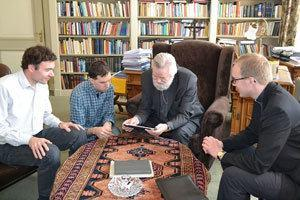

\[caption id="attachment\_1162" align="alignright" width="300"\] Mgr. Punt stelt met een druk op de knop de getijdengebedapp beschikbaar\[/caption\]

De nieuwsbrief van het [getijdengebed-team](http://www.tiltenberg.org/getijdengebed/Download.php?request=%2Fgetijdengebed%2Findex.php) bericht dat de e-books voor 2016 klaar zijn voor download. Nieuw dit jaar is een versie in EPUB-formaat, dat je in de meeste (gratis) e-bookapps kan lezen. Tot vorig jaar was enkel een versie in het Isilo-formaat beschikbaar, waarvoor je je een speciale app moest aanschaffen.

Vorig jaar werd het getijdengebed ook uitgebracht als [volwaardige app op Android en Apple](/blog/op-naar-een-vrij-en-gratis-gebruik-van-kerkelijke-teksten-met-keurmerk/), maar het voordeel van het e-bookformaat is dat je nooit online hoeft te zijn om de teksten te raadplegen.

Je vindt de e-bookversies nu ook op deze pagina:

[http://gelovenleren.net/page/e-boeken](/page/e-boeken/)
