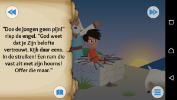

Er kwam een tip binnen over een goeie [bijbel-app voor kinderen](https://www.bible.com/nl/kids):

<table class="widget"><tbody><tr><td></td><td><a href="https://play.google.com/store/apps/details?id=com.bible.kids&amp;featurem&amp;hl=nl">De Bijbel App voor kinderen (Android)</a></td></tr><tr><td></td><td><a href="https://itunes.apple.com/nl/app/bible-for-kids/id668692393?ls=1&amp;mt=8">De Bijbel App voor kinderen (iOS)</a></td></tr></tbody></table>

 

In een veertigtal verhalen doorkruis je de belangrijkste verhalen van het Oude en het Nieuwe Testament van de Bijbel. Elk verhaal is geillustreerd en je kan kiezen of je de tekst zelf voorleest of de app laten voorlezen. Bovendien bevat elk verhaal een kwis of een spelletje waarmee je punten kan verdienen om toegang te krijgen tot "de wapenuitrusting van God" of "de gaven van de Heilige Geest".

 Isaac gered van het offer
