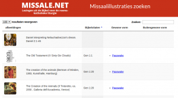

Op de website Missale, die volgens de liturgische kalender evangeliecitaten en bijhorende illustraties aanbiedt, kan je nu ook de volledige beeldinventaris raadplegen en doorzoeken:

[http://www.missale.net/inventory/nl](http://www.missale.net/inventory/nl)

\[caption id="attachment\_2089" align="alignnone" width="300"\] Missaalillustraties zoeken\[/caption\]

De afbeeldingen zijn geordend in de volgorde van de bijbel. De volledige database kan je met het zoekveld rechts bovenaan doorzoeken: typ een trefwoord in om de gegevens te filteren. Zo kan je bijvoorbeeld alle schilderijen opzoeken van "Rubens", of alle illustraties voor "Allerheiligen", of alle illustraties waarbij wordt vermeld dat ze zich in "Antwerpen" bevinden.

Op dit ogenblik zitten er 656 afbeeldingen in de database, waarmee het volledige missaal voor zon- en feestdagen is ingevuld, maar er staan nog heel wat illustraties in de [wachtrij](http://pinterest.com/vicmortelmans/missale/). Het is een hele klus om voor elke illustratie de nodige metadata en het juiste bijbelcitaat op te zoeken, maar het staat op het to-do-lijstje...
