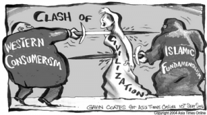

 Clash of civilizations

Een botsing van culturen. Dat is vaak de analyse van problemen met migranten. Die uitspraak veronderstelt dat er minstens twee culturen in het spel zijn. Is dat wel zo? Zou de correcte analyse misschien kunnen zijn dat er gebrek is aan cultuur, aan beide zijden?

Cultuur, dat definieer ik graag als _uitings- en omgansvormen die orde scheppen door voorborgen waarheid inzichtelijk te maken, die emoties sublimeren tot een vormelijke expressie, die zelfrespect verschaffen en een mens boven zichzelf uittillen, en dat alles ---als het even kan--- gepaard gaande met een aangename esthetiek._ Bijzonder kenmerk van cultuur, maar steeds minder vanzelfspreked, is dat ze _appelleert aan iets wat gemeenschappelijk is en belangrijk geacht wordt: individuen schragen geen cultuur, gemeenschappen doen dat._ Dat is mijn definitie, misschien niet de uwe, maar hopelijk is het begrip daarmee duidelijk.

Ik gebruik deze definitie, omdat cultuur de beste voedingsbodem is om een vredevolle samenleving op te bouwen. Daarmee bedoel ik niet noodzakelijk een mono-culturele samenleving. Integendeel: een multi-culturele samenleving moet perfect leefbaar zijn en bovendien rijker dan een mono-culturele. Cultuur is niet het probleem in een multiculturele samenleving, maar wel het gebrek aan cultuur.

### Jeugdbeweging

Religie voldoet perfect aan mijn definitie van wat cultuur is, maar is zeker niet het enige. Heel veel van wat er in het 'middenveld' gebeurt, is een vorm van cultuur. Wanneer heb je laatst een kippenvelmoment gehad bij iets waar je het gevoel hebt: "hier hoor ik bij"? Bij mij was dat in de kerk. Voor veel jongeren, hoop ik, zal dat in hun jeugdbeweging zijn, wanneer ze merken dat er iets gebeurt dat belangrijk is, waarbij ze boven zichzelf worden uitgetild, ook al is hun rol erin slechts hun deelname. Dat is cultuur! Bij de [zeescouts](http://www.zeescouts2.be/) heb ik als ouder al enkele keren het plechtig groepsaantreden bijgewoond en ik kan me voorstellen dat dat een jongere iets doet! Na een hele dag spelen: cultuur!

### Militant

Veel jeugdbewegingen ontstonden zo'n honderd jaar geleden en hadden doelstellingen die perfect te rijmen zijn met mijn definitie van 'cultuur'. Historicus ben ik niet, maar ongetwijfeld was dat een reactie op een cultureel vacuum, te kaderen in verstedelijking, oorlogsdreiging, opkomst van het socialisme, verzwakking van de katholieke Kerk, economische crisissen, etc… Of de jeugdbewegingen er vandaag nog in slagen, durf ik niet zeggen, maar ten tijde van hun oprichting was het doel duidelijk: vorm geven aan een bepaalde ideologie of religie. Tot een eind na WO II waren jeugdbewegingen zelfs para-militaire organisaties, maar dat is normaal, want er is ook een zekere graad van [militantisme](/blog/o-kruise-den-jihadi/) nodig, om aan mijn definitie van cultuur te kunnen voldoen. Zelfopoffering en martelaarschap voor de eigen zaak worden er op geweldloze wijze gesublimeerd. Levert zo'n militante jeugdbeweging opgehitst kanonnenvlees voor een oorlog, of kan het juist de drukklep zijn waarlangs socio-culturele frustraties kunnen ontsnappen voor ze tot geweld aanleiding geven? Ik zou op het laatste durven gokken.

Cultuur is dan ook een [preconditie voor democratie](http://doorstroming.net/2016/01/07/wir-schaffen-helemaal-niks/), een systeem dat niet op een verzameling geisoleerde individuen _kan_ bestaan. Misschien zou het daarom niet slecht zijn als we terug wat van dat soort cultureel militantisme ontdekken; niet alleen onze eigen cultuur wens ik dat toe, maar ook de cultuur van onze medeburgers van vreemde origine. En het is niet de politiek die daarvoor zal zorgen, die palmt al veel te veel publiek domein in met haar betuttelende houding en onophoudende culturele vergrouwing.

### Onderwijs

De verzuiling, die lange tijd kweekvijver was voor een kleurrijk cultureel militantisme, is voorbij, dixit Lieven Boeve in de context van het onderwijs. Zijn [apologetiek](http://www.kuleuven.be/thomas/page/nieuwsbrief/view/186145/) beperkt zich tot de _ontkenning_ van enig militantisme, katholiek of ander, in de katholieke scholen. Die ene katholieke school die dat wel beoogt, krijgt georchestreerd [lik op stuk](http://www.demorgen.be/binnenland/bijbels-rozenkransen-uniformen-en-erkende-diploma-s-bc1e9044/XaZbd/). Het enige militantisme dat opgang maakt, is dat van het secularisme, dat zichzelf voordoet als _universeel_ draagvlak voor de Westerse cultuur. Jammer genoeg voldoet het niet aan mijn definitie van cultuur… en dat wil meteen zeggen dat het secularisme eigenlijk de slechts denkbare basis is om een democratie op te bouwen!

### Islamcultuur

De oplossing is een gezonde dosis herverzuiling, waarin cultuur meer is dan een vage 'identiteit' bovenop een geinstitutionaliseerd individualisme en doordringt tot het hart van de instellingen. Vlaanderen neemt al decennialang een aanzienlijke instroom van islamieten onder de vleugels, maar waar blijven hun culturele instellingen? Waarom slagen zij er niet in om naast de  talloze achterhuismoskeeen hun eigen cultuurtempels te bouwen? Waar blijft de islamitische Hendrik Conscience? Waar blijft de islamitische scouting, het islamitische cultuurfonds? Onlangs zag een heuse [islamitische studentenvereniging](http://mahara.be/) het licht… misschien staat daaruit een arabische Albrecht Rodenbach op? Beste landgenoten, _plus est en vous_!
