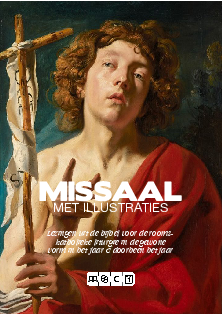
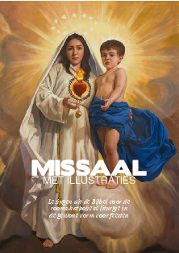
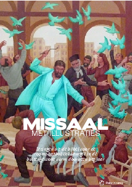
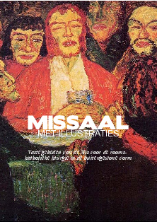
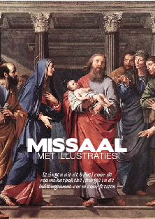

Nu Jezus is gedoopt, laten we de kersttijd weer een jaar achter ons. Heb je voor het nieuwe seizoen al een prentenmissaaltje afgedrukt?

Prentenmissaal met de evangelielezingen voor de tijd doorheen het C-jaar:

<table class="widget"><tbody><tr><td></td><td><a href="http://www.missale.net/print/nl#-scope-lectionary-form-of-season-annum-cycle--c" target="_blank">Missaal voor zon- en feestdagen – Lezingen</a> voor het huidige jaargetijde: Tijd doorheen het jaar, jaar C</td></tr></tbody></table>

 

Prentenmissaal met de vaste gebeden van de H. Mis:

<table class="widget"><tbody><tr><td></td><td><a href="http://www.missale.net/print/nl#-scope-ordomissae-form-of-season-all-cycle-abc" target="_blank">Missaal – Vaste gebeden</a> De vaste gebeden van de katholieke mis die door de gelovigen worden meegebeden, elk met een toepasselijke prent en bijbelcitaat.</td></tr></tbody></table>

 

Prentenmissaal met de evangelielezingen voor de feesten:

<table class="widget"><tbody><tr><td></td><td><a href="http://www.missale.net/print/nl#-scope-lectionary-form-of-season-feasts" target="_blank">Missaal voor heiligenfeesten – Lezingen</a></td></tr></tbody></table>

 

 

Volg je de H. Mis in de buitengewone vorm, heb je meer aan deze bestanden:

Prentenmissaal met de evangelielezingen voor de tijd doorheen het jaar

<table class="widget"><tbody><tr><td></td><td><a href="http://www.missale.net/print/nl#-scope-lectionary-form-eo-season-annum" target="_blank">Missaal voor zon- en feestdagen – Lezingen voor de Tridentijnse ritus</a> voor het huidigejaargetijde:&nbsp;Tijd doorheen het jaar</td></tr></tbody></table>

 

 

Prentenmissaal met de vaste gebeden van de H. Mis

<table class="widget"><tbody><tr><td></td><td><a href="http://www.missale.net/print/nl#-scope-ordomissae-form-eo-season-nativ-season-pascha-season-annum-season-feasts-season-all-cycle-abc-cycle--a-cycle--b-cycle--c" target="_blank">Missaal – Vaste gebeden voor de Tridentijnse ritus (buitengewone vorm van de Latijnse ritus)</a> &nbsp;De vaste gebeden van de katholieke mis die door de gelovigen kunnen worden meegebeden, elk met een toepasselijke prent en bijbelcitaat.</td></tr></tbody></table>

 

 

Prentenmissaal met de evangelielezingen voor de feesten:

<table class="widget"><tbody><tr><td></td><td><a href="http://www.missale.net/print/nl#-scope-lectionary-form-eo-season-feasts" target="_blank">Missaal voor heiligenfeesten – Lezingen voor de Tridentijnse ritus</a></td></tr></tbody></table>

 

 

Dit en nog meer vind je op de  pagina met [KATHOLIEKE BOEKJES OM ZELF AF TE DRUKKEN](/page/katholieke-printerboekjes/).
