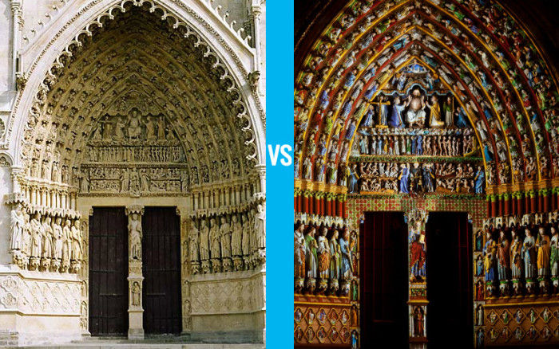

Wie nog nooit een klank-en-lichtshow heeft gezien in een kerk, is nog niet in Frankrijk op reis geweest. Doorgaans niets om over naar huis te schrijven, maar over wat er in Amiens in de kerstvakantie werd vertoond wil ik toch even in mijn blogje schrijven. Ik had het spektakel graag meegemaakt. 

Het procede is redelijk eenvoudig: je neemt foto's van het portaal vanuit verschillende aanzichten, je kleurt die digitaal in, en je projecteert de afbeeldingen met de aangebrachte kleuren terug op het portaal. De positie van de projectoren moet exact overeenkomen met de posities vanwaaruit de foto's werden genomen. Als je die posities goed kiest, moet het effect overweldigend realistisch zijn: de beelden zijn polychroom beschilderd, net zoals dat ---blijkbaar--- oorspronkelijk ook het opzet was!

Zoiets kan je aan de buitenkant van de kerk enkel tijdelijk opzetten, en dan nog uitsluitend 's nachts. Binnenin een kerk zou je kunnen overwegen zo'n opstelling semi-permanent te maken, wat bv. zou kunnen kaderen in een restauratieproject. De interieurs van de kerken waren vroeger immers net even kleurrijk als dit Middeleeuwse portaal. In sommige Franse kerken kan je daar nog de sporen van zien. De meeste Vlaamse kerken zijn netjes witgekalkt, dankzij een drieste restauratiepolitiek die veel weg heeft van een beeldenstorm.

De confrontatie van de twee beelden bovenaan dit bericht doet me ook vragen stellen over ons geloof... Echt geloof is een totaalspektakel, een wonderlijke klank-en-lichtshow waarin je volledig wordt ondergedompeld, een grote liturgie met tierlantijntjes die op elk moment kunnen opduiken uit het niets en in veelheid Gods lof zingen. Dat lijkt me toch hoe een bezoek aan een Middeleeuwse kerk gevoeld moet hebben. Zou dat niet reflecteren hoe een Middeleeuwer zijn geloof beleefde? Kunnen we nog wat van opsteken, in onze kleurloze Kerk die zogenaamd overbodige tierlantijntjes van het geloof nog al te snel met witkalk te lijf gaat.
