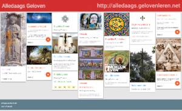
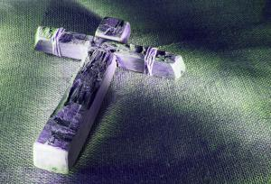
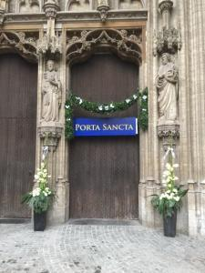
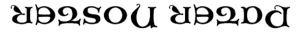
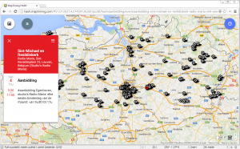
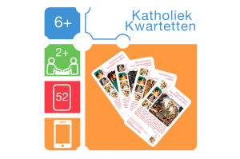
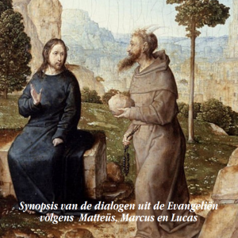
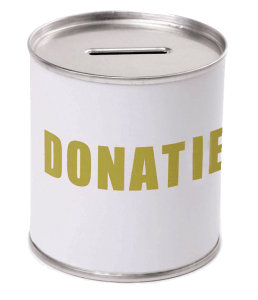

Volgende week begint de vasten weer! Misschien heb je je al voorgenomen wat minder gulzig te zijn met voedsel, drank of andere consumptieartikelen. Maar heb je ook al voornemens om wat minder zuinig te zijn met het voedsel voor je geloof?

Tien voedzame tips:

### 1\. Gebed

Bezoek elke dag [alledaags.gelovenleren.net](http://alledaags.gelovenleren.net/). Je vindt er meer dan twintig kaarten die je elke dag een vers menu met geloofsvoedsel voorschotelen. Kies een kaart die je aanspreekt, en klik verder om een stukje te mediteren, bidden of studeren.

 

### 2\. Bezinning

Schrijf je in op de 40-dagenretraite van [ignatiaansbidden.org](http://www.ignatiaansbidden.org/). Je krijgt elke dag een kleine bezinning op je bord. Wil je het iets klassieker, volg dan het [getijdengebed](http://www.tiltenberg.org/getijdengebed/login.php) (of bid [live](/blog/alledaags-getijdengebed-live/) mee).

### 3\. Verzoening

Maak in je agenda een plaats vrij om te gaan [biechten](/blog/biecht/). Als je niet weet waarheen, zoek de dichtsbijzijnde 'Heilige Deur'. Op Kerknet heb je een [overzicht van de 'jubelkerken' in Vlaanderen](https://www.kerknet.be/kerknet-redactie/artikel/pelgrimeren-naar-barmhartigheid-jubelkerken-eigen-land). In bisdom Antwerpen is die in de kathedraal, en elke dag geopend van twee tot vier in de namiddag, met biechtgelegenheid. Jammer genoeg vind ik nergens een praktisch overzicht van de openingsuren voor andere bisdommen. 

 

### 4\. Onzevader

Bid het [onzevader](/blog/ondersteboven-van-een-vaderons/). Als je de tekst niet gewoon afraffelt, maar elke dag probeert even stil te staan bij een van de verzen en met Jezus, Maria of je favoriete heilige overloopt hoe je dat vers die dag hebt ingevuld (of net niet), doe je precies wat Jezus zijn leerlingen heeft willen leren.

 

### 5\. Aanbidding

Kijk eens of je nergens in je buurt kan deelnemen aan een [aanbiddingsuur](http://adoremus.maptiming.com/). Als je dichter bij Jezus wil komen, is dat echt wel __the place to be.__

 

### 6\. Radio

Zet eens wat vaker een [katholieke radio](http://radio.gelovenleren.net) op, gewoon in de achtergrond. De muziekkeuze zal niet altijd jouw smaak zijn, maar de inhoud kan heel boeiend zijn!

 

### 7\. Spel

Een druilerige namiddag? Knutsel een [katholieke kwartetkaartenset](http://kwartet.gelovenleren.net/) en speel enkele potjes. Met je mobieltje in de hand, krijg je er nog een uitdagende kwis bij!

### 8\. Toneel

Misschien vinden de kinderen [toneel](/page/bijbeltoneel/) wel leuk? De bekoring van Jezus in de woestijn, of het Lijdensverhaal komen in deze periode goed tot hun recht.

### 9\. Geef

Vorige tips kostten je nog geen rooie duit, dus nu is het tijd om iets te doen met het geld dat je reeds hebt uitgespaard op lekkernijen. Toegegeven, je geeft al veel voor het algemeen welzijn via de belastingen en misschien doneer je ook al aan je parochie of bisdom, maar wist je dat niet alle organisaties op dat geld beroep kunnen doen? Soms moet je gewoon heel specifiek een donatie maken voor iets wat je belangrijk vindt. Een [katholieke krant](http://www.arnulfus.nl/), een [katholieke](http://www.radiomaria.be/giften/) [radio](http://www.radiomaria.nl/wp/?page_id=145), een [katholieke school](http://www.sint-ignatius.be/steunen/), een [katholieke documentatiewebsite](http://www.rkdocumenten.nl/rkdocs/index.php?page=3), en nog [zoveel andere](http://www.rkgoededoelen.nl/)…

### 10\. K.I.S.S.

Tiende en laatste tip: _keep it simple, stupid!_ \---of: wees nederig! Als je bovenstaande opdrachten allemaal goed onder de knie hebt, dan pas kan je beginnen met "het redden van de wereld" en armoede en onrecht verdrijven, of het klimaat regelen. Ook onze lieve Heer heeft immers armoede en onrecht niet uit de wereld geholpen, of het klimaat geregeld. Vind je dat te ambitieus, hou het dan bij een glimlach, een vriendelijk woord, eens 'ja' zeggen in plaats van 'nee', of fluit een deuntje.
