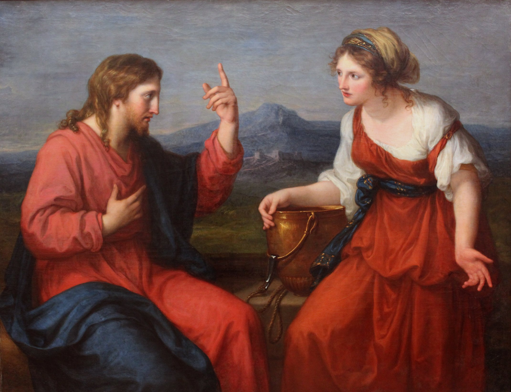
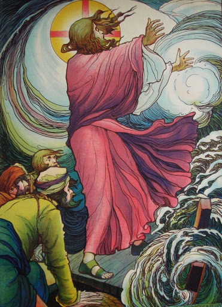
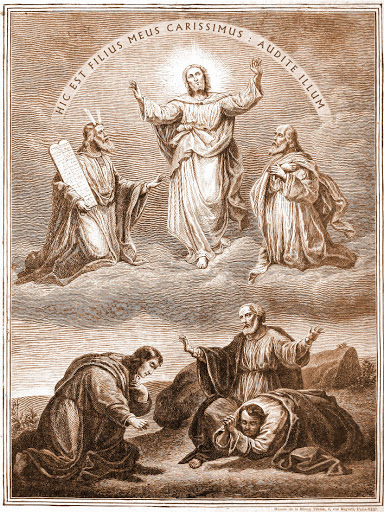
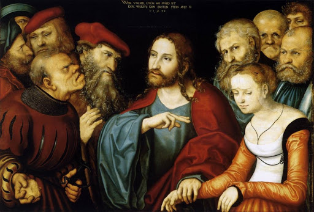
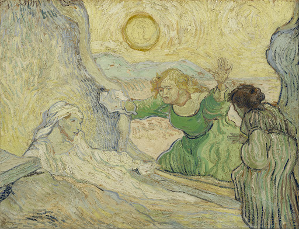
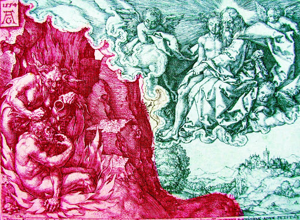

Voorlezen uit de Bijbel aan kinderen kan dankbaar zijn, maar je moet het een beetje op hun niveau brengen. Niet dat je teksten en verhalen moet vereenvoudigen, of er 'leuke' dingen bij moet fantaseren, tot er niets meer van overschiet, want dat je een kind niet zou mogen uitdagen, is een absurd idee. Als er een moeilijk woord of een rare wending in het verhaal komt, dan leg je het gewoon uit, toch? Je kind kan er wat van opsteken, en jij ook! En dat je sommige dingen niet kan uitleggen, dat hoort er ook bij. Mysterie, weet je wel? Kinderen kunnen daar nogal goed mee overweg.

Een verhaal op het niveau van een kind brengen, betekent de inleving verhogen. Dat kan door te lezen met voldoende intonatie, maar beter nog, door een rollenspel van te maken. Grote stukken van het Evangelie zijn uitgeschreven dialogen. Daar maak je in een wip een toneelstukje van. Het is niet de bedoeling dat de stukken gebracht worden als een toneel, helemaal van buiten gestudeerd en voor een publiek. Het is al heel bruikbaar als je gewoon de rollen verdeelt en iedereen zijn stuk laat lezen, eventueel met een beetje kostumering en enkele rekwisieten, 's avonds thuis voor het slapengaan, in plaats van een sprookje, of in de klas of tijdens de catechese.

Ik heb weer enkele nieuwe, kortere bijbelverhalen uitgeschreven in toneelvorm, volledig getrouw aan de oorspronkelijke tekst. Er is gewerkt aan een synopsis van de verhalen die in verschillende evangelien met telkens andere details verteld worden. Zo krijg je een nieuwe versie van het verhaal met alle details die de verschillende evangelisten konden oprakelen. Ik heb dat geleerd van paus Benedictus XVI, die deed dat ook in zijn Jezustrilogie. Ik weet wel dat het haar van historisch-kritische exegeten nu overeind gaat staan, maar dat trek ik me niet aan.

De korte toneeltjes zijn kant en klaar te downloaden om af te drukken op A4 of A3 (boekvorm) en gegarandeerd 100% puur natuur, zonder simplismes of fantasieën! Veel plezier ermee!

Op de [pagina met bijbeltoneel](/page/bijbeltoneel/), zijn volgende publicaties toegevoegd:

<table class="widget"><tbody><tr><td></td><td><a href="https://storage.googleapis.com/geloven-leren/toneel/Jezus%20en%20de%20samaritaanse%20vrouw-a3.pdf" target="_blank">Download Jezus en de Samaritaanse vrouw (Johannes, hoofdstuk 4) in toneelvorm</a> (als je kan afdrukken op A3, download anders <a href="https://storage.googleapis.com/geloven-leren/toneel/Jezus%20en%20de%20samaritaanse%20vrouw.pdf" target="_blank">deze PDF</a> voor losse bladen op A4).</td></tr><tr><td></td><td><a href="https://storage.googleapis.com/geloven-leren/toneel/Storm%20op%20het%20meer%20en%20genezing%20van%20een%20bezetene-a3.pdf" target="_blank">Download Storm op het meer en genezing van een bezetene (Matteüs 8, Marcus 4 en 5 en Lucas 8) in toneelvorm</a> (als je kan afdrukken op A3, download anders <a href="https://storage.googleapis.com/geloven-leren/toneel/Storm%20op%20het%20meer%20en%20genezing%20van%20een%20bezetene.pdf" target="_blank">deze PDF</a> voor losse bladen op A4).</td></tr><tr><td></td><td><a href="https://storage.googleapis.com/geloven-leren/toneel/Het%20lijden%20van%20de%20Mensenzoon%20en%20zijn%20volgelingen%20en%20de%20Gedaanteverandering-a3.pdf" target="_blank">Download Het lijden van de Mensenzoon en zijn volgelingen en de Gedaanteverandering (Matteüs 16 en 17, Marcus 8 en 9 en Lucas 9) in toneelvorm</a> (als je kan afdrukken op A3, download anders <a href="https://storage.googleapis.com/geloven-leren/toneel/Het%20lijden%20van%20de%20Mensenzoon%20en%20zijn%20volgelingen%20en%20de%20Gedaanteverandering.pdf" target="_blank">deze PDF</a> voor losse bladen op A4).</td></tr><tr><td></td><td><a href="https://storage.googleapis.com/geloven-leren/toneel/Jezus%20en%20de%20overspelige%20vrouw.pdf" target="_blank">Download Jezus en de overspelige vrouw (Johannes, hoofdstuk 8) in toneelvorm</a>.</td></tr><tr><td></td><td><a href="https://storage.googleapis.com/geloven-leren/toneel/De%20opwekking%20van%20Lazarus-a3.pdf" target="_blank">Download De opwekking van Lazarus (Johannes, hoofdstuk 11) in toneelvorm</a> (als je kan afdrukken op A3, download anders <a href="https://storage.googleapis.com/geloven-leren/toneel/De%20opwekking%20van%20Lazarus.pdf" target="_blank">deze PDF</a> voor losse bladen op A4).</td></tr><tr><td></td><td><a href="https://storage.googleapis.com/geloven-leren/toneel/Parabel%20van%20Lazarus%20en%20de%20rijke%20man.pdf" target="_blank">Download de Parabel van Lazarus en de rijke man (Lucas, hoofdstuk 16) in toneelvorm</a>.</td></tr></tbody></table>
