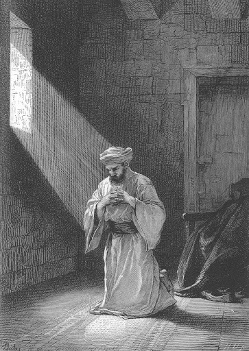

Op Kerknet las ik het korte verslag van een homilie van paus Franciscus, getiteld "[Het christendom is een godsdienst van de daad, niet van het woord](https://www.kerknet.be/kerknet-redactie/nieuws/het-christendom-een-godsdienst-van-de-daad-niet-van-het-woord)". Die titel is een beetje gechargeerd, want de aanklacht gaat over 'lege' woorden, niet over 'het woord' (zeker niet over 'het Woord' met hoofdletter, want dat is Jezus zelf). Toch drukt hij een idee uit dat me verontrust.

Er heerst immers een misverstand over de verhouding tussen woord en daad in het geloofsleven, en die gaat terug op de strenge woorden die Jezus richt tot de farizeeën als hij hen uitscheldt voor ['witgekalkte graven'](/blog/de-ware-eredienst/), omdat ze anderen vrome regels opleggen die ze zelf niet volgen, of erger nog, die ze misbruiken om er zelf beter van te worden. Oppervlakkig lijkt het alsof Jezus ten strijde trekt tegen de religieuze leefregels, maar niets is minder waar! Jezus' toorn richt zich op de _leegte_ van de uitvoering van de wet,  [niet op de wet zelf](/blog/godsdienstige-tafelmanieren/), waaraan Hij geen jota verandert, maar die Hij 'vervult'; lees: Hij maakt 'vol' wat 'leeg' was, de praktijk krijgt weer inhoud.

 Als je bidt, ga dan je binnenkamer in, doe de deur dicht.

Waarmee moet die praktijk 'gevuld' worden? Met Christus zelf, natuurlijk! Met zijn genade, verkregen door gebed en door de sacramenten. Dat geldt voor onze dienst aan God,  maar evenzo voor onze dienst jegens onze naaste. Goede werken dreigen anders vervulling te vinden in [eigenwaan en hoogmoed](https://nl.wikipedia.org/wiki/Pelagianisme), alsof de verdienste volledig ons toekomt en we Christus' genade en verlossende werk van het Kruis helemaal niet nodig hebben.

We moeten zorgen dat onze goede werken 'vervuld' blijven van een sterk, uitgesproken en in gemeenschap beleefd geloof, vervuld van 'het woord'. Dat is de juiste verhouding tussen 'woord' en 'daad' in de Kerk van Christus. We moeten voorzichtig zijn als we merken dat de 'woorden' van ons geloof, de sacramenten, de bijbel, de catechese, naar de achtergrond verzinken, want dan lopen we het risico dat onze 'goede werken' ook zo'n witgekalkte graven worden.
