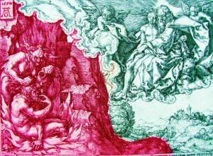

De parabel van Lazarus en de rijke man

_**uit het evangelie volgens Lucas, hoofdstuk 16 zesentwintigste zondag door het jaar, jaar C**_

<table width="627" cellspacing="0" cellpadding="7"><colgroup><col width="119"> <col width="346"> <col width="120"></colgroup><tbody><tr><td valign="top" bgcolor="#ffffff" width="119">
3
</td><td valign="top" bgcolor="#ffffff" width="346">
Jezus (verteller), rijke man, Abraham
</td><td valign="bottom" bgcolor="#ffffff" width="120"></td></tr><tr><td colspan="2" valign="top" bgcolor="#ffffff" width="479">&nbsp;</td><td valign="bottom" bgcolor="#ffffff" width="120">
Parabel van Lazarus en de rijke man (Heinrich Aldegrever, 1554)
</td></tr><tr><td valign="top" bgcolor="#ffffff" width="119">
<b>Verteller</b>
</td><td valign="top" bgcolor="#ffffff" width="346">
Er was een rijk man, die gekleed ging in purper en het fijnste linnen, en elke dag uitbundig feestvierde. Aan zijn poort lag een zekere Lazarus; hij was arm en zat onder de zweren. Hij had graag zijn honger gestild met wat er van de tafel van de rijke op de grond viel, maar nee, de honden kwamen en likten aan zijn zweren. Toen kwam de arme te sterven; de engelen droegen hem in de schoot van Abraham. Ook de rijke stierf, en werd begraven. In het dodenrijk sloeg hij gekweld door pijn zijn ogen op en zag van verre Abraham met Lazarus in zijn schoot.
</td><td valign="bottom" bgcolor="#ffffff" width="120">
Lc 16:19-23
</td></tr><tr><td valign="top" bgcolor="#ffffff" width="119"></td><td valign="top" bgcolor="#ffffff" width="346">
Hemel, met Abraham en Lazarus, en Hel, met de rijke man
</td><td valign="bottom" bgcolor="#ffffff" width="120"></td></tr><tr><td valign="top" bgcolor="#ffffff" width="119">
<b>Rijke man</b>
</td><td valign="top" bgcolor="#ffffff" width="346">
Vader Abraham, heb medelijden met me; stuur Lazarus om de toppen van zijn vingers nat te maken met water, en er mijn tong mee te verkoelen, want ik lijd hevig in dit vuur.
</td><td valign="bottom" bgcolor="#ffffff" width="120">
Lc 16:24
</td></tr><tr><td valign="top" bgcolor="#ffffff" width="119">
<b>Abraham</b>
</td><td valign="top" bgcolor="#ffffff" width="346">
Kind, vergeet niet dat jij het heel je leven goed hebt gehad en Lazarus altijd slecht; nu wordt hij hier getroost, en jij lijdt pijn. Bovendien, er gaapt tussen ons en jullie een diepe kloof; al zou iemand van hier naar jullie willen oversteken, hij zou het niet kunnen; evenmin kan iemand van daar naar ons komen.
</td><td valign="bottom" bgcolor="#ffffff" width="120">
Lc 16:25-26
</td></tr><tr><td valign="top" bgcolor="#ffffff" width="119">
<b>Rijke man</b>
</td><td valign="top" bgcolor="#ffffff" width="346">
Dan, vader, vraag ik u hem naar mijn ouderlijk huis te sturen, want ik heb nog vijf broers. Laat hij hen gaan waarschuwen, zodat zij niet eveneens terechtkomen in dit oord van pijn.
</td><td valign="bottom" bgcolor="#ffffff" width="120">
Lc 16:27-28
</td></tr><tr><td valign="top" bgcolor="#ffffff" width="119">
<b>Abraham</b>
</td><td valign="top" bgcolor="#ffffff" width="346">
Ze hebben Mozes en de Profeten; daar moeten ze naar luisteren.
</td><td valign="bottom" bgcolor="#ffffff" width="120">
Lc 16:29
</td></tr><tr><td valign="top" bgcolor="#ffffff" width="119">
<b>Rijke man</b>
</td><td valign="top" bgcolor="#ffffff" width="346">
Nee, vader Abraham, als iemand van de doden naar hen toe komt, dan zullen zij zich bekeren.
</td><td valign="bottom" bgcolor="#ffffff" width="120">
Lc 16:30
</td></tr><tr><td valign="top" bgcolor="#ffffff" width="119">
<b>Abraham</b>
</td><td valign="top" bgcolor="#ffffff" width="346">
Als ze niet naar Mozes en de Profeten luisteren, dan zullen ze zich ook niet laten overtuigen als iemand uit de doden opstaat.
</td><td valign="bottom" bgcolor="#ffffff" width="120">
Lc 16:31
</td></tr></tbody></table>

# [MEER BIJBELTONEEL](/bijbeltoneel/ "Bijbeltoneel")

A.M.D.G. www.gelovenleren.net
