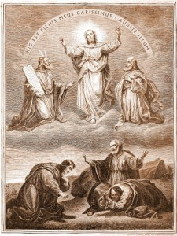

De Gedaanteverandering

_**Synopsis van de evangeliën volgens Matteüs 16 en 17, Marcus 8 en 9 en Lucas 9**_

<table width="627" cellspacing="0" cellpadding="7"><colgroup><col width="119"> <col width="346"> <col width="120"></colgroup><tbody><tr><td valign="top" bgcolor="#ffffff" width="119">
4 spelers met tekst
</td><td valign="top" bgcolor="#ffffff" width="346">
Verteller, leerlingen, Petrus, stem van God
</td><td valign="bottom" bgcolor="#ffffff" width="120"></td></tr><tr><td valign="top" bgcolor="#ffffff" width="119">
2 spelers zonder tekst
</td><td valign="top" bgcolor="#ffffff" width="346">
Mozes en Elia
</td><td valign="bottom" bgcolor="#ffffff" width="120"></td></tr><tr><td valign="top" bgcolor="#ffffff" width="119"></td><td valign="top" bgcolor="#ffffff" width="346">
Jezus met de leerlingen onderweg
</td><td valign="bottom" bgcolor="#ffffff" width="120"></td></tr><tr><td valign="top" bgcolor="#ffffff" width="119">
<b>Jezus</b>
</td><td valign="top" bgcolor="#ffffff" width="346">
Wie zeggen de mensen dat Ik ben?
</td><td valign="bottom" bgcolor="#ffffff" width="120">
Mc 8:27
</td></tr><tr><td valign="top" bgcolor="#ffffff" width="119">
<b>Leerlingen</b>
</td><td valign="top" bgcolor="#ffffff" width="346">
Volgens sommigen Johannes de Doper, volgens anderen Elia, volgens weer anderen Jeremia of een van de profeten.
</td><td valign="bottom" bgcolor="#ffffff" width="120">
Mt 16:14
</td></tr><tr><td valign="top" bgcolor="#ffffff" width="119">
<b>Jezus</b>
</td><td valign="top" bgcolor="#ffffff" width="346">
En jullie, wie ben Ik volgens jullie?
</td><td valign="bottom" bgcolor="#ffffff" width="120">
Mt 16:15
</td></tr><tr><td valign="top" bgcolor="#ffffff" width="119">
<b>Petrus</b>
</td><td valign="top" bgcolor="#ffffff" width="346">
U bent de Messias, de Zoon van de levende God.
</td><td valign="bottom" bgcolor="#ffffff" width="120">
Mt 16:16
</td></tr><tr><td valign="top" bgcolor="#ffffff" width="119">
<b>Jezus</b>
</td><td valign="top" bgcolor="#ffffff" width="346">
Gelukkig ben jij, Simon Barjona; niet vlees en bloed hebben jou dat onthuld, maar mijn Vader in de hemel. Ik zeg jou: jij bent Petrus; op die steenrots zal Ik mijn kerk bouwen, en de poorten van het dodenrijk zullen haar er niet onder krijgen. Ik zal je de sleutels geven van het koninkrijk der hemelen, en wat je op aarde bindt zal ook in de hemel gebonden zijn, en wat je op aarde ontbindt zal ook in de hemel ontbonden zijn.
</td><td valign="bottom" bgcolor="#ffffff" width="120">
Mt 16:17-19
</td></tr><tr><td colspan="2" valign="top" bgcolor="#ffffff" width="479"></td><td valign="bottom" bgcolor="#ffffff" width="120">
Pope Franics greets pilgrims in St Peters Square before the Wednesday general audience on Oct 29 2014 (Daniel Ibez, 2014, © Daniel Ibez)
</td></tr><tr><td valign="top" bgcolor="#ffffff" width="119">
<b>Jezus (tot de leerlingen)</b>
</td><td valign="top" bgcolor="#ffffff" width="346">
Jullie mogen niemand zeggen dat ik de Messias ben! Ik moet naar Jeruzalem gaan en zal veel moeten lijden van de oudsten, hogepriesters en schriftgeleerden, ik zal ter dood gebracht worden en op de derde dag worden opgewekt.
</td><td valign="bottom" bgcolor="#ffffff" width="120">
Mt 16:20-21
</td></tr><tr><td valign="top" bgcolor="#ffffff" width="119">
<b>Petrus (tot Jezus apart)</b>
</td><td valign="top" bgcolor="#ffffff" width="346">
God beware U, Heer! Dat mag U niet overkomen.
</td><td valign="bottom" bgcolor="#ffffff" width="120">
Mt 16:22
</td></tr><tr><td valign="top" bgcolor="#ffffff" width="119">
<b>Jezus</b>
</td><td valign="top" bgcolor="#ffffff" width="346">
Weg daar, achter Mij, satan. Je bent een struikelblok voor Mij, want jouw gedachten zijn niet Gods gedachten, maar die van mensen.
</td><td valign="bottom" bgcolor="#ffffff" width="120">
Mt 16:23
</td></tr><tr><td valign="top" bgcolor="#ffffff" width="119">
<b>Jezus (tot alle leerlingen)</b>
</td><td valign="top" bgcolor="#ffffff" width="346">
Als iemand achter Mij aan wil komen, laat hij dan met zichzelf breken, zijn kruis opnemen en Mij volgen. Want wie zijn leven wil redden, zal het verliezen. Wie zijn leven verliest vanwege Mij en de goede boodschap, zal het redden. Want wat baat het een mens heel de wereld te winnen maar zichzelf schade toe te brengen? Want wat kan een mens geven in ruil voor zichzelf? Want wie zich schaamt voor Mij en mijn woorden te midden van deze overspelige en afvallige generatie, over hem zal ook de Mensenzoon zich schamen wanneer Hij, bekleed met de heerlijkheid van zijn Vader, komt met de heilige engelen om iedereen loon naar werken te geven. Ik verzeker u, er zijn er hier die de dood niet zullen proeven voordat ze hebben gezien dat Gods koninkrijk met kracht gekomen is.
</td><td valign="bottom" bgcolor="#ffffff" width="120">
Mc 8:34-38

Mt 16:27

Mc 9:1
</td></tr><tr><td valign="top" bgcolor="#ffffff" width="119"></td><td valign="top" bgcolor="#ffffff" width="346">
Jezus met Petrus, Johannes en Jakobus bij de berg
</td><td valign="bottom" bgcolor="#ffffff" width="120"></td></tr><tr><td valign="top" bgcolor="#ffffff" width="119">
<b>Verteller</b>
</td><td valign="top" bgcolor="#ffffff" width="346">
Ongeveer een week na deze woorden nam Hij Petrus, Johannes en Jakobus mee en ging Hij de berg op om te bidden. Terwijl Hij aan het bidden was, veranderde Hij van uiterlijk en werden zijn kleren stralend wit. Ineens waren er twee mannen met Hem in gesprek. Het waren Mozes en Elia, die in heerlijkheid verschenen en over zijn heengaan spraken, de voleinding van zijn leven in Jeruzalem. Petrus en de anderen waren overmand door slaap; toen ze wakker werden, zagen ze zijn heerlijkheid en de twee mannen die bij Hem stonden.
</td><td valign="bottom" bgcolor="#ffffff" width="120">
Lc 9:28-32
</td></tr><tr><td valign="top" bgcolor="#ffffff" width="119">
<b>Petrus</b>
</td><td valign="top" bgcolor="#ffffff" width="346">
Meester, het is maar goed dat wij hier zijn; laten wij drie hutten maken, een voor U, een voor Mozes, en een voor Elia.
</td><td valign="bottom" bgcolor="#ffffff" width="120">
Lc 9:33
</td></tr><tr><td valign="top" bgcolor="#ffffff" width="119">
<b>Verteller</b>
</td><td valign="top" bgcolor="#ffffff" width="346">
Hij was nog niet uitgesproken of daar kwam een lichtende wolk die hen overdekte.
</td><td valign="bottom" bgcolor="#ffffff" width="120">
Mt 9:5
</td></tr><tr><td valign="top" bgcolor="#ffffff" width="119">
<b>Stem van God</b>
</td><td valign="top" bgcolor="#ffffff" width="346">
Dit is mijn geliefde Zoon, in wie Ik vreugde vind. Luister naar Hem.
</td><td valign="bottom" bgcolor="#ffffff" width="120">
Mt 9:5
</td></tr><tr><td colspan="2" valign="top" bgcolor="#ffffff" width="479"></td><td valign="bottom" bgcolor="#ffffff" width="120">
The transfiguration (1891, Le Grand Catéchisme en Images)
</td></tr><tr><td valign="top" bgcolor="#ffffff" width="119">
<b>Verteller</b>
</td><td valign="top" bgcolor="#ffffff" width="346">
Toen de leerlingen dat hoorden, wierpen ze zich op de grond en werden ze vreselijk bang. Jezus kwam naar hen toe en raakte hen aan.
</td><td valign="bottom" bgcolor="#ffffff" width="120">
Mt 9:6-7
</td></tr><tr><td valign="top" bgcolor="#ffffff" width="119">
<b>Jezus</b>
</td><td valign="top" bgcolor="#ffffff" width="346">
Sta op en wees niet bang.
</td><td valign="bottom" bgcolor="#ffffff" width="120">
Mt 9:7
</td></tr><tr><td valign="top" bgcolor="#ffffff" width="119">
<b>Verteller</b>
</td><td valign="top" bgcolor="#ffffff" width="346">
Toen ze hun ogen opsloegen, zagen ze niemand meer dan Jezus alleen en daalden ze van de berg af.
</td><td valign="bottom" bgcolor="#ffffff" width="120">
Mt 9:8-9
</td></tr><tr><td valign="top" bgcolor="#ffffff" width="119">
<b>Jezus</b>
</td><td valign="top" bgcolor="#ffffff" width="346">
Vertel niemand van dit visioen voordat de Mensenzoon uit de doden is opgewekt.
</td><td valign="bottom" bgcolor="#ffffff" width="120">
Mt 9:9
</td></tr><tr><td valign="top" bgcolor="#ffffff" width="119">
<b>Leerlingen (tot mekaar)</b>
</td><td valign="top" bgcolor="#ffffff" width="346">
Waarop zou dat opwekken uit de doden slaan?
</td><td valign="bottom" bgcolor="#ffffff" width="120">
Mc 9:10
</td></tr><tr><td valign="top" bgcolor="#ffffff" width="119">
<b>Leerlingen (tot Jezus)</b>
</td><td valign="top" bgcolor="#ffffff" width="346">
Waarom zeggen de schriftgeleerden dat Elia eerst moet komen?
</td><td valign="bottom" bgcolor="#ffffff" width="120">
Mc 9:11
</td></tr><tr><td valign="top" bgcolor="#ffffff" width="119">
<b>Jezus</b>
</td><td valign="top" bgcolor="#ffffff" width="346">
Elia komt eerst en herstelt alles. Maar hoe kan over de Mensenzoon geschreven staan dat Hij veel lijden moet en miskend moet worden? Ik zeg jullie: Elia is al gekomen, en ze hebben hem niet herkend; ze hebben met hem gedaan wat ze wilden. Zo zal ook de Mensenzoon door hun toedoen moeten lijden.
</td><td valign="bottom" bgcolor="#ffffff" width="120">
Mc 9:12

Mt 9:12
</td></tr><tr><td valign="top" bgcolor="#ffffff" width="119">
<b>Leerlingen</b>
</td><td valign="top" bgcolor="#ffffff" width="346">
Hij heeft het over Johannes de Doper!
</td><td valign="bottom" bgcolor="#ffffff" width="120">
Mt 9:13
</td></tr></tbody></table>

A.M.D.G. www.gelovenleren.net

# [MEER BIJBELTONEEL](/bijbeltoneel/ "Bijbeltoneel")
