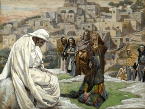
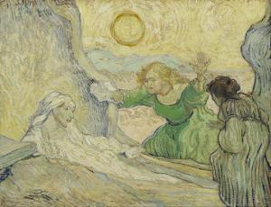

De opwekking van Lazarus

_**uit het evangelie volgens Johannes, hoofdstuk 11 vijfde zondag van de Veertigdagentijd, jaar A**_

<table width="627" cellspacing="0" cellpadding="7"><colgroup><col width="119"> <col width="346"> <col width="120"></colgroup><tbody><tr><td valign="top" bgcolor="#ffffff" width="119">
6 spelers met tekst
</td><td valign="top" bgcolor="#ffffff" width="346">
Verteller, Martha, Maria, Jezus, leerlingen, joden
</td><td valign="bottom" bgcolor="#ffffff" width="120"></td></tr><tr><td valign="top" bgcolor="#ffffff" width="119">
1 speler zonder tekst
</td><td valign="top" bgcolor="#ffffff" width="346">
Lazarus
</td><td valign="bottom" bgcolor="#ffffff" width="120"></td></tr><tr><td valign="top" bgcolor="#ffffff" width="119">
<b>Verteller</b>
</td><td valign="top" bgcolor="#ffffff" width="346">
Er was iemand ziek, een zekere Lazarus uit Betanië, het dorp van Maria en haar zuster, Marta. Maria is de vrouw die de Heer met balsem zalfde en zijn voeten met haar haren afdroogde; de zieke Lazarus was haar broer. De zusters stuurden Jezus een boodschap.
</td><td valign="bottom" bgcolor="#ffffff" width="120">
Joh 11:1-3
</td></tr><tr><td valign="top" bgcolor="#ffffff" width="119">
<b>Martha en Maria</b>
</td><td valign="top" bgcolor="#ffffff" width="346">
<i>Heer, hier is iemand ziek, iemand van wie U houdt.</i>
</td><td valign="bottom" bgcolor="#ffffff" width="120">
Joh 11:3
</td></tr><tr><td valign="top" bgcolor="#ffffff" width="119">
<b>Jezus</b>
</td><td valign="top" bgcolor="#ffffff" width="346">
Deze ziekte loopt niet uit op de dood, maar op de verheerlijking van God, want de Zoon van God moet erdoor verheerlijkt worden.
</td><td valign="bottom" bgcolor="#ffffff" width="120">
Joh 11:4
</td></tr><tr><td valign="top" bgcolor="#ffffff" width="119">
<b>Verteller</b>
</td><td valign="top" bgcolor="#ffffff" width="346">
Jezus hield veel van Marta, van haar zuster en van Lazarus. Hij hoorde dus van zijn ziekte; toch bleef Hij nog twee dagen waar Hij was.
</td><td valign="bottom" bgcolor="#ffffff" width="120">
Joh 11:5-6
</td></tr><tr><td valign="top" bgcolor="#ffffff" width="119">
<b>Jezus</b>
</td><td valign="top" bgcolor="#ffffff" width="346">
Kom, we gaan weer naar Judea.
</td><td valign="bottom" bgcolor="#ffffff" width="120">
Joh 11:7
</td></tr><tr><td valign="top" bgcolor="#ffffff" width="119">
<b>Leerlingen</b>
</td><td valign="top" bgcolor="#ffffff" width="346">
Maar rabbi, onlangs nog probeerden de Joden U te stenigen, wilt U er nu alweer heen?
</td><td valign="bottom" bgcolor="#ffffff" width="120">
Joh 11:8
</td></tr><tr><td valign="top" bgcolor="#ffffff" width="119">
<b>Jezus</b>
</td><td valign="top" bgcolor="#ffffff" width="346">
Een dag duurt toch twaalf uren? Zolang het dag is kan men zijn weg gaan zonder te struikelen, omdat men het licht van deze wereld ziet. Maar als men ’s nachts zijn weg gaat zal men struikelen, omdat men dan het licht moet missen. Onze vriend Lazarus is ingeslapen, maar Ik ga erheen om hem wakker te maken.
</td><td valign="bottom" bgcolor="#ffffff" width="120">
Joh 11:9-11
</td></tr><tr><td valign="top" bgcolor="#ffffff" width="119">
<b>Leerlingen</b>
</td><td valign="top" bgcolor="#ffffff" width="346">
Als hij slaapt, Heer, dan komt hij er weer bovenop.
</td><td valign="bottom" bgcolor="#ffffff" width="120">
Joh 11:12
</td></tr><tr><td valign="top" bgcolor="#ffffff" width="119">
<b>Jezus</b>
</td><td valign="top" bgcolor="#ffffff" width="346">
Lazarus is gestorven. Toch ben Ik blij voor jullie, met het oog op jullie geloof, dat Ik niet ter plaatse was. Maar kom, laten we er nu heen gaan.
</td><td valign="bottom" bgcolor="#ffffff" width="120">
Joh 11:14-15
</td></tr><tr><td valign="top" bgcolor="#ffffff" width="119">
<b>Leerlingen</b>
</td><td valign="top" bgcolor="#ffffff" width="346">
Laten wij ook maar gaan, dan kunnen we samen met Hem sterven.
</td><td valign="bottom" bgcolor="#ffffff" width="120">
Joh 11:16
</td></tr><tr><td valign="top" bgcolor="#ffffff" width="119"></td><td valign="top" bgcolor="#ffffff" width="346">
In Betanië
</td><td valign="bottom" bgcolor="#ffffff" width="120"></td></tr><tr><td valign="top" bgcolor="#ffffff" width="119">
<b>Verteller</b>
</td><td valign="top" bgcolor="#ffffff" width="346">
Bij de aankomst van Jezus bleek Lazarus al vier dagen in het graf te liggen. Nu lag Betanië dichtbij Jeruzalem, op een afstand van ongeveer vijftien stadiën. Heel wat Joden waren dan ook naar Marta en Maria toe gekomen om hun medeleven te betuigen met het verlies van hun broer. Marta, die gehoord had dat Jezus op komst was, was Hem tegemoet gegaan; Maria was thuisgebleven.
</td><td valign="bottom" bgcolor="#ffffff" width="120">
Joh 11:17-20
</td></tr><tr><td valign="top" bgcolor="#ffffff" width="119">
<b>Marta</b>
</td><td valign="top" bgcolor="#ffffff" width="346">
Heer, als U hier geweest was, zou mijn broer nooit gestorven zijn. Maar ik weet zeker dat U ook nu nog alles aan God kunt vragen en dat Hij het U zal geven.
</td><td valign="bottom" bgcolor="#ffffff" width="120">
Joh 11:21-22
</td></tr><tr><td valign="top" bgcolor="#ffffff" width="119">
<b>Jezus</b>
</td><td valign="top" bgcolor="#ffffff" width="346">
Je broer zal opstaan.
</td><td valign="bottom" bgcolor="#ffffff" width="120">
Joh 11:23
</td></tr><tr><td valign="top" bgcolor="#ffffff" width="119">
<b>Marta</b>
</td><td valign="top" bgcolor="#ffffff" width="346">
Dat weet ik, hij zal opstaan bij de opstanding op de laatste dag.
</td><td valign="bottom" bgcolor="#ffffff" width="120">
Joh 11:24
</td></tr><tr><td valign="top" bgcolor="#ffffff" width="119">
<b>Jezus</b>
</td><td valign="top" bgcolor="#ffffff" width="346">
Ik ben de opstanding en het leven. Wie in Mij gelooft mag dan wel sterven, toch zal hij leven; en iedereen die leeft en in Mij gelooft, zal in eeuwigheid niet sterven. Geloof je dat?
</td><td valign="bottom" bgcolor="#ffffff" width="120">
Joh 11:25-26
</td></tr><tr><td valign="top" bgcolor="#ffffff" width="119">
<b>Marta</b>
</td><td valign="top" bgcolor="#ffffff" width="346">
Ja Heer, ik geloof vast dat U de Messias bent, de Zoon van God, degene die in de wereld komen zou.’
</td><td valign="bottom" bgcolor="#ffffff" width="120">
Joh 11:27
</td></tr><tr><td valign="top" bgcolor="#ffffff" width="119"></td><td valign="top" bgcolor="#ffffff" width="346">
In het huis van Lazarus
</td><td valign="bottom" bgcolor="#ffffff" width="120"></td></tr><tr><td valign="top" bgcolor="#ffffff" width="119">
<b>Marta (tot Maria)</b>
</td><td valign="top" bgcolor="#ffffff" width="346">
De meester is er. Hij laat je roepen.
</td><td valign="bottom" bgcolor="#ffffff" width="120">
Joh 11:28
</td></tr><tr><td valign="top" bgcolor="#ffffff" width="119">
<b>Verteller</b>
</td><td valign="top" bgcolor="#ffffff" width="346">
Zodra ze het hoorde, ging ze op weg, naar Hem toe. De Joden die bij Maria in huis waren om hun medeleven te betuigen, zagen haar het huis uit snellen en gingen haar achterna, in de veronderstelling dat ze bij het graf wilde gaan treuren.
</td><td valign="bottom" bgcolor="#ffffff" width="120">
Joh 11:29-32
</td></tr><tr><td valign="top" bgcolor="#ffffff" width="119"></td><td valign="top" bgcolor="#ffffff" width="346">
Weer op de plaats waar Marta Hem ontmoet had
</td><td valign="bottom" bgcolor="#ffffff" width="120"></td></tr><tr><td valign="top" bgcolor="#ffffff" width="119">
<b>Verteller</b>
</td><td valign="top" bgcolor="#ffffff" width="346">
Maria wierp zich, zodra ze Jezus zag, voor Hem neer.
</td><td valign="bottom" bgcolor="#ffffff" width="120"></td></tr><tr><td valign="top" bgcolor="#ffffff" width="119">
<b>Maria</b>
</td><td valign="top" bgcolor="#ffffff" width="346">
Heer, als U hier geweest was, zou mijn broer nooit gestorven zijn.
</td><td valign="bottom" bgcolor="#ffffff" width="120">
Joh 11:32
</td></tr><tr><td valign="top" bgcolor="#ffffff" width="119">
<b>Jezus (in toorn tot de weekla­gen­de joden)</b>
</td><td valign="top" bgcolor="#ffffff" width="346">
Waar hebt u hem neergelegd?
</td><td valign="bottom" bgcolor="#ffffff" width="120">
Joh 11:33-34
</td></tr><tr><td valign="top" bgcolor="#ffffff" width="119">
<b>Joden</b>
</td><td valign="top" bgcolor="#ffffff" width="346">
Komt u maar kijken, Heer.
</td><td valign="bottom" bgcolor="#ffffff" width="120">
Joh 11:34
</td></tr><tr><td valign="top" bgcolor="#ffffff" width="119">
<b>Jezus (huilend)</b>
</td><td valign="top" bgcolor="#ffffff" width="346">

</td><td valign="bottom" bgcolor="#ffffff" width="120">
Joh 11:35

Jésus pleura (James Tissot, 1894, Brooklyn Museum)
</td></tr><tr><td valign="top" bgcolor="#ffffff" width="119">
<b>Joden</b>
</td><td valign="top" bgcolor="#ffffff" width="346">
Hij moet wel veel van hem gehouden hebben! Maar had Hij dan niet kunnen zorgen dat hij niet doodging? Hij heeft toch ook de ogen van de blinde geopend?
</td><td valign="bottom" bgcolor="#ffffff" width="120">
Joh 11:36-37
</td></tr><tr><td valign="top" bgcolor="#ffffff" width="119"></td><td valign="top" bgcolor="#ffffff" width="346">
Bij het graf
</td><td valign="bottom" bgcolor="#ffffff" width="120"></td></tr><tr><td valign="top" bgcolor="#ffffff" width="119">
<b>Jezus (in toorn)</b>
</td><td valign="top" bgcolor="#ffffff" width="346">
Neem die steen weg.
</td><td valign="bottom" bgcolor="#ffffff" width="120">
Joh 11:39
</td></tr><tr><td valign="top" bgcolor="#ffffff" width="119">
<b>Marta</b>
</td><td valign="top" bgcolor="#ffffff" width="346">
Maar Heer, de stank! Hij ligt er al vier dagen!
</td><td valign="bottom" bgcolor="#ffffff" width="120">
Joh 11:39
</td></tr><tr><td valign="top" bgcolor="#ffffff" width="119">
<b>Jezus</b>
</td><td valign="top" bgcolor="#ffffff" width="346">
Heb Ik je niet gezegd dat je de heerlijkheid van God zult zien als je maar gelooft?
</td><td valign="bottom" bgcolor="#ffffff" width="120">
Joh 11:40
</td></tr><tr><td valign="top" bgcolor="#ffffff" width="119">
<b>Verteller</b>
</td><td valign="top" bgcolor="#ffffff" width="346">
Toen nam men de steen weg.
</td><td valign="bottom" bgcolor="#ffffff" width="120">
Joh 11:41
</td></tr><tr><td valign="top" bgcolor="#ffffff" width="119">
<b>Jezus (in gebed)</b>
</td><td valign="top" bgcolor="#ffffff" width="346">
Vader, Ik dank U dat U Mij aanhoord hebt. Voor Mij stond het vast dat U Mij altijd aanhoort, maar Ik spreek zo met het oog op al die mensen hier, opdat ze mogen geloven dat U Mij gezonden hebt.
</td><td valign="bottom" bgcolor="#ffffff" width="120">
Joh 11:41-42
</td></tr><tr><td valign="top" bgcolor="#ffffff" width="119">
<b>Jezus</b>
</td><td valign="top" bgcolor="#ffffff" width="346">
Lazarus, kom naar buiten!
</td><td valign="bottom" bgcolor="#ffffff" width="120">
Joh 11:43
</td></tr><tr><td colspan="2" valign="top" bgcolor="#ffffff" width="479">

</td><td valign="bottom" bgcolor="#ffffff" width="120">
The raising of Lazarus (after Rembrandt) (Vincent van Gogh, 1890, Van Gogh Museum)
</td></tr><tr><td valign="top" bgcolor="#ffffff" width="119">
<b>Verteller</b>
</td><td valign="top" bgcolor="#ffffff" width="346">
En de dode kwam naar buiten, zijn voeten en handen gebonden met zwachtels en zijn gezicht in een doek gewikkeld.
</td><td valign="bottom" bgcolor="#ffffff" width="120">
Joh 11:44
</td></tr><tr><td valign="top" bgcolor="#ffffff" width="119">
<b>Jezus</b>
</td><td valign="top" bgcolor="#ffffff" width="346">
Maak hem los, en laat hem gaan.
</td><td valign="bottom" bgcolor="#ffffff" width="120">
Joh 11:44
</td></tr><tr><td valign="top" bgcolor="#ffffff" width="119">
<b>Verteller</b>
</td><td valign="top" bgcolor="#ffffff" width="346">
Van de Joden die naar Maria toe waren gegaan en gezien hadden wat Hij gedaan had, gingen velen in Hem geloven.
</td><td valign="bottom" bgcolor="#ffffff" width="120">
Joh 11:45
</td></tr></tbody></table>

A.M.D.G. www.gelovenleren.net

# [MEER BIJBELTONEEL](/bijbeltoneel/ "Bijbeltoneel")
