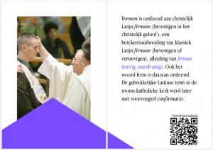
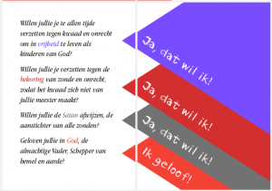

Beste vormelingen, peters en meters, ouders, vormselverantwoordelijken, catechisten en andere vrijwilligers van de vormselwerking,

[Geloven Leren](http://gelovenleren.net/) heeft een nieuw boekje-om-zelf-af-te-drukken samengesteld: [**_GEVORMD_**](/portfolio/gevormd/). Het bevat de krachtlijnen van de vorm, achtergrond en betekenis van het sacrament van het Vormsel. Het is geen catechesetraject, maar een zinvol extraatje bovenop het reeds geleverde werk.

_Wil je je petekind behalve die nieuwe spelconsole ook iets inhoudelijks cadeau geven?_ _Heb je met je kind nog niet in de diepte gesproken over de betekenis van het sacrament?_ _Heb je nog vragen bij wat er nu precies in je leven is veranderd na het Vormsel?_ _Heb je geen inspiratie meer voor de laatste catecheselessen?_

Inspiratie vind je in **_GEVORMD_**, een verzameling tekstfragmenten uit diverse referentiewebsites, waaronder kerknet.be, [rkdocumenten.nl](http://www.rkdocumenten.nl/rkdocs/index.php?mi=600&doc=1&al=1299), [grootseminariebrugge.be](http://www.grootseminariebrugge.be/sacramentenleer/sacramenten_vormsel.htm), bisdomdenbosch.nl, [rkbijbel.nl](https://rkbijbel.nl/kbs/bijbel/neovulgaat/willibrord1975/handelingen/8), [hetkatholiekegeloof.nl](http://www.hetkatholiekegeloof.nl/sub/381-wanneer-hebben-we-de-gena/), [prentencatechismus.org](http://prentencatechismus.org/uncategorized/de-sacramenten-het-vormsel/) en een [reeks catecheses van Paus Franciscus over de Zeven Gaven van de Heilige Geest](http://www.rkdocumenten.nl/rkdocs/index.php?mi=650&dos=393).

Vermits de meeste vormelingen vandaag de dag een smartphone cadeau krijgen (toch?), is elk artikel voorzien van een [QR-code](https://appsindeles.wordpress.com/2013/03/17/qr-droid/) waarmee je snel de volledige teksten online kan terugvinden om er dieper op in te gaan.

 Etymologie van 'Vormsel'

Het boekje komt in twee formaten. Je kan een [PDF downloaden die je op je scherm kan lezen](https://storage.googleapis.com/geloven-leren/printerboekjes/vormsel.pdf) en een [PDF die je kan afdrukken](https://storage.googleapis.com/geloven-leren/printerboekjes/gevormd.pdf) om er een mooi boekje van te maken. Afdrukken doe je op een gewone printer op A4-formaat, tweezijdig, in kleur, en met de instelling dat de pagina niet wordt aangepast aan de printermarges, waarna je het in het midden plooit en aan de drie zijden met een mesje op maat snijdt volgens de snijlijnen. Is dat te lastig, kan je het boekje ook [online bestellen](http://www.peecho.com/print/nl/195217) aan kostprijs.

 Hernieuwing van de doopbeloften

En als je dan toch je eigen drukkerijtje opstart (of je vormelingen aan de slag zet), kijk nog eens rond of er geen [andere boekjes](/page/katholieke-printerboekjes/) zijn die je kan gebruiken. Een missaaltje of de gebeden van priester Poppe of een prentencatechismus. Of een [katholiek kwartetspel](http://kwartet.gelovenleren.net), da's ook altijd aardig als [knutselproject](/page/katholiek-kwartetten/) voor de catechese of als geschenk!
