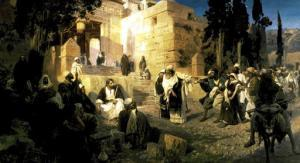
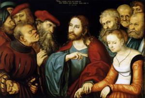

Jezus en de overspelige vrouw

_**uit het evangelie volgens Johannes, hoofdstuk 8 vijfde zondag van de Veertigdagentijd, jaar C**_

<table width="627"><colgroup><col width="119"> <col width="346"> <col width="120"></colgroup><tbody><tr><td valign="top" bgcolor="#ffffff" width="119">
4 spelers
</td><td valign="top" bgcolor="#ffffff" width="346">
Verteller, schriftgeleerden en farizeeën, Jezus, vrouw
</td><td valign="bottom" bgcolor="#ffffff" width="120"></td></tr><tr><td colspan="2" valign="top" bgcolor="#ffffff" width="479">&nbsp;</td><td valign="bottom" bgcolor="#ffffff" width="120">
Jesus and the Sinner Woman (Vasily Polenov, 1886-1887 , Russian Museum, St Petersburg)
</td></tr><tr><td valign="top" bgcolor="#ffffff" width="119">
<b>Verteller</b>
</td><td valign="top" bgcolor="#ffffff" width="346">
In de vroegte was Jezus alweer in de tempel en heel het volk stroomde naar Hem toe. Hij ging zitten en onderrichtte hen. Nu kwamen de schriftgeleerden en de farizeeën aanzetten met een vrouw die betrapt was op echtbreuk.
</td><td valign="bottom" bgcolor="#ffffff" width="120">
Joh 8:2-3
</td></tr><tr><td valign="top" bgcolor="#ffffff" width="119">
<b>Schriftgeleerdenen farizeeën</b>
</td><td valign="top" bgcolor="#ffffff" width="346">
Meester, deze vrouw is op heterdaad betrapt op echtbreuk. Mozes heeft ons in de wet voorgeschreven zulke vrouwen te stenigen. Hoe staat U daar tegenover?
</td><td valign="bottom" bgcolor="#ffffff" width="120">
Joh 8:4-5
</td></tr><tr><td valign="top" bgcolor="#ffffff" width="119">
<b>Verteller</b>
</td><td valign="top" bgcolor="#ffffff" width="346">
Met deze vraag wilden ze Hem op de proef stellen, om te zien of ze een aanklacht tegen Hem konden indienen. Maar Jezus bukte zich om met zijn vinger op de grond te schrijven.
</td><td valign="bottom" bgcolor="#ffffff" width="120">
Joh 8:6
</td></tr><tr><td valign="top" bgcolor="#ffffff" width="119">
<b>Schriftgeleerdenen farizeeën</b>
</td><td valign="top" bgcolor="#ffffff" width="346">
Meester, U moet ons vertellen wat we met deze vrouw moeten doen!
</td><td valign="bottom" bgcolor="#ffffff" width="120">
Joh 8:7
</td></tr><tr><td colspan="2" valign="top" bgcolor="#ffffff" width="479">&nbsp;</td><td valign="bottom" bgcolor="#ffffff" width="120">
Jesus and the Adulteress (Lucas Cranach the Elder, 1532, Museum of Fine Arts, Budapest)
</td></tr><tr><td valign="top" bgcolor="#ffffff" width="119">
<b>Jezus</b>
</td><td valign="top" bgcolor="#ffffff" width="346">
Wie van u zonder zonde is, moet dan maar als eerste een steen op haar werpen.
</td><td valign="bottom" bgcolor="#ffffff" width="120">
Joh 8:7
</td></tr><tr><td valign="top" bgcolor="#ffffff" width="119">
<b>Verteller</b>
</td><td valign="top" bgcolor="#ffffff" width="346">
Weer bukte Hij zich om op de grond te schrijven. Zij echter trokken na die woorden weg, de een na de ander, te beginnen met de oudsten, zodat Hij alleen achterbleef met de vrouw daar vóór Hem.
</td><td valign="bottom" bgcolor="#ffffff" width="120">
Joh 8:8
</td></tr><tr><td valign="top" bgcolor="#ffffff" width="119">
<b>Jezus</b>
</td><td valign="top" bgcolor="#ffffff" width="346">
Waar zijn ze gebleven, vrouw? Heeft niemand u veroordeeld?
</td><td valign="bottom" bgcolor="#ffffff" width="120">
Joh 8:10
</td></tr><tr><td valign="top" bgcolor="#ffffff" width="119">
<b>Vrouw</b>
</td><td valign="top" bgcolor="#ffffff" width="346">
Nee Heer, niemand
</td><td valign="bottom" bgcolor="#ffffff" width="120">
Joh 8:11
</td></tr><tr><td valign="top" bgcolor="#ffffff" width="119">
<b>Jezus</b>
</td><td valign="top" bgcolor="#ffffff" width="346">
Ik veroordeel u ook niet. Ga nu maar, en zondig voortaan niet meer.
</td><td valign="bottom" bgcolor="#ffffff" width="120">
Joh 8:11
</td></tr></tbody></table>

A.M.D.G. www.gelovenleren.net

# [MEER BIJBELTONEEL](/bijbeltoneel/ "Bijbeltoneel")
