Om [missale.net](http://www.missale.net) te stofferen, heb ik de website [sacredartmeditations.com](http://sacredartmeditations.com/) geplunderd. Daar vond ik ook een hele reeks kruiswegafbeeldingen. Samen met de mooie bezinnende teksten uit het "Modern gebedenboek voor meisjes" die ik [elders van internet](http://users.telenet.be/katholieke-informatie/Kruis/heilige%20kruisweg%20(33).html) plukte, heb ik die prenten gebundeld in een kruiswegmeditatie die je kan downloaden en zelf afdrukken om er de kruisweg mee te beleven.

<table class="widget"><tbody><tr><td><a href="https://storage.googleapis.com/geloven-leren/printerboekjes/DE%20KRUISWEG%20tweede%20versie.pdf" target="_blank">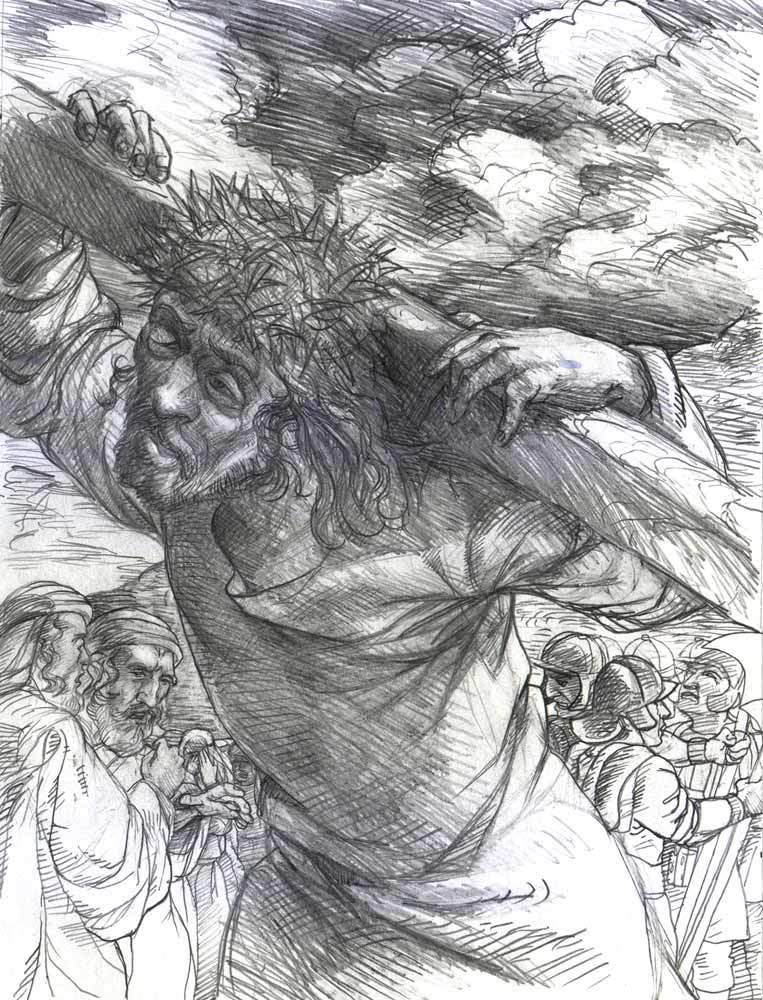</a></td><td colspan="2">Download&nbsp;<a href="https://storage.googleapis.com/geloven-leren/printerboekjes/DE%20KRUISWEG%20tweede%20versie.pdf" target="_blank">Kruisweg met moderne kunst</a> om af te drukken.</td></tr></tbody></table>

<table width="743" cellspacing="0" cellpadding="7"><colgroup><col width="729"></colgroup><tbody><tr><td width="729" height="514">U weet, lieve Jezus, dat ik wel eens de mensen benijddie tegelijk met U hebben geleefd. Nu ik de kruisweg ga bidden, denk ik daar ook weer aan. Hoe graag zou ik U gevolgd zijn op Uw lijdensweg. Ik zou dat toch wel iets bedacht hebben om U te helpen en te troosten! Maar, lieve Heer, ik weet door het geloof, dat ik dat nu ook nog kan doen. Toen U met Uw kruis beladen door Jeruzalem ging, hebt U gezien dat ik nu hier neerkniel, dat ik straks de staties langs ga om bij U te zijn in het lijden en me eens heel hartelijk te verdiepen in Uw liefde voor mij.

Jezus, ik vertrouw op Uw macht en Uw liefde. Daarom bid ik U: laat mij deze kruisweg heel vurig doen. Laat mij iets meer van Uw liefde begrijpen en geef mij dezelfde genaden alsook ik bij Uw lijden tegenwoordig was geweest. Laat mij U altijd trouw blijven en Uw kruis tot middelpunt van mijn leven maken. Amen.</td></tr><tr><td width="729" height="514"><h2 class="western">EERSTE STATIE Jezus wordt ter dood veroordeeld</h2><i>Wij aanbidden U Christus en loven U.</i>

<i>Omdat Gij door Uw H. Kruis de wereld verlost hebt.</i>

Lieve Jezus, U staat hier voor Pilatus. U bent de Zoon van God, door Wie alles gemaakt is. En U staat machteloos, gebonden, gevangen, voor een mens, omdat U het Zelf gewild hebt. U staat daar in onze plaats. Om ons te verlossen laat U toe, dat Pilatus U ter dood veroordeelt. U laat het toe uit liefde tot Uw Vader, uit liefde tot ons.

Jezus, voor mij ter dood veroordeeld, leer mij leven voor U.

<i>Onze Vader ... Weesgegroet ... Glorie zij de Vader ...</i>

<i>Ontferm U over ons. Heer ontferm U over ons.</i>

<i>God, wees ons, zondaars, genadig.</i>

[caption id="attachment_2207" align="aligncenter" width="300"]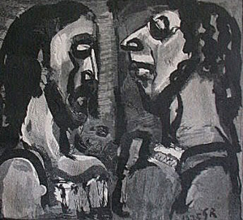 Georges Rouault Wood engraving From Passion by Andre Suares (Ambroise Vollard, Paris: 1939)[/caption]</td></tr><tr><td width="729" height="514"><h2 class="western">TWEEDE STATIE Jezus neemt het kruis op zijn schouders</h2><i>Wij aanbidden U Christus en loven U.</i>

<i>Omdat Gij door Uw H. Kruis de wereld verlost hebt.</i>

Jezus, U hebt het offer aanvaard: het is het kruis.

U neemt het van ganser harte aan. U weet wat het is.

Voor U: pijnen, vernedering, een schandelijke dood.

Voor ons: vrijmaking van de zonde, Gods liefde, het eeuwig leven.

O Kruis, onze enige hoop, wees gegroet.

Jezus, om U wil ik elke dag mijn kruis opnemen

en U navolgen uit liefde.

<i>Onze Vader ... Weesgegroet ... Glorie zij de Vader ...</i>

<i>Ontferm U over ons. Heer ontferm U over ons.</i>

<i>God, wees ons, zondaars, genadig.</i>

[caption id="attachment_2208" align="aligncenter" width="227"]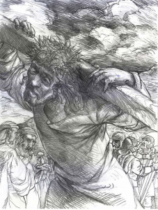 David Greg Taylor Pencil drawing[/caption]</td></tr><tr><td width="729" height="514"><h2 class="western">DERDE STATIE Jezus valt voor de eerste maal onder het kruis</h2><i>Wij aanbidden U Christus en loven U.</i>

<i>Omdat Gij door Uw H. Kruis de wereld verlost hebt.</i>

Lieve Jezus, U valt! Machteloos ligt daar de Almacht. U, Die de wereld in stand houdt, U bent bezweken onder de last van het kruis. Het was de last van onze zonden, die U deed vallen. Onze trots, onze zelfverheffing brachten U tot deze vernedering, opdat wij onze schuld zouden inzien, opdat wij ze zouden erkennen en toegeven.

Jezus, help mij door Uw genade om te doen wat ik zo moeilijk vind: eerlijk mijn fouten toegeven en U zó te volgen in de vernedering.

<i>Onze Vader ... Weesgegroet ... Glorie zij de Vader ...</i>

<i>Ontferm U over ons. Heer ontferm U over ons.</i>

<i>God, wees ons, zondaars, genadig.</i>

[caption id="attachment_2209" align="aligncenter" width="223"]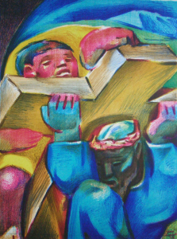 Jean Charlot Lithograph[/caption]</td></tr><tr><td width="729" height="514"><h2 class="western">VIERDE STATIE Jezus ontmoet zijn bedroefde Moeder</h2><i>Wij aanbidden U Christus en loven U.</i>

<i>Omdat Gij door Uw H. Kruis de wereld verlost hebt.</i>

Hier staat Jezus - daar Maria, Hun ogen ontmoeten elkaar en het lijden wordt nog dieper. Jezus, U denkt aan Maria. Eens troostte U d weduwe van Naïm - en gaf haar haar zoon terug. U schreide om Uw vriend Lazarus - en riep hem ten leven. Nu breekt Uw hart omdat U Uw Moeder ziet lijden. Maar U gaat verder op Uw weg - voor ons.

Maria begrijpt Jezus. Zij volgt Hem. Want zij weet: dit is het uur, waarvan Simeon gesproken heeft: Nu zal het Offer voltrokken worden, dat zij toen heeft gebracht.

Maria, lieve Moeder, er zal wel eens een ogenblik komen, waarop God van mij een groot offer vraagt. U hebt Jezus bijgestaan op Zijn kruisweg, sta mij bij om met Jezus mijn kruis te dragen.

<i>Onze Vader ... Weesgegroet ... Glorie zij de Vader ...</i>

<i>Ontferm U over ons. Heer ontferm U over ons.</i>

<i>God, wees ons, zondaars, genadig.</i>

[caption id="attachment_2210" align="aligncenter" width="300"]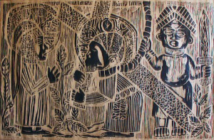 Ademola Olugebefola Woodcut[/caption]</td></tr><tr><td width="729" height="514"><h2 class="western">VIJFDE STATIE Simon van Cyrene helpt Jezus het kruis dragen</h2><i>Wij aanbidden U Christus en loven U.</i>

<i>Omdat Gij door Uw H. Kruis de wereld verlost hebt.</i>

Lieve Heer, U bent aan het eind van Uw menselijke krachten.

U bent de Godmens - beladen met onze schuld.

En U wilt de volle zwaarte van die schuld dragen.

Maar U wilt ook, dat wij het kruis met U méédragen.

Dat zie ik aan Simon van Cyrene, die daar voorbij komt.

De soldaten dwingen hem U te helpen. Hij wil eerst niet, hij begrijpt niets van het kruis, maar als hij iets van Uw last afneemt, en U helpt het kruis te dragen, dan begint hij U en Uw kruis lief te hebben.

Zo helpt Uw genade. Lieve Heer, leer mij ook het kruis - dat is alles wat mij tegenstaat - te begrijpen en graag met U te dragen.

<i>Onze Vader ... Weesgegroet ... Glorie zij de Vader ...</i>

<i>Ontferm U over ons. Heer ontferm U over ons.</i>

<i>God, wees ons, zondaars, genadig.</i>

[caption id="attachment_2211" align="aligncenter" width="268"]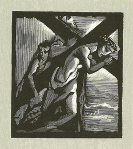 Bernard Brussel-Smith Woodcut/wood engraving[/caption]</td></tr><tr><td width="729" height="514"><h2 class="western">ZESDE STATIE</h2><h2 class="western">Veronica droogt het aanschijn van Jezus af</h2><i>Wij aanbidden U Christus en loven U.</i>

<i>Omdat Gij door Uw H. Kruis de wereld verlost hebt.</i>

Veronica treedt uit de deur van haar huis. Zij gaat Jezus tegemoet. Duwen, stompen, scheldwoorden telt zij niet. Zij ziet alleen het aanbiddelijk Gelaat, dat gehoond en besmeurd is. En zij drukt haar zachte, koele, weldoende doek tegen Jezus’ gewonde aangezicht.

Jezus, met heel mijn hart sluit ik mij bij Veronica aan. Laat mijn ziel voor U zijn als die fijne, witglanzende doek die zij U gaf, maak mij aldoor fijner en stralender, laat mijn liefde veel leed wegwissen. En druk Uw heilig beeld aldoor dieper in mij.

<i>Onze Vader ... Weesgegroet ... Glorie zij de Vader ...</i>

<i>Ontferm U over ons. Heer ontferm U over ons.</i>

<i>God, wees ons, zondaars, genadig.</i>

[caption id="attachment_2212" align="aligncenter" width="190"]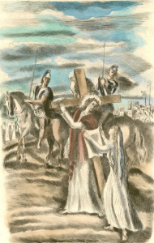 Hermine David Tinted drypoint From Sagesse by Paul Verlaine (Creuzevault, Paris: 1943)[/caption]</td></tr><tr><td width="729" height="514"><h2 class="western">ZEVENDE STATIE</h2><h2 class="western">Jezus valt voor de tweede maal onder het kruis</h2><i>Wij aanbidden U Christus en loven U.</i>

<i>Omdat Gij door Uw H. Kruis de wereld verlost hebt.</i>

Jezus, U valt wéér! Ondanks de hulp van Simon, ondanks de troost van Veronica, hulpelozer dan tevoren... U voelt de ogen van de mensen op U ... en doodsbleek, wankelend, raapt U al Uw krachten bijeen en staat op. Jezus, is dat om mij moed te geven? Is dat om mij aan te sporen, altijd maar weer opnieuw te beginnen?

Ja, Jezus, ik wil U mijn liefde tonen, ik wil U volgen ‘tot in ‘t einde’ puttend uit Uw moed!

<i>Onze Vader ... Weesgegroet ... Glorie zij de Vader ...</i>

<i>Ontferm U over ons. Heer ontferm U over ons.</i>

<i>God, wees ons, zondaars, genadig.</i>

[caption id="attachment_2213" align="aligncenter" width="197"]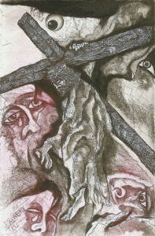 Leo Bednarik Etching, aquatint[/caption]</td></tr><tr><td width="729" height="514"><h2 class="western">ACHTSTE STATIE</h2><h2 class="western">Jezus troost de wenende vrouwen</h2><i>Wij aanbidden U Christus en loven U.</i>

<i>Omdat Gij door Uw H. Kruis de wereld verlost hebt.</i>

Jezus, het zijn de meest fijngevoelige zielen die om U schreien. Het zijn - uit die hele stad Jeruzalem - een paar vrouwen, die voor U uit durven komen. Als sterke vrouwen trekken zij niet terug nu zij U zien in verlatenheid en schande. Zo zijn zij voor U een troost geweest. Jezus, geef ook mij de moed om Uw genade te volgen, telkens als zij mij roept.

<i>Onze Vader ... Weesgegroet ... Glorie zij de Vader ...</i>

<i>Ontferm U over ons. Heer ontferm U over ons.</i>

<i>God, wees ons, zondaars, genadig.</i>

[caption id="attachment_2214" align="aligncenter" width="300"]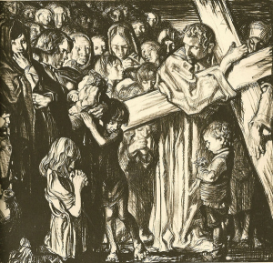 Frank Brangwyn Illustration From The Way of the Cross by Frank Brangwyn (Hodder &amp; Stoughton, Ltd.)[/caption]</td></tr><tr><td width="729" height="514"><h2 class="western">NEGENDE STATIE</h2><h2 class="western">Jezus valt voor de derde maal onder het kruis</h2><i>Wij aanbidden U Christus en loven U.</i>

<i>Omdat Gij door Uw H. Kruis de wereld verlost hebt.</i>

Jezus, nu zie ik U vallen voor de derde maal! Languit, plat ter aarde, verbrijzeld en vernietigd. Calvarië is vlakbij. Vlakbij is het verschrikkelijk ogenblik - Jezus staat op en gaat de berg op. Hij kan bijna niet meer, maar Zijn liefde drijft Hem naar de plaats van het offer. En Hij telt Zijn lijden niet. Jezus, geef mij de genade, die U voor mij verdiend hebt, om als U het vraagt, het moeilijkste aan te durven, en samen met U niet bang te zijn voor het kruis.

<i>Onze Vader ... Weesgegroet ... Glorie zij de Vader ...</i>

<i>Ontferm U over ons. Heer ontferm U over ons.</i>

<i>God, wees ons, zondaars, genadig.</i>

[caption id="attachment_2215" align="aligncenter" width="269"]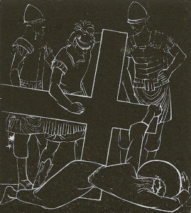 Pat M. Mallinson Woodcut[/caption]</td></tr><tr><td width="729" height="514"><h2 class="western">TIENDE STATIE</h2><h2 class="western">Jezus wordt van zijn kleren beroofd</h2><i>Wij aanbidden U Christus en loven U.</i>

<i>Omdat Gij door Uw H. Kruis de wereld verlost hebt.</i>

Jezus wordt ontkleed. Al Zijn wonden worden opengerukt. Daar staat Hij omhuld door de rode mantel van Zijn bloed... Bitterheid geeft men Hem te drinken. Lieve Jezus, er zal nooit iemand kunnen zeggen dat hij meer geleden heeft dan U. Maar miljoenen en miljoenen zullen op de dag van het wereldoordeel getuigen dat zij kracht en zoetheid hebben geput uit Uw lijden. Jezus, leer mij aan U denken als het lijden mij treft, en geef Uw sterkte aan de mensen, die op het ogenblik groot lijden te dragen hebben.

<i>Onze Vader ... Weesgegroet ... Glorie zij de Vader ...</i>

<i>Ontferm U over ons. Heer ontferm U over ons.</i>

<i>God, wees ons, zondaars, genadig.</i>

[caption id="attachment_2216" align="aligncenter" width="300"]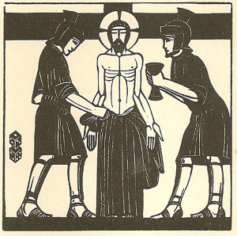 Eric Gill Wood engraving[/caption]</td></tr><tr><td width="729" height="514"><h2 class="western">ELFDE STATIE</h2><h2 class="western">Jezus wordt aan het kruis genageld</h2><i>Wij aanbidden U Christus en loven U.</i>

<i>Omdat Gij door Uw H. Kruis de wereld verlost hebt.</i>

Lam Gods, dat de zonden der wereld wegneemt!

Lam Gods, dat mijn zonden wegneemt...

Het kruis wordt opgeheven. Het kruis staat... Het staat tot ‘een banier der volkeren’. Want voortaan zal het kruis de mensheid in tweeën scheiden; in hen die het beminnen, in hen die het haten.

De pijnen klimmen al hoger en hoger; de spot en de minachting gaan al dieper en dieper, de verlatenheid wordt grenzeloos... en aldoor druppelt het goddelijk Bloed.

Lief Lam Gods, dat de zonden wegneemt, ontferm U over ons.

<i>Onze Vader ... Weesgegroet ... Glorie zij de Vader ...</i>

<i>Ontferm U over ons. Heer ontferm U over ons.</i>

<i>God, wees ons, zondaars, genadig.</i>

[caption id="attachment_2217" align="aligncenter" width="300"]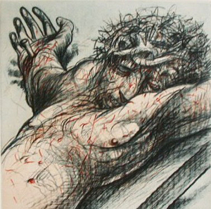 Peter Howson Lithograph[/caption]</td></tr><tr><td width="729" height="514"><h2 class="western">TWAALFDE STATIE</h2><h2 class="western">Jezus sterft aan het kruis</h2><i>Wij aanbidden U Christus en loven U.</i>

<i>Omdat Gij door Uw H. Kruis de wereld verlost hebt.</i>

Hij heeft Zich vernederd tot de dood, tot de Kruisdood. Er is in de wereldgeschiedenis één boven alles verheven ogenblik. Een ogenblik van ontzetting. Een ogenblik van eeuwigheidsomvattende genade. Dat was, toen Jezus alleen maar diep neerbuigen en stil zijn. God sterft, sterft uit liefde... Wij aanbidden U Christus en loven U, omdat Gij door Uw H. Kruis de wereld verlost hebt.

<i>Onze Vader ... Weesgegroet ... Glorie zij de Vader ...</i>

<i>Ontferm U over ons. Heer ontferm U over ons.</i>

<i>God, wees ons, zondaars, genadig.</i>

[caption id="attachment_2218" align="aligncenter" width="219"]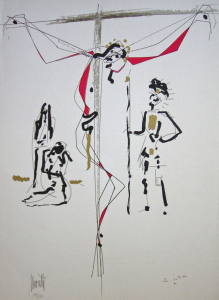 Jean Cocteau/Raymond Moretti Serigraph[/caption]</td></tr><tr><td width="729" height="514"><h2 class="western">DERTIENDE STATIE</h2><h2 class="western">Jezus wordt van het kruis genomen</h2><i>Wij aanbidden U Christus en loven U.</i>

<i>Omdat Gij door Uw H. Kruis de wereld verlost hebt.</i>

Heel behoedzaam leggen zij Jezus in Maria’s schoot. Nu is Zij - voor heel de wereld en voor alle tijden - de Moeder van Smarten. Toch kan ik het niet helpen, Moeder, dat ik heel stil, binnen in mij, blij word. Een blijheid, die opglanst als een nieuwe dageraad:

Jezus kan nu nooit meer lijden. Nooit meer! Zijn lieve Lichaam ligt in wonden open. Zijn ogen zijn geloken in de dook. Maar ‘t lijden is voorbij; voorgoed voorbij. Koningin van smarten, verheug U! En help ons door de genade van Jezus, Uw Zoon.

<i>Onze Vader ... Weesgegroet ... Glorie zij de Vader ...</i>

<i>Ontferm U over ons. Heer ontferm U over ons.</i>

<i>God, wees ons, zondaars, genadig.</i>

[caption id="attachment_2219" align="aligncenter" width="300"]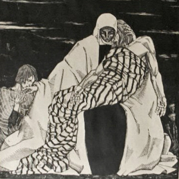 Wiktoria Gorynska Woodcut[/caption]</td></tr><tr><td width="729" height="514"><h2 class="western">VEERTIENDE STATIE</h2><h2 class="western">Jezus wordt in het graf gelegd</h2><i>Wij aanbidden U Christus en loven U.</i>

<i>Omdat Gij door Uw H. Kruis de wereld verlost hebt.</i>

‘Zijn graf zal heerlijk zijn’.

Er is rust. Er is vrede, de de bittere strijd.

Mild valt de avond. Maria en Jezus’ vrienden zien nog eenmaal Zijn edel gelaat, vertederd en verheerlijkt in de dood. Langzaam gaan zij.

Nog twéé lange nachten. Dan zal Hij opstaan uit dit graf, verrezen, verheerlijkt, goddelijk... Tu Rex gloriae Christe! Christus U bent de Koning der glorie! U hebt ons duur gekocht, maar nu behoren wij U ook voor eeuwig toe. Gezegend zij de heilige en aanbiddelijke Drieëenheid, omdat zij ons door Jezus’ kruisdood barmhartig is geweest. Amen.

<i>Onze Vader ... Weesgegroet ... Glorie zij de Vader ...</i>

<i>Ontferm U over ons. Heer ontferm U over ons.</i>

<i>God, wees ons, zondaars, genadig.</i>

[caption id="attachment_2220" align="aligncenter" width="273"]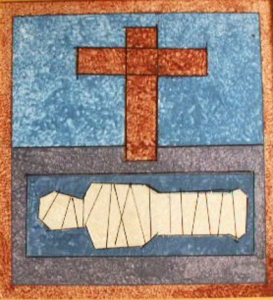 William Schickel Acrylic on panel[/caption]</td></tr></tbody></table>
