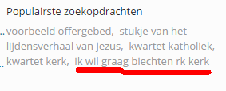
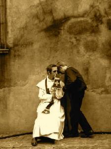

\[caption id="attachment\_2177" align="alignleft" width="283"\] Populaire zoekopdrachten waarmee men op deze website terechtkomt\[/caption\]

Het artikeltje dat ik vier jaar geleden schreef [over de biecht](/blog/biecht/), blijft in de bezoekersstatistieken een van de meest populaire op mijn blogje. Dat toont twee zaken aan: ten eerste dat er mensen naar deze informatie op zoek zijn, wat goed is, en ten tweede dat er elders over dit onderwerp weinig informatie te vinden is, wat slecht is.

\[caption id="attachment\_2173" align="alignright" width="225"\] Biecht\[/caption\]

Om aan het zoeken een antwoord te bieden, probeer ik het artikel up-to-date te houden met nieuwe verwijzingen. Ik druk hier immers niet meer uit dan mijn persoonlijke zielenroerselen, waaraan niemand zich hoeft te spiegelen. Daarom ben ik blij als ik kan verwijzen naar nuttige informatie op websites die op een of andere manier gepatroneerd worden door de kerkelijke overheid.

Tot voor kort was dat huilen met de pet op. Op de officiële website van de katholieke Kerk in Vlaanderen was weinig of geen bruikbare informatie te vinden voor een bezoeker die wil gaan biechten, maar niet weet waar of hoe.

Met de lancering van het nieuwe Kerknet lijkt daarin verandering te komen. Schoorvoetend weliswaar, maar hoopgevend. Met een tweetal algemene artikels over het sacrament en een formeel document dat zowaar zelfs een biechtspiegel of gewetensonderzoek bevat, staat de berouwvolle gelovige niet langer in de kou.

[Het sacrament van de verzoening vieren: hoe doe je dat?](https://www.kerknet.be/iclz/artikel/het-sacrament-van-de-verzoening-vieren-hoe-doe-je-dat#sthash.lmFxmY5q.dpuf)

[Biechten, zo had je het nog nooit bekeken](https://www.kerknet.be/kerknet-redactie/artikel/biechten-zo-had-je-het-nog-nooit-bekeken)

[Het sacrament van de verzoening vieren, hoe doe je dat?](https://www.kerknet.be/sites/default/files/Het%20sacrament%20van%20de%20verzoening%20vieren.docx) (docx)

Beter ware meer concrete wegwijzers te verzamelen naar [plaatsen in het Vlaamse land waar men kan biechten](http://www.sint-janscentrum.nl/index.php?p=biecht), maar ik begrijp dat zulks teveel onderhoud zou vergen en dat het eigenlijk aan de lokale gemeenschappen toekomt om die wegwijzers te voorzien (en er zijn er een heel aantal die dat ook doen).

Inhoudelijk is dat een hele stap vooruit, en er zijn meer tekenen dat Kerknet niet de site wil blijven van een nogal enge vorm van geloofsbeleving die de vorige halve eeuw de Kerk in Vlaanderen is gaan overheersen, waarin het woord 'zonde' zorgvuldig uit de liturgische en theologische _newspeak_ is geschrapt en waarin zelfs maar spreken in het openbaar over een sacrament als de biecht of de waarachtige aanwezigheid van Christus in de eucharistie niet zonder schaamte en hoon mogelijk was of zonder uitvoerige relativerende verantwoording, tenzij het om een mop ging.

\[caption id="attachment\_1522" align="alignleft" width="300"\] Bezeten kerkbanken\[/caption\]

Onlangs is er zo op Kerknet zelfs een [artikel verschenen over geloofshoudingen in de liturgie](https://www.kerknet.be/iclz/blog/lichamelijke-opvoeding-tijdens-de-eucharistieviering), ook iets waarover ik op mijn blogje [praktische informatie](/page/praktische-gids-bij-gebedshoudingen-in-de-liturgie/) probeer te verschaffen die in officiële kerkelijke documentatie volledig onvindbaar is. Hoewel het artikel heel helder verwoordt wat het probleem is met de manie in de Vlaamse kerk om als aan de kerkstoel vastgelijmd 'deel te nemen' aan de eucharistie, durft de auteur blijkbaar niet de 'full monty' aan, en blijft hij schaamtevol de knielende gebedshouding in het hoekje 'van vroeger' duwen. Of is het misschien die kleine passage die hem publicatierecht verschafte? Zo blijven we nog even aanmodderen, maar niet getreurd: de opstanding is immanent!
