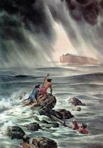

Gisteren zagen we een heel mooie regenboog aan de hemel. Misschien zag u hem ook? Het deed me denken aan het einde van het verhaal van Noach, waar God een regenboog aan de hemel zet als teken van zijn belofte aan Noach. Een verhaal dat ik al vaak gehoord heb, en zelfs voorgelezen aan de kinderen. Toch was het slechts gisteren dat me heel bewust het verband daagde tussen het teken van de regenboog en de voorafgaande zondvloed.

Regen en regenboog? Hoeveel logischer kan het verband zijn, zou je denken? Niet als je het verhaal leest! Op het moment dat de regenboog verschijnt, is de regen immers al weken- zoniet maandenlang opgehouden. De [tijdsbepalingen in Genesis zijn nogal verwarrend](http://bijbel.net/wb/?p=page&i=188%2C209&wbv=on#v8974), maar laten geen twijfel bestaan dat er een lange tijd verliep tussen het stoppen van de regen en het aan land gaan van Noach en zijn familie.

Wat heeft dat besef me nu geopenbaard? Heel wat!

De regenboog die God toont nadat Noach een altaar heeft opgericht, heeft metereologisch niks te maken met de regen van de zondvloed. In het verhaal van Noach zijn zowel de regen als de zon elementen die door God gebruikt worden om het goede te bewerkstelligen, om de zondigheid van de wereld uit te wissen en te stralen op de deugdzaamheid.

Er zijn mensen die zouden zeggen dat zo'n bijbelverhaal slechts als functie heeft een verklaring te geven aan onverklaarbare fenomenen. Zo zou de primitieve mens die geen oorzaak vond voor een natuurramp en die evenmin het verschijnsel van de regenboog begreep, bij gebrek aan natuurkundige verklaringen een verhaaltje gebricoleerd hebben waaruit moet blijken dat het Gods werk is… Natuurlijk is het Gods werk, maar als dit de enige bedoeling was geweest van het verhaal, zou de regenboog verschenen zijn _tijdens_ of _vlak na_ de regenbui, zoals die dat in werkelijkheid ook doet, en niet vele weken nadien! Het feit dat de boog vele weken na de regen verschijnt, suggereert dat het een _bovennatuurlijk_ fenomeen betreft, waarin onmiskenbaar God de hand heeft, en waarmee Hij symbolisch verwijst naar de regen, waarvan Hij ook de aanzetter was.

Dat is het mooie aan het lezen van de heilige Schrift. Ik [maak me niet druk of Noach nu al dan niet echt heeft geleefd en heeft meegemaak](http://www.newadvent.org/cathen/04702a.htm) wat staat neergeschreven. Ik zie vele symbolische ladingen die ik allemaal kan smaken, en toch voel ik niet de behoefte de historiciteit aan te tonen dan wel aan te vechten. Ik heb er geen moeite mee het verhaal te lezen vanuit een vertrouwen dat het allemaal waar is

 Noah tried to tell them...

Moet ik dan geen afstand nemen ---zo zal de lezer oproepen--- van het beeld van een God die zomaar eventjes 99% van de mensheid (en van de dieren evenzo) een gruwelijke dood laat sterven? Nee, ik denk het niet. Als het werkelijk in Gods plan lag om zijn schepping op deze manier te zuiveren, moet Hij daarvoor een reden hebben gehad, of een gebrek aan alternatief ---zijn Zoon was immers nog niet in de wereld gekomen. Of Gods motivatie rationeel doorwrocht is, dan wel ingegeven vanuit radeloze liefde voor zijn schepping, kan ik niet begrijpen en zal geen mens ooit kunnen verklaren. Dat God zo'n gruwelijke oplossing verkiest, vind ik trouwens nog minder bevreemdend dan de vaststelling in het licht van Gods voorzienigheid en almacht dat het uiteindelijk niets heeft uitgehaald. Noach's nageslacht krijgt al snel te lijden van hoogmoed en bouwt de toren van Babel… De zonde van de mens zal de kop blijven opsteken en ook God leert zijn lesje en zal het met Jezus' verlossing definitief anders moeten aanpakken.

Het zou nogal hoogmoedig zijn van mijn kant om 'afstand te nemen' van een waarachtig beeld van God ---als ik dat ueberhaupt zou kunnen zonder Hem te verloochenen. Indien het oudtestamentische beeld van God vals is, zou het eerder aan iemand als Jezus toekomen om ervan afstand te nemen, maar [Die bevestigt het beeld juist in zijn eigen Persoon](http://bijbel.net/wb/?p=page&i=64795,64843)! _"Want zoals het was in de dagen van Noach, zo zal het gaan bij de komst van de Mensenzoon"_ (Mt 24:37). Voor Jezus is het verhaal van Noach niet zomaar een oud verhaal dat moet worden geherinterpreteerd of een metafoor voor een gratis Goddelijke zonden-car-wash, het is een concrete profetie van de eindtijd, waarin Hij de hoofdrol zal spelen en die Hij parabelsgewijs in meer detail en vaak even weinig subtiel illustreert.

Reden genoeg om de zondvloed niet alleen te lezen als een straf verhaal, het is ook een waar verhaal, dat me veel leert over Gods brandende en verzengende liefde voor de mens en over de zware verantwoordelijkheid die liefde te beantwoorden en niet te weerstreven.
