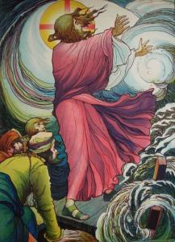

Storm op het meer en genezing van een bezetene

_**Synopsis uit de evangeliën volgens Matteüs 8, Marcus 4 en 5 en Lucas 8 Twaalfde zondag door het jaar, jaar B Vierde zondag na Driekoningen, tridentijnse kalender**_

<table width="627" cellspacing="0" cellpadding="7"><colgroup><col width="119"> <col width="346"> <col width="120"></colgroup><tbody><tr><td valign="top" bgcolor="#ffffff" width="119">
5 spelers
</td><td valign="top" bgcolor="#ffffff" width="346">
Verteller, Jezus, schriftgeleerde, leerling(en), Legio, Legio* (na uitdrijving)
</td><td valign="bottom" bgcolor="#ffffff" width="120"></td></tr><tr><td valign="top" bgcolor="#ffffff" width="119"></td><td valign="top" bgcolor="#ffffff" width="346">
Bij de oever van het meer staat een menigte. Jezus en zijn leerlingen zitten in een boot. De avond valt.
</td><td valign="bottom" bgcolor="#ffffff" width="120">
Mt 8:18

Mc 4:35

Lc 8:22
</td></tr><tr><td colspan="2" valign="top" bgcolor="#ffffff" width="479">

</td><td valign="bottom" bgcolor="#ffffff" width="120">
Christ Asleep During the Tempest (Eugene Delacroix, 1853)
</td></tr><tr><td valign="top" bgcolor="#ffffff" width="119">
<b>Jezus (aan de leerlingen)</b>
</td><td valign="top" bgcolor="#ffffff" width="346">
Laten we naar de overkant van het meer gaan.
</td><td valign="bottom" bgcolor="#ffffff" width="120">
Lc 8:22
</td></tr><tr><td valign="top" bgcolor="#ffffff" width="119">
<b>Verteller</b>
</td><td valign="top" bgcolor="#ffffff" width="346">
Een schriftgeleerde kwam naar Hem toe.
</td><td valign="bottom" bgcolor="#ffffff" width="120">
Mt 8:19
</td></tr><tr><td valign="top" bgcolor="#ffffff" width="119">
<b>Schriftgeleerde</b>
</td><td valign="top" bgcolor="#ffffff" width="346">
Meester, ik zal U volgen, waar U ook gaat.
</td><td valign="bottom" bgcolor="#ffffff" width="120">
Mt 8:19
</td></tr><tr><td valign="top" bgcolor="#ffffff" width="119">
<b>Jezus</b>
</td><td valign="top" bgcolor="#ffffff" width="346">
De vossen hebben een hol, en de vogels van de hemel een nest, maar de Mensenzoon kan nergens het hoofd neerleggen.
</td><td valign="bottom" bgcolor="#ffffff" width="120">
Mt 8:20
</td></tr><tr><td valign="top" bgcolor="#ffffff" width="119">
<b>Leerling</b>
</td><td valign="top" bgcolor="#ffffff" width="346">
Heer, sta me toe om eerst mijn vader te gaan begraven.
</td><td valign="bottom" bgcolor="#ffffff" width="120">
Mt 8:21
</td></tr><tr><td valign="top" bgcolor="#ffffff" width="119">
<b>Jezus</b>
</td><td valign="top" bgcolor="#ffffff" width="346">
Volg Mij, en laat de doden hun doden begraven.
</td><td valign="bottom" bgcolor="#ffffff" width="120">
Mt 8:22
</td></tr><tr><td valign="top" bgcolor="#ffffff" width="119">
<b>Verteller</b>
</td><td valign="top" bgcolor="#ffffff" width="346">
Ze lieten de mensen achter en namen Hem mee met de boot waarin Hij zat; er waren nog andere boten bij. En er stak een hevige storm op, en de golven sloegen over de boot, zodat die al volliep. Maar Hij lag op het achterdek op een kussen te slapen. Ze maakten Hem wakker
</td><td valign="bottom" bgcolor="#ffffff" width="120">
Mc 4:36-38
</td></tr><tr><td colspan="2" valign="top" bgcolor="#ffffff" width="479">

</td><td valign="bottom" bgcolor="#ffffff" width="120">
Jesus Stills the Storm (Jos Speybrouck)
</td></tr><tr><td valign="top" bgcolor="#ffffff" width="119">
<b>Leerlingen</b>
</td><td valign="top" bgcolor="#ffffff" width="346">
Meester, kan het U niet schelen dat wij vergaan?
</td><td valign="bottom" bgcolor="#ffffff" width="120">
Mc 4:38
</td></tr><tr><td valign="top" bgcolor="#ffffff" width="119">
<b>Jezus (aan de leerlingen)</b>
</td><td valign="top" bgcolor="#ffffff" width="346">
Waarom zijn jullie bang, kleingelovigen?
</td><td valign="bottom" bgcolor="#ffffff" width="120">
Mt 8:26
</td></tr><tr><td valign="top" bgcolor="#ffffff" width="119">
<b>Jezus (aan de wind)</b>
</td><td valign="top" bgcolor="#ffffff" width="346">
Zwijg, wees stil!
</td><td valign="bottom" bgcolor="#ffffff" width="120">
Mc 4:39
</td></tr><tr><td valign="top" bgcolor="#ffffff" width="119">
<b>Jezus (aan de leerlingen)</b>
</td><td valign="top" bgcolor="#ffffff" width="346">
Waar is jullie vertrouwen?
</td><td valign="bottom" bgcolor="#ffffff" width="120">
Lc 8:25
</td></tr><tr><td valign="top" bgcolor="#ffffff" width="119">
<b>Leerlingen (aan mekaar)</b>
</td><td valign="top" bgcolor="#ffffff" width="346">
Wie is dat toch, dat zelfs wind en water naar zijn bevelen luisteren?
</td><td valign="bottom" bgcolor="#ffffff" width="120">
Lc 8:25
</td></tr><tr><td valign="top" bgcolor="#ffffff" width="119"></td><td valign="top" bgcolor="#ffffff" width="346">
Aan de overkant van het meer, rotsgraven en verderop een troep varkens.
</td><td valign="bottom" bgcolor="#ffffff" width="120"></td></tr><tr><td valign="top" bgcolor="#ffffff" width="119">
<b>Verteller</b>
</td><td valign="top" bgcolor="#ffffff" width="346">
Ze kwamen aan de overkant van het meer in het land van de Gerasenen. Zodra Hij van boord was gegaan, kwam vanuit de rotsgraven meteen iemand Hem tegemoet die in de greep was van een onreine geest. Hij had zijn verblijf in die graven. Zelfs met een ketting kon niemand hem meer vastbinden. Want hij was al vaak met voetboeien en kettingen vastgebonden, maar de kettingen had hij uit elkaar getrokken en de boeien had hij vernield; niemand kon hem bedwingen. Dag en nacht liep hij tussen de graven en op de bergen te brullen en zichzelf met stenen te beuken. Toen hij Jezus in de verte zag, rende hij op Hem af, viel voor Hem op zijn knieën.
</td><td valign="bottom" bgcolor="#ffffff" width="120">
Mc 5:1-6
</td></tr><tr><td valign="top" bgcolor="#ffffff" width="119">
<b>Legio</b>
</td><td valign="top" bgcolor="#ffffff" width="346">
Wat wilt U van ons, Zoon van God? Bent U ons hier voortijdig komen kwellen? Ik bezweer U bij God: doe mij geen pijn.
</td><td valign="bottom" bgcolor="#ffffff" width="120">
Mt 8:29

Mc 5:7
</td></tr><tr><td valign="top" bgcolor="#ffffff" width="119">
<b>Jezus</b>
</td><td valign="top" bgcolor="#ffffff" width="346">
Wat is uw naam?
</td><td valign="bottom" bgcolor="#ffffff" width="120">
Mc 5:9
</td></tr><tr><td valign="top" bgcolor="#ffffff" width="119">
<b>Legio</b>
</td><td valign="top" bgcolor="#ffffff" width="346">
Mijn naam is Legio, want we zijn met velen. We smeken u: stuur ons niet het land uit! Als U ons uitdrijft, stuur ons dan naar die troep varkens.
</td><td valign="bottom" bgcolor="#ffffff" width="120">
Mc 5:9-10

Mt 8:31
</td></tr><tr><td valign="top" bgcolor="#ffffff" width="119">
<b>Jezus</b>
</td><td valign="top" bgcolor="#ffffff" width="346">
Ga maar.
</td><td valign="bottom" bgcolor="#ffffff" width="120">
Mt 8:32
</td></tr><tr><td colspan="2" valign="top" bgcolor="#ffffff" width="479">

</td><td valign="bottom" bgcolor="#ffffff" width="120">
L'indemoniato geraseno e i porci
</td></tr><tr><td valign="top" bgcolor="#ffffff" width="119">
<b>Verteller</b>
</td><td valign="top" bgcolor="#ffffff" width="346">
Ze kwamen eruit en gingen de varkens in. Heel de troep stoof de helling af het meer in, en ze kwamen om in het water. En de varkenshoeders gingen ervandoor en vertelden het in de stad en op het land. De mensen kwamen kijken wat er nu precies gebeurd was. Ze kwamen bij Jezus, en zagen toen de bezetene zitten, gekleed en bij zijn volle verstand, de man die in de macht van Legio was geweest, en ze werden met ontzag vervuld. De hele bevolking van de streek van de Gerasenen vroeg Jezus toen bij hen weg te gaan, want ze waren hevig geschrokken.
</td><td valign="bottom" bgcolor="#ffffff" width="120">
Mt 8:32

Mc 4:14-15

Lc 8:37
</td></tr><tr><td valign="top" bgcolor="#ffffff" width="119"></td><td valign="top" bgcolor="#ffffff" width="346">
Terug bij de boot. Jezus stapt in.
</td><td valign="bottom" bgcolor="#ffffff" width="120">
Mc 5:18
</td></tr><tr><td valign="top" bgcolor="#ffffff" width="119">
<b>Legio*</b>
</td><td valign="top" bgcolor="#ffffff" width="346">
Ik smeek U: mag ik met U mee?
</td><td valign="bottom" bgcolor="#ffffff" width="120">
Mc 5:18
</td></tr><tr><td valign="top" bgcolor="#ffffff" width="119">
<b>Jezus</b>
</td><td valign="top" bgcolor="#ffffff" width="346">
Ga naar huis, naar uw familie, en vertel hun wat de Heer voor u gedaan heeft en hoe Hij zich over u heeft ontfermd.
</td><td valign="bottom" bgcolor="#ffffff" width="120">
Mc 5:19
</td></tr><tr><td valign="top" bgcolor="#ffffff" width="119">
<b>Verteller</b>
</td><td valign="top" bgcolor="#ffffff" width="346">
Hij ging weg en begon in de Dekapolis te verkondigen wat Jezus voor hem gedaan had, en allen stonden verbaasd.
</td><td valign="bottom" bgcolor="#ffffff" width="120">
Mc 5:20
</td></tr></tbody></table>

A.M.D.G. www.gelovenleren.net

# [MEER BIJBELTONEEL](/bijbeltoneel/ "Bijbeltoneel")
