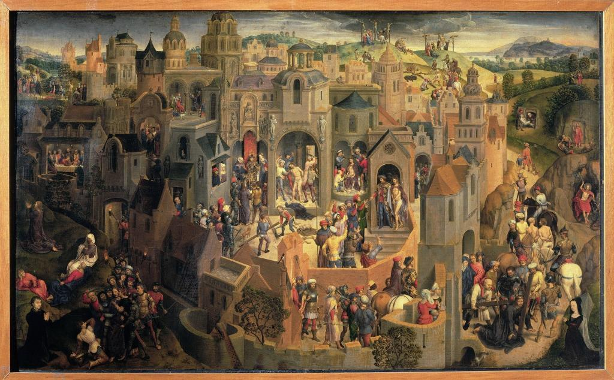
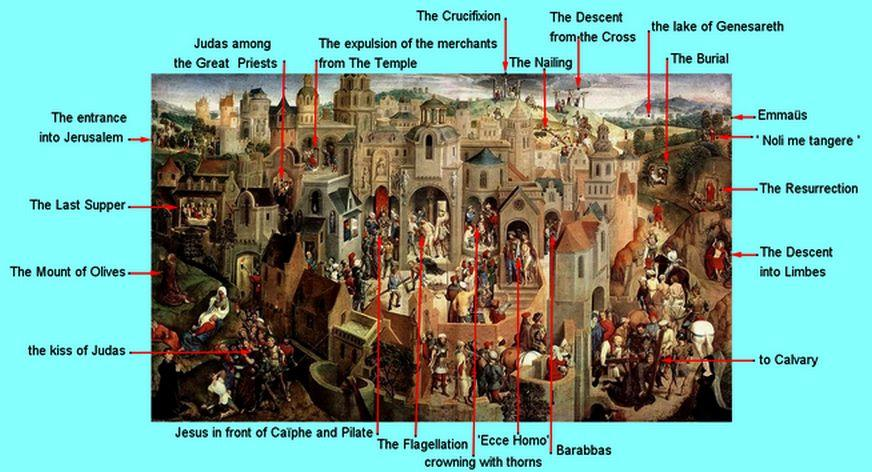

Je kent de platen wel met de opdracht 'zoek Wally!'? Er bestaat nog zo'n plaat, een hele speciale, die een goeie vijfhonderd jaar oud is. Hans Memling maakte een schilderij waarop alle taferelen van Jezus' lijden, sterven en verrijzenis door mekaar plaatsvinden. Heel aardig om interactief het lijdensverhaal te vertellen: gewoon de [prent openen](https://upload.wikimedia.org/wikipedia/commons/a/af/Hans_Memling_Passione.jpg) op een tablet, inzoomen, en met je vingers van het ene naar het andere tafereel navigeren. Of voor de gevorderden: een zoekopdracht geven om bepaalde personages of taferelen terug te vinden.

\[caption id="attachment\_2181" align="aligncenter" width="640"\] Memling, Hans (1425/40-1494): The Passion. Turin, Galleria Sabauda\[/caption\]

 

Hier krijg je alvast enkele tips, maar de rest moet je zelf maar zien uit te vissen:

\[caption id="attachment\_2182" align="aligncenter" width="639"\] Taferelen van het lijden, sterven en verrijzen\[/caption\]

Heb je niet meteen een bijbel bij de hand, of vind je je weg niet in de vier evangelies, is er het [synoptische toneelstuk dat als gebruiksvriendelijke leidraad bij het lijdensverhaal kan dienen (laatste stuk in de lijst)](/page/bijbeltoneel/).
