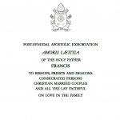

 Amoris Laetitiae, the exhortation based on the synod of the family

I do most of my (e-book) reading on my phone. Sometimes I read printed books. But very very seldom I read lengthy PDF files on my PC or in print. Strange enough, that's how Pope Francis' exhortation on the family has been sent out to the world.

An Italian EPUB-copy of the text has been around. For English readers, I've spent some time to produce a usable [EPUB version of the English full text of the exhortation Amoris Laetitiae](https://drive.google.com/open?id=0B-659FdpCliwX2JQcXMtR3QzNHc), including footnotes. That will allow for the 'leisurely reading' which Pope Francis advises himself in the introduction.
