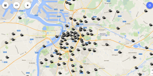

Enkele weken geleden stond ik er weer voor. Ik was op zondag ergens midden in Antwerpen en ik wilde nog ergens naar de mis gaan, maar hoe kom je te weten in welke kerken er nog diensten zijn? Daar zou toch een appje voor moeten bestaan!

Het platform om de gegevens aan te bieden staat gereed: [www.maptiming.com](http://www.maptiming.com), maar tot nu toe enkel gebruikt voor aanbiddingsuren ([adoremus.maptiming.com](http://adoremus.maptiming.com)). Het was dus zaak even het werk over te doen dat ik [enkele jaren geleden](/blog/kan-ik-vandaag-nog-ergens-naar-de-mis/) al eens verrichtte, om de misuren van Kerknet (nu nog op de oude site: archief.kerknet.be) te plunderen en op te laden in een meer gebruiksvriendelijke databank.

Het resultaat: **[naar-de-mis.maptiming.com](http://naar-de-mis.maptiming.com)**

Hier kan je heel overzichtelijk de wekelijkse eucharistievieringen van alle parochies in Vlaanderen opzoeken. Een dezer maak ik er ook een appje van, dan heb je de gegevens altijd bij de hand.

### Crowd-sourcing

Om de tool echt nuttig te maken, moeten ontbrekende gegevens worden ingevuld. Ook ---en vooral---  de missen op de liturgische kalender die buiten het gewone zondagspatroon vallen, zoals Kerstmis, Aswoensdag, het Paastriduum, O.H. Hemelvaart, Pinksteren, Allerheiligen, O.L.V. Tenhemelopneming enzovoort. Op die dagen zullen immers de meeste mensen op zoek zijn naar dit soort gegevens.

Geen nood, daar is aan gedacht. Elke parochie kan zelf de gegevens op MapTiming aanpassen en aanvullen. Rechts onderaan het scherm staan knoppen om nieuwe 'events' [toe te voegen](http://www.maptiming.com/nl/help-nl/geef-een-nieuw-evenement-in/), of om bestaande misuren [te wijzigen](http://www.maptiming.com/nl/help-nl/een-evenement-wijzigen/). De gewone zondagsmissen worden beheerd als 'herhalende afspraken', dus die moet je maar één keer ingeven.

Een mis toevoegen

De gegevens van een mis wijzigen

Echte crowd-sourcing wordt het pas als parochies deze tool dagdagelijks gaan gebruiken om hun gegevens te beheren. Daarvoor heeft dit project niet de nodige hefbomen. Toch kan het ook nuttig zijn voor individuele parochies, pastorale eenheden, federaties of dekenaten om er alvast mee aan de slag te gaan.

De website kan je ook mooi integreren in een bestaande website, door ze als iframe te embedden. Zo geef je elke bezoeker een direct en actueel overzicht van wat er de komende week te doen is.

Op termijn zal de [nieuwe Kerknetwebsite](/blog/nieuw-kerknet-eerste-indrukken-en-verzuchtingen/) ook een parochiezoeker uitrollen, maar in afwachting kan dit al een stap vooruit betekenen.

_Voor meer informatie: stuur een berichtje naar het adres rechtsbovenaan deze pagina._
