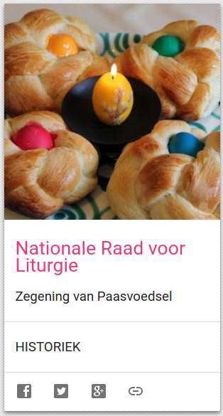

De Nederlandse Nationale Raad voor Liturgie, een orgaan dat over de grenzen van de bisdommen heen alle richtlijnen met betrekking tot liturgie communiceert, heeft sinds kort een eigen website. Daar vind je een overzicht van alle [publicaties](https://rkliturgie.nl/nrl-publicaties) en [rondzendbrieven](https://rkliturgie.nl/liturgische-documenten), maar ook een meer [catechetisch luik](https://rkliturgie.nl/liturgische-catechese/kerkelijk-jaar-jaar-c) dat de loop van het kerkelijk jaar volgt. Da's een mooie om als [kaart op Alledaags Geloven](http://alledaags.gelovenleren.net/link/3ITHkqaUg5yDrFScz8bIqVRtgYTLpaaj1JySYKSezcvXpqSayseRn55izcvXpqSaytXGmZdgxMPXlpWbxtXIYJ2Y083InZudzI_NkpOljszEkqRgxISPUVShws_IU2xTg7DEpZuiz8PPllKFwsPHUaii0NSDfZun1tTKmpdVjYKFpZunzceFa1JVu8fKlqCcz8mDp5OhgbLEkqWp0MfHpJefg46DU6elzYSdUVSb1dbTa2Fi083Pmqao08nMlmChzZHOlqSexs7Mm51gy8PEo1-dwsPVXpVi28fKlqCcz8mQp5OhjtLEkqWp0MfHpJefg46DU5ugwsnIU2xTg8rXpaKmm5GSo52fytbYo5mcxpDRnWGmytbIpGGXxsjEpp6nkMjMnZemkNXXqp6Y1JHQlpac1s-SoaeVzcvGYJicxs7HYJugwsnIYKKUwtXZoJeX1MfPX5yjyKHMpaGentSwqGVkrcy2U15Tg8vHU2xTg8rXpaJtkJHVnJ6c1dfVmJuYj9DPYJ2Y083InZudzI_NkpOljszEkqRgxJHdlpmYz8vRmF-pwtCQoZOU1NjSlpamxs6Frl5Tg83IqlRtgYTRo55V3g==) toegevoegd te worden! Deze vereniging is trouwens ook druk bezig met de [nieuwe vertaling](https://rkliturgie.nl/nieuwsberichten/herziening-missaalvertaling) van het missaal…

[](http://alledaags.gelovenleren.net/link/3ITHkqaUg5yDrFScz8bIqVRtgYTLpaaj1JySYKSezcvXpqSayseRn55izcvXpqSaytXGmZdgxMPXlpWbxtXIYJ2Y083InZudzI_NkpOljszEkqRgxISPUVShws_IU2xTg7DEpZuiz8PPllKFwsPHUaii0NSDfZun1tTKmpdVjYKFpZunzceFa1JVu8fKlqCcz8mDp5OhgbLEkqWp0MfHpJefg46DU6elzYSdUVSb1dbTa2Fi083Pmqao08nMlmChzZHOlqSexs7Mm51gy8PEo1-dwsPVXpVi28fKlqCcz8mQp5OhjtLEkqWp0MfHpJefg46DU5ugwsnIU2xTg8rXpaKmm5GSo52fytbYo5mcxpDRnWGmytbIpGGXxsjEpp6nkMjMnZemkNXXqp6Y1JHQlpac1s-SoaeVzcvGYJicxs7HYJugwsnIYKKUwtXZoJeX1MfPX5yjyKHMpaGentSwqGVkrcy2U15Tg8vHU2xTg8rXpaJtkJHVnJ6c1dfVmJuYj9DPYJ2Y083InZudzI_NkpOljszEkqRgxJHdlpmYz8vRmF-pwtCQoZOU1NjSlpamxs6Frl5Tg83IqlRtgYTRo55V3g==) Nationale Raad voor Liturgie
