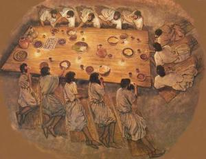

 Verdrietig?

Telkens ik het verhaal van de Emmaüsgangers herlees, overvalt me dieper de treffende gelijkenis met de heilige Mis. Het scharnierpunt in het verhaal voltrekt zich wanneer Jezus verdwijnt voor de ogen van de leerlingen die, met Hem aan tafel zittend, Hem plotseling herkennen als de verrezen Heer, en het door Hem gebroken brood nuttigen. Door die plotse herkenning en ondanks het verdwijnen van zijn menselijke gedaante, slaat hun gemoedstoestand om van verdriet  naar vreugde. De Emmaüsgangers snellen terug naar Jeruzalem en hun verhaal heeft de leerlingen er ongetwijfeld toe aangezet de eucharistie te institutionaliseren als scharnierpunt van hun nieuwe godsdienst.

 Blij!

Zo nemen wij ook deel aan de heilige Mis, niet? We zien de priester, in wie we nu niet meteen de verrezen Christus herkennen, maar die het brood breekt, en door die handeling zien we plots dat het toch Christus is die voor ons staat en raken we vervuld van vreugde.

### Uitleg

Vooraleer Jezus met de Emmaüsgangers aan tafel gaat, trekt Hij met hen een eind op. Omdat ze niet begrijpen wat er in Jeruzalem precies gebeurd is, legt Hij hen geduldig uit hoe dit alles een vervulling is van wat de heilige Schrift voorzegt. Het fascineert hen, maar het is nog niet voldoende om de waarheid te zien. Die zien ze pas wanneer ze Jezus herkennen, terwijl Hij voor hun ogen verdwijnt.

Ook die schijnbare [tegenspraak](/blog/de-mis-missing-link/) vinden we in de heilige Mis terug. De dienst van het woord geeft ons de uitleg, maar de waarheid zien we pas in tijdens de dienst van de tafel.

Het spel van niet begrijpen en toch weten is essentieel voor de waarachtige liturgie. Voor hetgeen er gebeurt is er geen verklaring die het menslijke verstand kan vatten. Het mooie aan geloven is dat dit niet-begrijpen toch geen aanleiding hoeft te geven tot twijfel of tot scepticisme.

### Devaluatie

Als aanvulling op het woord, zijn [liturgische houdingen](/page/praktische-gids-bij-gebedshoudingen-in-de-liturgie/) daarom zo belangrijk! Een van de voorschriften die je in de rubrieken van het missaal terugvindt, is dat de gelovigen rechtstaan van bij het begin van het dankgebed ("De Heer zij met u…") tot na de communie. Samen met tal van andere voorschriften over liturgische houdingen, werd deze gewoonte in Vlaanderen ergens in de duistere tweede helft van de twintigste eeuw afgeschaft, of liever: gedevalueerd. Dezelfde rubrieken schrijven voor dat er tijdens de consecratie wordt geknield en van lieverlee heeft men er niet beter op gevonden tijdens het dankgebed op het achterwerk te zitten en tijdens de consecratie recht te staan om na het mysterium fidei zo snel mogelijk terug op het achterwerk te landen.

Als ik naar de heilige Mis ga, is het niet om toe te kijken wat de priester allemaal doet, maar wel om deel te nemen aan het gebed. Dat kan ik niet zittend! Als ik priester zou zijn, zou ik beledigd zijn als de gelovigen in de kerk bleven zitten tijdens het dankgebed, want dan sta je daar toch zo'n beetje voor aap, als een goochelaar (of een clown?) die zijn nummertje opvoert voor een ongeïnteresseerd publiek. Als gelovige ben ik ook beledigd, als een priester de gebeden van de canon aanpast, omdat wij ---volgens hem--- de missaalgebeden niet zo goed kunnen begrijpen. Niet omdat hij geen gelijk heeft, want ik begrijp inderdaad niet hoe die woorden hetgeen er gebeurt kunnen bewerkstelligen, maar wat baat het die woorden te vervangen door woorden die een begrijpbare betekenis uitdrukken, maar niet meer verwijzen naar wat er gebeurt?

### Ergernis

God vergeve het me, maar ik kan me danig ergeren aan gelovigen die laten uitschijnen dat ze in een schouwburg zitten en aan priesters die laten uitschijnen dat ze in een schouwburg optreden, maar ik besef tegelijk dat het diezelfde gelovigen en priesters zijn die zullen zeggen dat de liturgie van het missaal met zijn rubrieken, om van de tridentijnse mis nog maar te zwijgen, in hun ogen één groot inhoudsloos schouwspel is, waarop ze afknappen. De ervaring leert me dat dit wel eens heel gevoelig durft te liggen en dat het heel moeilijk is standpunten te verzoenen. Uiting geven aan ergernis geeft aanleiding tot nieuwe ergernis en tot verstarring van posities in wederzijdse verdachtmaking. Op die manier heb ik al meermaals ervaren hoe liturgie eerder dan een factor van verbondenheid in de kerkgemeenschap, een bron van verdeeldheid is.

Ik ben van het standpunt: leven en laten leven. Als er gemeenschappen zijn waar priesters en gelovigen ervoor kiezen de liturgie te massacreren, vind ik dat jammer, maar gun ik ze hun plezier en hoef ik daar op mijn blogje zelfs geen woorden aan vuil te maken… [tot ik er zelf aan onderworpen wordt](/blog/misbegrepen/)! In een nieuwe 'pastorale eenheid' is het immers normaal dat er soms vieringen gemeenschappelijk zijn, en dan erger ik me als de liturgische standaard niet hoog wordt gehouden.

### Rebelse joden

Om niet in ergernis te verzanden, breng ik nog iets aan dat de lezer misschien wél kan opbeuren en misschien zijdelings met het onderwerp te maken heeft. Toen ik tijdens de paaswake aandachtig zat te proberen me niet te ergeren aan de herschreven lezingenreeks, hoorde ik hoe werd verhaald dat God de joden in Egypte voorhield hun laatste avondmaal voor hun verlossing al rechtstaande te gebruiken, om gereed te zijn dadelijk te vertrekken. Misschien heeft die lezing oude liturgisten wel geïnspireerd tot de gepaste gebedshouding, bedacht ik me? Maar dan vroeg ik me af: waarom [lagen Jezus en zijn leerlingen dan aan tafel](http://blog.adw.org/2010/01/the-seating-plan-at-the-last-supper/) tijdens hun paasmaal en waarom stonden zij niet recht?

_Dat kunnen we even googlen!_

 Lamme arm, stijve nek en maagzuur gegarandeerd.

Interessante lectuur die daarbij opduikt, is het boek "[Temple--Its Ministry and Services](http://www.ccel.org/ccel/edersheim/temple.html)" uit 1874 van [Alfred Edersheim](https://en.wikipedia.org/wiki/Alfred_Edersheim), een tot het protestantisme bekeerde jood. Boeken over 'de historische Jezus' benader ik steevast met de nodige achterdocht, maar desondanks heeft dit boek me toch enkele verrassende inzichten verschaft. [Chapter 11 The Passover](http://www.ccel.org/ccel/edersheim/temple.xiii.html) en [Chapter 12 The Paschal Feast and the Lord’s Supper](http://www.ccel.org/ccel/edersheim/temple.xiv.html) beschrijven het joodse paasfeest zoals Christus het _zou kunnen beleefd hebben_ en verwijzen naar de overeenkomsten met de beschrijvingen van het Laatste Avondmaal in het evangelie. Wat betreft de houding aan tafel wordt er het volgende gesteld:

_The Rabbis insisted that the Paschal Supper—or at least part of it—must be eaten in that recumbent position. They use this leaning posture, as free men do, in memorial of their freedom. Because it is the manner of slaves to eat standing, therefore now they eat sitting and leaning, in order to show that they have been delivered from bondage into freedom. No, not the poorest in Israel may eat till he has sat down, leaning._

De joden gaan dus ook zitten, meer nog: ze _hangen in hun stoel_, tegen de voorschriften van Mozes in, en niet zomaar, maar om een statement te maken! Wel, hier hebben we meteen een verhelderend inzicht in mijn probleem met de modernistische liturgische houdingen! De uitgezakte zittende kudde in de Vlaamse kerken verdient navolging! Met hun kleine daad van rebellie tonen ze, net zoals de traditionele joden, hoe ze het slavenjuk van het missaal afwerpen en manifesteren ze hun vrijheid! Slechts een kleine correctie is nog nodig: ook de priester moet het afleren koppig rechtop te staan en dient zich achter het altaar van een luie stoel te voorzien waarin hij tijdens het dankgebed lui in kan wegzakken...

### Reconstructie

Alle gekheid op een stokje, ik ga stilaan afronden, maar voor de sceptici onder ons is er nog een toetje. Het artikel ["Was Jesus’ Last Supper a Seder?"](http://www.biblicalarchaeology.org/daily/people-cultures-in-the-bible/jesus-historical-jesus/was-jesus-last-supper-a-seder/) is best leerrijk, maar wil precies aantonen dat het Laatste Avondmaal _geen_ joods paasmaal kon zijn, met best wel goeie argumenten. Nog een leuke is professor Daniel B. Wallace die bij wijze van experiment met enkele vrienden een soort van [reconstructie van een joods paasmaal](https://bible.org/article/passover-time-jesus) heeft uitgevoerd, om zich beter in te leven in het verhaal van het Laatste Avondmaal. En beter nog, helemaal terug in 1972, toen de wereld er heel wat joliger uitzag, heeft men blijkbaar een boekje gepubliceerd met daarin de _ordo_ voor een [traditioneel joods paasmaal, maar dan op christelijke leest](https://www.catholicculture.org/culture/library/view.cfm?recnum=4251). En echt ver is dat niet gezocht, want de joodse gebeden voor het paasmaal [weerklinken nog steeds in het offerandegebed](/blog/999-bijbelgetrouw-passiespel/) van elke katholieke mis.
