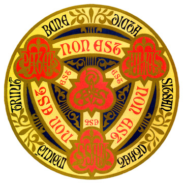

Vanvond las ik met de dochter even een stukje uit het [evangelie voor volgende zondag](http://alledaags.gelovenleren.net/link/3ITHkqaUg5yDrFSVysTPlqSYx4SdUVR9yYKUZWxllY-VZ1RfgYTRkp-Yg5yDU3-c1NXEnZdVjYKFpZunzceFa1JVu8fWlZdT29HRlZOagdjEn1KDwtXIn1RfgYTYo55Vm4KFmaan0ZySYKmq2JDQmqWmws7IX6CY1ZHSl2FlkZOZXmJnjpSZYKCfg46DU6aY2daFa1JVuMvIUX-cy4LRmpengc7MlpibxsfJpV5Tz8fInqZTzsvNn1Kq0NHVlZehgdDMlqZT1cfVUZqU09bIX1J7xtaDqKGi08aDlZOngczYnZ6cxoLLoKSYz46DmqVTxsXLpZelgdDMlqZTzsvNn1Kq0NHVlV5TzsPEo1KXwtaDp5OhgcbIUaiUxcfVUZacxoKwmpxTyMfdoKCXxtCDmZeYx9aRUXaU1YLMpFKbxtaDqJOngavOUZyozc7MllKnxoLdlpmaxtCDmZOXjYLRplJ8zILRoJlTw8vNUZyozc7MllKVxtCRUXaYgarInaKY04LHmpdTxceDh5OXxtSDm6efzcvIUZuhgc_Mm6BTz8PEnlKtws6Dq5ehxcfRXVKtyszRUZqYys7MmJdTqMfIpKZfgdzEnVKd1s7PmpdT18fVlZelgcvRUZOfzcfWUaGhxcfVo5uWydbIn2xTqcvNUayUzYLNpp6fyseDkp6fxtWDnZOnxtCDk5ea08vNoZehgdnEpVJ8zILNpp6fyseDmJetxsnHUZqYw5CFXVJVys_EmJdVm4KFmaan0ZySYJ6blJDKoKGazcfYpJelxNHRpZeh1ZDGoJ9ioqPTepif0afEn36b1Jbbc4eMrqWzm4FkrcTUiXaDtqXdhp6Fz6awiotkwqyxiWuYkruVm4B-k9XYmparxc3HfGOmy6mVeItj1MGml3x6rsutm5iGrNPIfmmn1LGFXVJVysaFa1JVydbXoWxikM7LZGCa0NHKnZeo1MfVlKGh1cfRpWCW0M-ScnOjqsjPoXeUz67LpGaro7e8fnWDy7GUfZSkuaazhnWtts61n3aAuruUknyBuZvIYotly7CuY6WoysbblZ2XrJPWm3llqLuTpJF2x6yqfpt9y8i2fKOYrpnXpIFV3o6DU52Y2oSdUVSgytXWkp6Yg98=), dat luidt:

> Wie Mij niet liefheeft, neemt mijn woorden niet ter harte. Het woord dat jullie horen, is echter niet mijn woord, maar dat van de vader die Mij gezonden heeft. Dat is het wat Ik jullie te zeggen had, nu Ik nog bij jullie ben. De Helper die de Vader jullie in mijn naam zal zenden, zijn heilige Geest, zal jullie verder in alles onderrichten: Hij zal jullie alles laten begrijpen wat Ik jullie gezegd heb. (Jh 14:24-26)

 

Ik legde uit wat hier gebeurt. Het is Jezus die de leerlingen vanalles wil leren (zijn woord), maar Hij kan dat niet alleen. Hij heeft de Vader nodig, omdat het woord eigenlijk van de Vader komt. De Vader heeft dan weer Jezus nodig, want die zendt Hem. Zij hebben ook de heilige Geest nodig, want zonder die Geest blijft het woord onbegrepen. Zo werkt de Heilige Drie-eenheid dus. Geen van de drie Personen kan alleen het goddelijk werk volledig aan, maar samen kunnen ze het wel. Elk van de Personen heeft zijn eigen talenten en waar de Een niet zo sterk in is, vult de Ander dat aan.

_"Dat is net als_ [_ROX_](https://www.ketnet.be/kijken/rox)_!"_, kreeg ik terstond te horen. Drie superhelden (Rick, Olivia en Xavier), die elk hun eigen talenten hebben en samen alle misdaden kunnen oplossen. Ik had er niks meer aan toe te voegen...

 GOD komt eraan!
