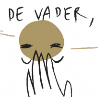

Het [nieuwe Kerknet](https://www.kerknet.be) is een [vreemde website](/blog/nieuw-kerknet-eerste-indrukken-en-verzuchtingen/). Er komen zoveel verschillende soorten artikels op dat zelfs een kritische mediagebruiker, zoals uw dienaar, elke dag opnieuw nieuwsgierig de nieuwsbrief opent.

Veel thema's zijn niet meteen mijn ding en laat ik links liggen, dat is geen probleem: niet iedereen heeft dezelfde interesses. Sommige thema's vind ik wel relevant, maar het komt voor dat er wordt geopinieerd 'bij opbod', zoals Vanmaercke dat onlangs presteerde met zijn ['Priesterambt'](https://www.kerknet.be/kerk-leven/blog/priesterambt), en dan slaat mijn ergernis weer aan. Ook dat mag ik niet mijn probleem maken, want ergernis is een zonde en slaat wonden in de Kerk (maar hetzelfde geldt voor het geven van ergernis, door gelovigen 'aanstoot' te geven in een representatief kerkelijk orgaan---dit terzijde).

En dan verschijnt er plots een artikel, zoals vandaag, dat naadloos aansluit bij mijn persoonlijke interessesfeer. In de naam van de Vader - wat heeft het kruisteken te betekenen? is een mooi opgemaakt boekje, dat je kan downloaden als PDF en zelf afdrukken, waarin met tekeningen en in een aantrekkelijk design het kruisteken wordt uitgelegd. Alles bevalt me: catechetisch, recht in de leer, toegankelijke inhoud zonder te verkleuteren, gratis te downloaden, mooi ontworpen. Hier kunnen ouders, catechisten en leerkrachten meteen mee aan de slag!

Geloven Leren heeft reeds tal van dat soort publicaties uitgebracht, dus het nieuwe boekje heeft meteen zijn plaats verdiend op de bibliotheek met [Katholieke boekjes om zelf af te drukken](/page/katholieke-printerboekjes/).

<table class="widget"><tbody><tr><td></td><td colspan="2">Download&nbsp;In de naam van de Vader - wat heeft het kruisteken te betekenen? om af te drukken.</td></tr></tbody></table>

Hopelijk mag ik nog heel wat van zo'n pareltjes in de Kerknetnieuwsbrief aantreffen!
