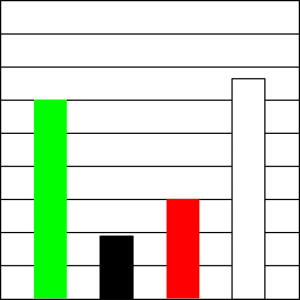
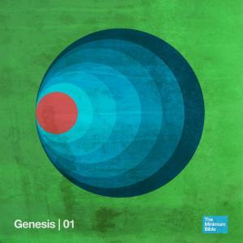
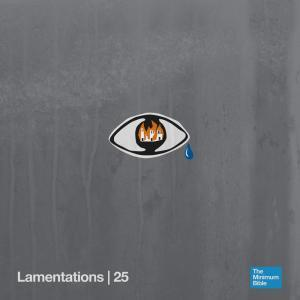
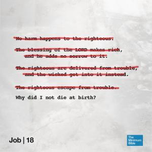
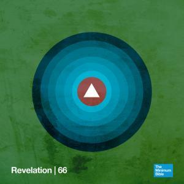

Het gebeurt dat ik het zo'n beetje gehad heb met de klassieke bijbelverhalen. Je kan natuurlijk de bijbel willekeurig openslaan, maar dat is vragen om verwarring. Om het bijbellezen toch een schijn van doelgerichtheid te geven, gebruik ik liever de principes van de serendipiteit, waarmee je iets waardevols kan vinden door naar iets anders op zoek te gaan. Tegenwoordig is het een koud kunstje om de bijbel te doorzoeken op trefwoorden, dus dat heb ik dan maar eens gedaan ---waarom niet?--- op basis van kleuren.

Wit is de kleur (jaja, technisch gezien is het geen kleur, voor dit onderzoek even wel) die het meest voorkomt, met 66 treffers, dichtbij gevolgd door groen, met 60 treffers. Dan komt rood, 30 keer gevonden en verderop zwart, 19 keer. Andere kleuren komen minder vaak voor, of toch niet in betekenisvolle context.

\[caption id="attachment\_2422" align="aligncenter" width="300"\] Hoogtes en laagtes van het bijbels zieleleven\[/caption\]

Ik heb op eigen houtje uit de zoekresultaten telkens vijf relevante resultaten geselecteerd, en getracht de kleur symbolisch te duiden. Vermits de bijbel het verhaal is van de heilsgeschiedenis van de mens, krijgen de kleuren in die context elk hun eigen rol.

Dezelfde stappen die te duiden zijn in de heilsgeschiedenis van de mensheid, vind je ook terug in je eigen ziel. Groen is wat pril is en onbezoedeld, wat rechtstreeks van God komt. Zwart is wat wegvoert van God, zonde en schuld. Rood is het besef dat daarop volgt, van schaamte en berouw. Wit tenslotte is de bestemming, die na zuivering alles terugvoert tot God.

### **Groen (60)**

> Groen is de kleur van de Schepping, van het nieuwe leven. De genade van God is het groen van de aarde.

[**Genesis 1:11**](http://bijbel.net/wb/?p=page&i=2,36)

**En God zei: ‘Het land moet zich tooien met jong groen gras, zaadvormend gewas en vruchtbomen die ieder naar zijn soort hun vruchten dragen, met zaad erin.’ Zo gebeurde het.**

[**Genesis 8:11**](http://bijbel.net/wb/?p=page&i=188,209)

**Toen de duif tegen de avond bij hem terugkwam, met een groen olijfblad in haar bek, begreep Noach dat het water van de aarde weggezakt moest zijn.**

[**Jeremia 17:8**](http://bijbel.net/wb/?p=page&i=55226,55234)

**Hij is een boom aan een rivier** **met wortels tot in het water.** **Hij heeft geen last van de hitte,** **zijn bladeren blijven groen.** **Een tijd van droogte deert hem niet,** **hij blijft vrucht dragen.**

[**Jesaja 61:11**](http://bijbel.net/wb/?p=page&i=51521,51543)

**Want zoals de aarde groen voortbrengt** **en een tuin het opgenomen zaad laat ontkiemen,** **zo laat de Heer GOD uw heil ontkiemen,** **uw luister voor het oog van alle volken.**

[**Marcus 6:39**](http://bijbel.net/wb/?p=page&i=65273,65287)

**Hij zei dat ze allemaal in groepen in het groene gras moesten gaan zitten.**

### **Zwart (19)**

> Zwart is de kleur van het verderf, de afwezigheid van Gods licht. Door zich af te wenden van Gods genade veroordeelt de ziel zichzelf tot de duisternis.

[**Job 30:30**](http://bijbel.net/wb/?p=page&i=21584,21614)

**Mijn huid wordt zwart en scheurt los,** **mijn beenderen gloeien van koorts.**

[**Klaagliederen 3:2**](http://bijbel.net/wb/?p=page&i=56226,56258)

**In de donkerste duisternis heeft Hij mij gedreven.**

[**Klaagliederen 4:8**](http://bijbel.net/wb/?p=page&i=56292,56302)

**Nu zien ze zwarter dan roet, op straat herkent men hen niet;** **ze zijn nu vel over been en uitgedroogd als brandhout.**

[**Matteüs 27:45**](http://bijbel.net/wb/?p=page&i=65009,65018)

**Vanaf het zesde uur viel er duisternis over het hele land, tot aan het negende uur.**

[**Openbaring 6:5**](http://bijbel.net/wb/?p=page&i=71657,71673)

**Toen het lam het derde zegel verbrak, hoorde ik het derde dier roepen: ‘Kom!’ Ik zag een zwart paard verschijnen, en hij die erop zat hield een weegschaal in de hand.**

### **Rood (31)**

> Rood is de kleur van de schande, de schaamte over de afgewezen genade, maar tegelijk het eerste teken van inkeer.

[**Job 16:16**](http://bijbel.net/wb/?p=page&i=21265,21302)

**Rood zijn mijn ogen van tranen,** **helemaal verduisterd.**

[**Jesaja 1:18**](http://bijbel.net/wb/?p=page&i=50336,50346)

**Kom, laten we de zaak afhandelen’, zegt de HEER.** **‘Zouden uw zonden, die als scharlaken zijn, wit kunnen worden als sneeuw?** **Zouden zij, rood als purper, als wol kunnen worden?**

[**Jesaja 24:23**](http://bijbel.net/wb/?p=page&i=50772,50794)

**De bleke maan wordt rood van schaamte** **en de gloeiende zon bloost,** **omdat de HEER van de machten als koning heerst** **op de berg Sion en in Jeruzalem:** **voor de oudsten verschijnt zijn verhevenheid.**

[**Matteüs 27:28**](http://bijbel.net/wb/?p=page&i=64991,65008)

**Ze trokken Hem zijn kleren uit en hingen Hem een rode mantel om;**

[**Openbaring 6:12**](http://bijbel.net/wb/?p=page&i=71657,71673)

**Ik bleef toekijken. Toen het lam het zesde zegel verbrak, ontstond er een hevige aardbeving. De zon werd zwart als een harige zak en de maan werd helemaal rood als bloed.**

### **Wit (66)**

> Wit is de kleur van de genade, van de vervulde hoop, van de ultieme zuiverheid die slechts bij God is.

[**Exodus 16:31**](http://bijbel.net/wb/?p=page&i=1957,1992)

**Israël noemde het brood manna. Het was wit als korianderzaad en smaakte naar honingkoek.**

[**Matteüs 17:2**](http://bijbel.net/wb/?p=page&i=64539,64551)

**Voor hun ogen veranderde Hij van gedaante. Zijn gezicht ging stralen als de zon en zijn kleren werden wit als licht.**

[**Marcus 16:5**](http://bijbel.net/wb/?p=page&i=65705,65712)

**Toen ze het graf binnengingen, zagen ze rechts een jongeman zitten met een wit kleed om, en ze schrokken hevig.**

[**Openbaring 3:5**](http://bijbel.net/wb/?p=page&i=71610,71615)

**Wie overwint, zal aldus in het wit gekleed gaan. En Ik zal zijn naam niet uitwissen uit het boek des levens, maar zijn naam belijden voor mijn Vader en voor zijn engelen.**

[**Openbaring 20:11**](http://bijbel.net/wb/?p=page&i=71915,71919)

**Toen zag ik een grote, witte troon, en Hem die daarop zetelde. De aarde en de hemel vluchtten weg van zijn aanschijn en hun plaats werd niet meer gevonden.**

 

De prenten met abstracte afbeeldingen van de boeken van de bijbel komen uit [The Minimum Bible](http://www.fastcodesign.com/3027229/the-bible-reduced-to-minimalist-posters).

 

[Download dit artikel als PDF](/portfolio/kleuren-in-de-bijbel/)
