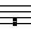
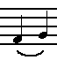
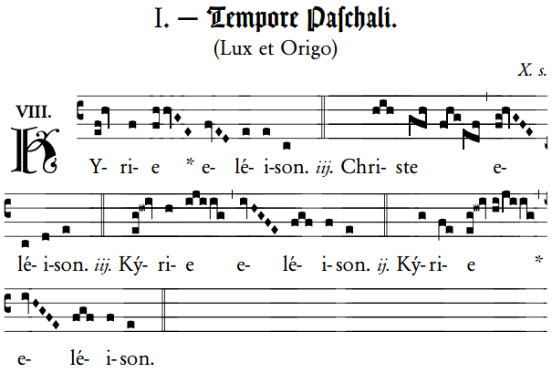
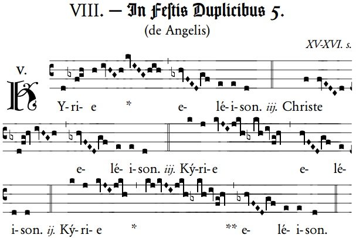
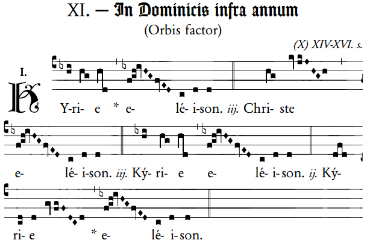
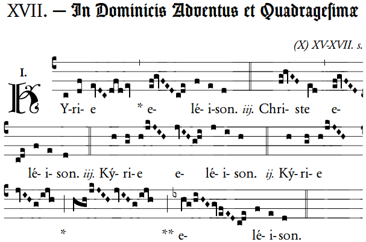

### Één gezongen gebed

Elke zondag klinkt de heilige mis anders, maar elke zondag draagt de hele katholieke geloofsgemeenschap, verspreid over heel de wereld, één en dezelfde mis op. Zo is de ganse Kerk verenigd in één gebed. Om die afstemming mogelijk te maken, staan de teksten van de mis voor elke dag van de liturgische kalender opgetekend in het **Romeins Missaal** en het **Lectionarium**, die in het Latijn zijn geschreven, de taal van de rooms-katholieke Kerk. In elke taalgemeenschap bestaan er vertalingen van die teksten in de volkstaal, bijvoorbeeld het Nederlands.

Het **Missaal** bevat de gebeden van de mis en het **Lectionarium** de bijbellezingen, die voor elke dag verschillend zijn. Sommige gebeden komen in bijna elke mis terug, dat is het **ordinarium** of het gewone van de mis. Andere gebeden verschillen elke dag, dat is het **proprium** of het eigen van de mis.

Omdat elke heilige mis een feest is, bestaat er ook een volledig gezongen versie van elke mis. Ook van de gezongen mis bestaat er een officiële versie die over de hele wereld gebruikt kan worden, en die is opgetekend in het [**Graduale**](https://en.wikipedia.org/wiki/Roman_Gradual), een boek met muzieknotatie bij alle gebeden uit het Missaal. Die muziek wordt het **Gregoriaans** genoemd.

### Geschiedenis

In de loop van de geschiedenis van de Kerk hebben de teksten en de muziek van de mis een evolutie ondergaan. Langs de ene kant zijn er lokale gemeenschappen, bisdommen of kloosters, die hun eigen manier ontwikkelen om de mis te verfraaien met bepaalde teksten of muziek en langs de andere kant probeert de Kerk, meestal vanuit Rome op gezag van de Paus, die verschillen te stroomlijnen, zodat katholieke gelovigen één blijven in gebed.

Tot in de achtste eeuw bestond er helemaal geen manier om muziek op papier te zetten, dus melodieën kon je alleen maar leren zingen door ze van iemand anders te horen en na te zingen. Het is omwille van de eenvormigheid in de gezangen van de mis, dat men een manier is [gaan zoeken om muziek op papier te zetten](http://www.schooltv.nl/video/hoe-zijn-muzieknoten-ontstaan-dankzij-zingende-monniken/) en zo door te geven. Eerst gebeurde dat met speciale tekentjes, [neumen](https://nl.wikipedia.org/wiki/Neume), boven de woorden te schrijven. Pas vierhonderd jaar later heeft dat geleid tot het gregoriaanse [notenschrift](http://historianet.nl/cultuur/hoe-ontstonden-muzieknoten) dat lijkt op de notenbalken die iedereen nu op de muziekschool leert. Het [schrift leest heel intuïtief](https://nl.wikipedia.org/wiki/Kwadraatnotatie), zodra je begrijpt dat twee noten die boven mekaar geschreven zijn, de _podatus_, gezongen wordt als twee opeenvolgende tonen, waarbij de laagste noot altijd het eerst komt.

  is hetzelfde als  

### Graduale

Op het einde van de negentiende eeuw, dus nog niet echt lang geleden in de geschiedenis van de Kerk, heeft men in Solesmes, een Franse abdij, het werk opgevat om de meest oorspronkelijke muziek van de mis te verzamelen in één boek, wat dan het [Graduale](http://www.newliturgicalmovement.org/2014/02/1974-graduale-romanum-available-for.html#.Vy5ULlZ9600) is geworden, waarover we hierboven reeds hebben gesproken. De volledige gezongen mis zal je slechts in enkele kloosters kunnen meemaken, maar een klein stukje va het Graduale, namelijk de gezangen van de vaste gebeden van de mis, het ordinarium, is bekend als het [**Kyriale**](http://www.gregorianbooks.com/kyriale.html) en wordt af en toe nog gezongen in gewone parochies. Dat zijn dus de gebeden die in elke mis terugkeren: het Kyrie (Heer ontferm U), Gloria (Eer aan God), Credo (Geloofsbelijdenis), Sanctus (Heilig) en Agnus Dei (Lam Gods).

Om het wat moeilijker te maken, bestaan er voor deze vaste gebeden verschillende composities (genummerd van I tot XVIII), afhankelijk van het soort mis dat wordt opgedragen. Die verschillende melodieën hebben een ingewikkelde ontstaansgeschiedenis in perioden van meerdere eeuwen.

### Kyrie

We gaan hier verder enkel het Kyrie bekijken, dat op zich bijzonder is omdat de tekst geen Latijn is, maar Grieks, de oorspronkelijke liturgische taal van de kerkgemeenschap van Rome. De tekst is eenvoudig:

> Kyrie Eleison - Heer, ontferm U
> 
> Christe Eleison - Christus, ontferm U
> 
> Kyrie Eleison - Heer, ontferm U

In de hedendaagse of **gewone vorm** van de Romeinse ritus zingt de priester of voorganger telkens een lijn, en het volk zingt die na. In de **buitengewone vorm**, die ouder is, wordt elke lijn driemaal gezongen. De melodieën stammen uit de tijd toen enkel de buitengewone vorm bestond, dus de Kyrie's die per herhaling een andere melodie hebben, zijn niet erg geschikt voor toepassing in de gewone vorm van de liturgie.

Het Kyrie wordt gezongen in het begin van de mis. Eerst is er de schuldbelijdenis, waarin we voorspraak vragen van alle Engelen en Heiligen, van de maagd Maria en van al onze medegelovigen om te bidden dat God zich over ons ontfermt… wat dus terstond verwezenlijkt wordt in het Kyrie.

Dit zijn enkele vaak gebruikte toonzettingen van het Kyrie:

 

 Voor zondagen in de Paastijd, uit het Kyriale I, Lux et Origo

 

 Voor feesten, uit het Kyriale VIII, De Angelis

 

 Voor zondagen in de tijd doorheen het jaar, uit Kyriale XI, Orbis Factor

 

 Voor zondagen van de Advent en de Veertigdagentijd, uit Kyriale XVII (melodie)

 

 

Het ganse Kyriale kan je downloaden als PDF:

[http://media.musicasacra.com/pdf/kyriale.pdf](http://media.musicasacra.com/pdf/kyriale.pdf)

[http://media.musicasacra.com/books/kyriale\_simplex.pdf](http://media.musicasacra.com/books/kyriale_simplex.pdf)

 

Je kan het Kyriale ook downloaden als luisterboek:

[http://gelovenleren.net/page/luisterboeken/](/page/luisterboeken/)

 

Ook het ganse Graduale is beschikbaar als PDF:

[http://www.ccwatershed.org/media/pdfs/14/02/17/10-18-21\_0.pdf](http://www.ccwatershed.org/media/pdfs/14/02/17/10-18-21_0.pdf)

 

[Download dit artikel als PDF](/portfolio/kyrie/)
