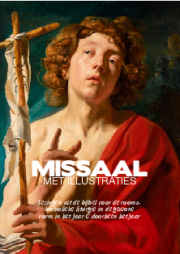
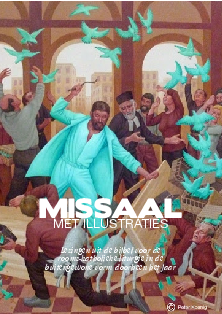

Zo, de paasversiering kan weer in de kast. We zijn weer aanbeland in de liturgische 'Tijd doorheen het jaar'. Als je de missaaltjes van [missale.net](http://www.missale.net/nl) gebruikt, wil dat zeggen dat je een nieuw missaaltje moet downloaden om af te drukken. Je vindt ze op [Katholieke boekjes om zelf af te drukken](/page/katholieke-printerboekjes/).

Voor de gewone vorm van de ritus:

<table class="widget"><tbody><tr><td></td><td colspan="2"><a href="http://www.missale.net/print/nl#-scope-lectionary-form-of-season-annum-cycle--c" target="_blank">Missaal voor zon- en feestdagen - Lezingen</a> voor het huidige jaargetijde: Tijd doorheen het jaar, jaar C</td></tr></tbody></table>

 

.

Voor de buitengewone vorm van de ritus (Tridentijnse ritus):

<table class="widget"><tbody><tr><td></td><td colspan="2"><a href="http://www.missale.net/print/nl#-scope-lectionary-form-eo-season-annum" target="_blank">Missaal voor zon- en feestdagen - Lezingen voor de Tridentijnse ritus</a> voor het huidige jaargetijde:&nbsp;Tijd doorheen het jaar</td></tr></tbody></table>
