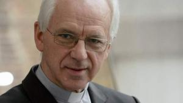
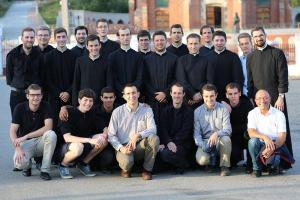
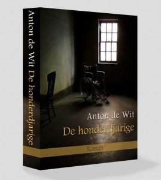

 mgr. De Kesel

De voorbije dagen heb ik me [behoorlijk opgewonden](https://twitter.com/vicmortelmans) over de maatregelen die mgr. De Kesel trof tegen de broederschap van de H. Apostelen. Ik weet zelf niet goed waarom, want ik kende die club tot voor een week slechts van horen zeggen en de naam Zanotti kon ik slechts verbinden aan een niet onaardig chanson "[Pour l'amour de l'Amour](https://www.youtube.com/watch?v=HhekxgDjG5k)" dat enkele jaren geleden op sociale media rondging. Het zal wel een soort van laat-puberaal rechtvaardigheidsgevoel zijn, dat de kop opstak, wat men me hopelijk niet kwalijk zal nemen.

Het gevoel van ontzetting is nog steeds niet geluwd, ondanks (of juist te wijten aan) het regiment voorsprekers dat intussen is mogen opdraven om de beslissing van de aartsbisschop te rechtvaardigen met soms nogal [misplaatste argumenten](https://www.kerknet.be/kerknet-redactie/nieuws/rik-devill%C3%A9-en-jan-van-eycken-achter-beslissing-over-fraterniteit#comment-1923). De eigenlijke motivatie is in mijn ogen nog steeds onuitgesproken, tenzij het dan toch om de [nogal brutale uitlating van Hans Geybels](http://deredactie.be/cm/vrtnieuws/binnenland/1.2692383) draait: ze zijn gewoon niet aangepast aan de moderne tijd. Daar houdt het recht van spreken dus op, [zo beseft ook een rabbijn](http://www.doorbraak.be/nl/nieuws/heilige-verontwaardiging) als hij over de [opvoeding van zijn kinderen](/blog/vrije-opvoeding/) wordt ondervraagd.

 Broederschap van de Heilige Apostelen - wat doen deze jongens dat zo verkeerd is?

De [jongste verdediging](http://www.standaard.be/cnt/dmf20160623_02353942?shareId=1cc751e86faa5b3c7bb3491ee9d36cd19077d1c6ddfe2e0635a4c9f4b751509e765e990e0e164890c4f0e0e8b65dbab7893b5d896a1e15f1774df3eb37412a2a) komt van priester Wim Collin, wiens rede merkwaardig genoeg een open einde kent, net als hij ertoe komt uit te leggen wat er nu precies mis is met de broederschap. De officiële argumenten kan ik begrijpen vanuit beleidsmatig oogpunt, maar ik kan ze niet aanvaarden als voldoende reden voor de getroffen maatregelen. Collins artikel wordt terecht getiteld "De logische keuze van De Kesel". Logisch, dat is ze, maar moet de logica van de bestuurder van een instituut in de Kerk het laatste woord krijgen? Zou er sprake zijn van misbruik in de broederschap? Zouden de priesters zich op grove wijze disloyaal opstellen tegenover hun bisschop of tegenover de paus? Zouden zij vanop de kansel ketterijen verkondigen? Zouden ze het geloof van hun parochianen schade toebrengen en zielen in gevaar brengen? Laat het dan gezegd zijn! Zoniet, laat er dan het zwijgen toe en geef het werk, hoe 'anders' het ook is, alle kans om te groeien en vruchten te dragen, ook al is de slaagkans onzeker en houdt het misschien zelfs een risico in.

 De Honderdjarige, Anton de Wit

Het hele gebeuren roept herinneringen op aan het boek dat Anton de Wit enkele jaren geleden schreef over Godfried Bomans, onder de titel "De honderdjarige", waarover ik toen ook een [recensie](/blog/de-honderdjarige/) schreef. Hij schetst daarin een heel mooi beeld van de middeleeuwse Kerk, die wordt bevolkt door aberrante figuren die zich bewegen in de marginaliteit, door kleurrijke kneusjes, door onaangepaste vrijbuiters, kortom: door allerhande figuren die in onze moderne Kerk ras de deur gewezen worden, maar die toen toch de kans kregen zich te ontplooien als echte heiligen en die doorheen de geschiedenis hun stempel op de Kerk hebben gedrukt.

Die spirituele diversiteit wordt nu gesmoord in een kille politiek van eenvormigheid, standaardisering en pensée unique. Verkeken kansen voor de toekomst van de Kerk.
