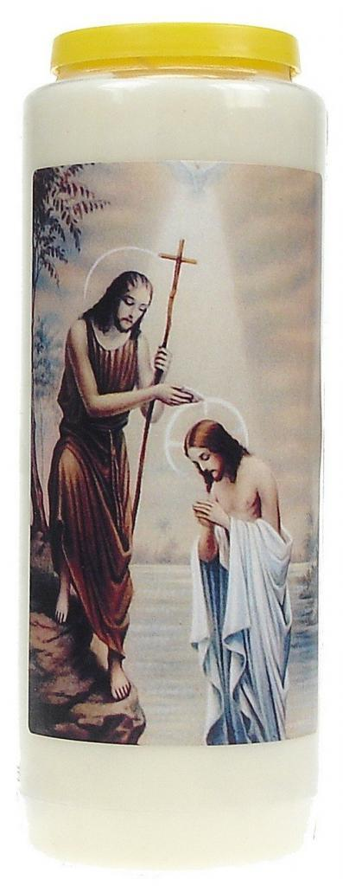

Het [bericht dat mgr. De Kesel zomaar een succesvolle priesterbroederschap aan de deur zet](https://www.kerknet.be/aartsbisdom-mechelen-brussel/nieuws/verklaring-over-fraterniteit-van-de-heilige-apostelen) zonder een echt geloofwaardige argumentie te geven, verontrust me.

Mark de Vries stelt er zich op zijn internationale blog over de Kerk in de Nederlanden ook [kritische vragen](https://incaelo.wordpress.com/2016/06/15/good-work-but-not-in-belgium-mechelen-brussels-sends-the-fraternity-of-the-holy-apostles-packing/) bij.

Ik krijg zo'n beetje het beeld van een Kerk die [niet meer wil profeteren](/blog/wars-van-de-wereld/). Als je je kop teveel uitsteekt voor het geloof, als je tegen de haren van de mensen of van de instituten instrijkt, als je niet in het vooropgestelde plaatje van de moderne Kerk past, dan ben je vogelvrij verklaard. De Kerk is aan het [verstarren](/blog/verstarring-verbeelding-en-fantasie/). Ze is nog veel bezig met besturen en beheren. Ze hoedt zich er angstvallig voor op niemands zere tenen te trappen. Ze is slechts weinig bezig met de profetische verkondiging van het geloof! 

Welnu, misschien als deel van Gods voorzienigheid, dateert het bericht van 15 juni, en op 24 juni vieren we het hoogfeest van de geboorte van Johannes de Doper, de laatste der profeten die ons vurig verbereidde op Jezus' komst. Hij zat er niet mee in iemand tegen de haren te strijken, hoor! Hij was echt een luis in de pels, en toch was zijn optreden noodzakelijk om plaats te maken voor Jezus.

Tijd dus om dit feest gepast voor te bereiden, met een noveen voor profetie in de Kerk. We hebben dat nodig. Het is niet dat we Jezus al in onze broekzak hebben zitten.

Aansteken die noveenkaars, even een [gepast gebed](http://www.sintjanwaalwijk.nl/bezinning/litaniegebed-van-sint-jan-de-doper/) opsnorren, en aan de slag!
