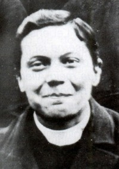
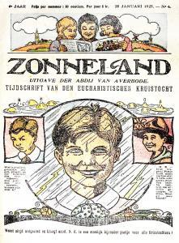
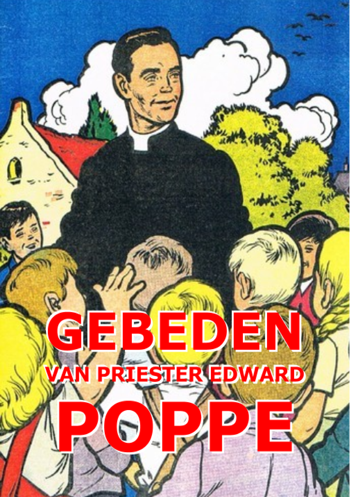

Op 10 juni vieren we de gedachtenis van de zalige priester Edward Poppe. Hij leefde een kleine eeuw geleden, in een Vlaanderen dat er gans anders uitzag. Ondanks zijn zwakke gezondheid, was hij een strijdvaardig priester, maar bovenal een nederig kind van Maria.

### **Biografie**

 Edward Poppe

Edward Poppe wordt op 18 december 1890 te Temse geboren. Hij is het derde kind en de eerste zoon in een bakkersgezin dat elf kinderen zal tellen. Drie zusters treden in het klooster en een broer wordt priester-minderbroeder. Edward studeert aan het seminarie in Gent en aan de Katholieke Universiteit Leuven van 1910 tot 1916 en wordt op 1 mei 1916 in Gent tot priester gewijd.

Al vroeg komt hij in aanraking met de grote problemen van zijn tijd. Vader is een aanhanger van Adolf Daens, een priester die zich vereenzelvigt met de barre sociale omstandigheden van de arme Vlamingen van zijn tijd, tegen de zin van de kerkelijke overheid, die hem uiteindelijk het lezen van de mis in het bijzijn van anderen, en het dragen van de priestersoutane verbiedt. Daens' begrafenis vond plaats zonder zang, in een doodskoets van de armen. Het portret van deze vurige strijder hangt boven de trog in vaders bakkerij.

Priester Poppe sterft op 33-jarige leeftijd, dezelfde leeftijd waarop Jezus de dood vond het op het Kruis, op 10 juni 1924 te Moerzeke, slechts acht jaar priester. Veel van die jaren moet hij doorbrengen in ziekte.

In 1945 wordt het proces geopend voor zijn zaligverklaring. In juni 1986 wordt Poppe eerbiedwaardig verklaard en op 3 oktober 1999 wordt hij door paus Johannes Paulus II zalig verklaard. Zijn feestdag vieren we op 10 juni.

### **Het gevecht om het geloof**

Poppe’s godsvrucht steunt op zijn geloof, op het Credo dat hij zelf bidt en leerde bidden als het eerste en het schoonste gebed. Hijzelf geeft het voorbeeld van een geharmoniseerd leven tussen studie en gebed. Op het seminarie herhaalt hij mediterend iedere les voor het heilig tabernakel. Zijn vroomheid is traditioneel en katholiek. Bij de zalige Edward Poppe vlamt een geestdriftige en warme liefde op voor Christus en zijn Rijk, en bij hem spreekt gelijkertijd het verlangen zo nauw mogelijk aan te sluiten bij de heilige Kerk. Zijn vroomheid is vrij en ongebonden, spontaan en veelzijdig als het leven, en toch komt ze tot volle bloei langs de nauwe wegen van "de regels", de rubrieken van de liturgie, en de dogma’s van het geloofsleer – de eeuwenoude proefsteen waaraan de kerk altijd haar beste dienaren getoetst heeft.

Het is voor hem de enige weg: _"Mij aanpassen, ik wil wel, maar ik heb er een walg van. Mij aanpassen aan de bestaande gewoonten? O Jezus ik brand van verlangen om mij aan te passen aan Uw Evangelie, aan Uw raden, aan Uw voorbeeld. Aan U en aan Uw heiligen wil ik mij aanpassen … Maar mij aanpassen aan een kleine vuige maat, niet Uw maat, hoe lastig zal dat gaan? Gij hebt toch maar één Evangelie … Geen half Evangelie!"_

De karmelietes Thérèse van Lisieux is een van de lievelingsheiligen van Priester Poppe. Hij wil haar navolging in haar 'Kleine Weg', de kleine overgave van zichzelf, gave en overgave in alle eenvoud aanhoudend vernieuwd in de velerlei omstandigheden van het leven en van de dagelijkse plicht.

Het roerende slot van Edward Poppe's laatste brief aan zijn geestelijke leidsman luidt: _"Vader, naam van mij weg het behoren aan mijzelf. Maak, dat geen enkele zucht, geen enkel woord meer ontsnappe aan de beweging van den Geest. Sluit mij op in de Toren van David , in de Toren van Jezus! Ik wil het, Vader, ik wil het, op mijn knieën."_

### **Het gevecht om de toewijding aan Maria**

Priester Poppe heeft ook een bijzonder uitgesproken voorliefde tot Onze Lieve Vrouw. Het is hem een grote vreugde op het seminarie, aan de hand van een theologisch handboek, zijn kinderlijk vertrouwen in Maria te stellen. Maria is de levende monstrans van Jezus, haar voorspraak het kanaal van Jezus' genade, en hij bergt zich onder de mantel van zijn Moeder om met meer vertrouwen naar Jezus te gaan. Zijn tedere Maria-godsvrucht is de uitdrukking van zijn grondige nederigheid.

In de advent van 1912, tijdens zijn voorbereiding tot het priesterschap, voelt hij zich 'opnieuw geboren', in de zin van Jezus' woorden tot de verbaasde Nicodemus: "Alleen wie opnieuw geboren wordt, kan het Rijk Gods zien." Hij schrijft het zo op in zijn dagboek:

_"Ik, Edward Johannes Maria Poppe, ontrouw en zondig als ik ben, hernieuw en bekrachtig heden in uw handen de beloften van mijn doopsel. Ik verzaak voor altijd aan Satan, aan zijn begoochelingen en zijn gedoe, en ik geef mij geheel en al aan Jezus Christus, de mens geworden Wijsheid, om achter Hem mijn kruis te dragen, alle dagen van mijn leven, en om Hem voortaan trouwer te dienen... En nu kies ik u, in tegenwoordigheid van heel de gemeenschap van de heiligen, tot mijn moeder en meesteres. Als slaaf geef ik u en wijd ik u toe mijn lichaam en mijn ziel, mijn innerlijke en uiterlijke goederen, zelfs de waarde van mijn goede werken in verleden, heden en toekomst.  Dat ik door uw tussenkomst en door uw voorbeeld kom tot de volheid van zijn leven op aarde en van zijn glorie in de hemel. Amen."_

Hij herneemt in zijn dagboek deze toewijdingstekst, die hij al tweemaal bij bedevaarten naar Scherpenheuvel gebruikt had, en hij zet er opnieuw plaats en datum bij en ondertekent. Hij maakt er telkens een officiële akte van.

Begin 1916, het jaar van zijn priesterwijding, maakt Edward op spiritueel vlak een heel moeilijke periode door, omdat hij in conflict komt met zijn geestelijke leiders. Eerst is het een pater karmeliet die hem wil aftrekken van zijn devotie tot Onze Lieve Vrouw omdat hij die overdreven vindt. Een andere geestelijke vader, een jezuïet, vindt dat hij niet bij Maria mag blijven staan, maar moet doorstoten tot Jezus. Hoewel Edward het gevoelen heeft dat heel zijn vroomheid plots ondergraven wordt, onderwerpt hij zich. Twee maanden lang maakt hij een verschrikkelijke tijd door. Waarom moet hij zijn lieve Moeder opzij schuiven? Verwaarloosde hij zijn relatie met Jezus door teveel met Maria bezig te zijn?

Uiteindelijk ontvangt hij een beslissende genade die hem bevrijdt uit het verscheurend dilemma. De heilige Maagd zelf neemt het op zich om hem te verlichten en te doen begrijpen dat de beste godsvrucht tot haar niet verschilt van die tot Jezus, dat zij geen verwarring zaait maar een vereenvoudiging van het geestelijk leven betekent: Maria is de weg die leidt naar Jezus, de band die ons met Hem verbindt en, in Hem, met de Heilige Drievuldigheid. Bijgevolg kan men heel bewust bij zijn Moeder blijven terwijl men ondertussen in de meest intieme vereniging met Jezus verkeert.

### **Het gevecht om het priesterschap**

De spiritualiteit van Edward Poppe is ernstig, mannelijk en door en door evangelisch. De hoeksteen van zijn priesterleven is de liefde, zoals die van de gekruisigde Christus, alles gevend en onbegrensd. De levende bron van zijn spiritualiteit is een radikale navolging van het evangelie met een apostolisch vuur voor de waarheid.

Centraal in zijn leven staat de eucharistie en het geloof dat de geconsacreerde hostie werkelijk het brood des levens is: Christus reëel aanwezig. Dat de priester een _alter Christus_ (een tweede Christus) is, is voor Poppe meer dan duidelijk. De mis opdragen, waar aan iedereen brood en wijn, Lichaam en Bloed van Jezus, worden aangeboden is niet een andere zaak dan zijn eigen leven elke dag opdragen. Hij zei: _"Ik begrijp de priester niet die het offer van Jezus opdraagt, en die zich niet als slachtoffer met Hem verenigt. Beminnen zonder lijden, is beminnen in een droom"_.

Er zijn vele getuigenissen van een buitengewone, bovennatuurlijke aantrekkingskracht die van hem uitstraalde. Rond Poppe ontstond aldus overal een concentratie van geestelijke krachten, die hij zelf, schijnbaar onbewust, samenhield en waaraan hij een vaste leiding wist te geven. Hij had zijn leven geofferd als een “langzaam martelaarschap” voor priesters. Zijn grafschrift geeft beknopt zijn levensfilosofie weer: _"Ik sterf liever dan God maar half te dienen"_.

### **Het gevecht om de christelijke opvoeding**

 Zonneland, tijdschrift van de Eucharistische Kruistocht met als bijzonder werkpuntje van de week: N.K. oftewel: niet klagen!

De [Eucharistische Kruistocht](http://users.telenet.be/katholieke-informatie/Poppe/De%20Euch.%20kruistocht.html) wordt in Vlaanderen gesticht in 1920 door de norbertijnen van Averbode, met de bedoeling de communiedecreten van Paus Pius X van 1910 meer ingang te doen vinden, waardoor kinderen op jongere leeftijd hun eerste communie kunnen doen, zoals nu nog de gewoonte is. De bedoeling is de leden te brengen tot het volledige eucharistische leven, ze moeten leren de grote genadebron ten volle benuttigen om te komen tot gelijkvormigheid aan Christus.

De beweging sluit deelt de bezorgdheid van priester Poppe over de toestand van de geloofsopvoeding. Hij meent dat de moderne opvoeders geen idee hebben van de genade, laat staan dat ze eruit leven. De katholieke scholen hebben geen christenen gevormd. Zij hebben wel de kennis van het geloof bijgebracht, maar niet de beleving. Niet de warmte van Gods tegenwoordigheid die hij zo terugvindt in de persoon van Jezus’ moeder Maria.

Priester Poppe wordt door de broeders van Averbode uitgenodigd om medewerker te zijn in de Eucharistische Kruistocht en zorgt in 1922 voor een belangrijk moment in [de bezieling en de groei van de beweging](http://users.telenet.be/katholieke-informatie/Poppe/Poppe.pdf). De leden beloven minstens eenmaal in de week ter Communie te gaan en verbinden zich ertoe te bidden en uit zelfverloochening een offer te brengen voor een bijzondere intentie, die tijdens de catechese of in de vergadering wordt aanbevolen. Als hulpmiddel hierbij is er het weekbriefje. Hun vurig optreden voor het geloof noemen ze kruistocht. De bewegingen uit die tijd gebruiken immers graag de woorden 'strijd' en 'kamp'. Ze spelden fier hun opvallend kenteken op met een wit kruis en een kelk. Hun strijdlied luidt: 'In dichte drommen staat, o Heer, uw kruisleger bereid.' Het weekblad Zonneland kadert in de E.K.-beweging en had als ondertitel "Tijdschrift van den Eucharistischen Kruistocht".

### **Het gevecht om de Vlaamse ontvoogding**

Vlaanderen kent in de negentiende eeuw extreme armoede. De industrialisatie biedt nieuwe werkgelegenheid, maar lonen en arbeidsomstandigheden zijn zo slecht dat zelfs wie werkt, leeft zonder enig perspectief op vooruitgang. In een land als België, waar de burgerlijke, kerkelijke en economische machten uitsluitend de Franse taal gebruiken, is dit sociaal probleem, dat priester Poppe nauw ter harte gaat, onlosmakelijk ook een cultureel en politiek probleem. Hij schrijft: _"Ik beschouw de Vlaamse Beweging als een vorm van geestelijk leven, als een uitstraling van onze natuurlijke en bovennatuurlijke liefde tot God en tot de naaste, als een echo van het 'Miserior super turbam'"_ (woorden uit [Mc 8:2](http://bijbel.net/wb/?p=page&i=65336,65345), 'Ik heb te doen met deze mensen').

Deze strijd wordt hem niet in dank afgenomen door de kerkelijke overheid. Kardinaal Mercier, die hem als een authentieke heilige beschouwt, maar zelf een overtuigd voorstander van een unitair België is, heeft het niet begrepen op het Vlaams nationalisme van Poppe. Mercier verbiedt Poppes biograaf ook maar enige toespeling te maken op dat facet van Edwards persoon, zodat het resultaat in feite een verminkte voorstelling van onze heilige is.  In de vrome boekjes over hem wordt nergens vermeld dat hij in zijn ziel altijd Daensist is gebleven, met hart voor de armen en gevoel voor sociale rechtvaardigheid. Dat hij droomde van een ontvoogding van de arme Vlaming, op het nationalistische af.

 

### **Gebed voor de heiligverklaring van priester Poppe**

Goede Vader, wij danken U omdat Gij ons de zalige priester Poppe hebt gegeven. Wil op zijn voorspraak onze bede verhoren. Moge hij ons een grotere liefde geven voor uw Zoon, voor zijn Kerk, voor de Eucharistie. Dat zijn getuigenis velen oproept om als christen te gaan leven. Dat zijn voorbeeld jongeren aanspoort om priester te worden voor vandaag. Verhaast de dag dat hij opgenomen wordt in de kring van uw heiligen. Wij vragen het U op voorspraak van Maria, zijn en onze Moeder. Amen.

 

<table class="widget"><tbody><tr><td></td><td>Download&nbsp;<a href="https://storage.googleapis.com/geloven-leren/printerboekjes/Gebeden-van-de-zalige-priester-Poppe-boekje.pdf" target="_blank">Gebeden</a> van de zalige priester Edward Poppe om af te drukken als boekje.

Download&nbsp;<a href="https://storage.googleapis.com/geloven-leren/printerboekjes/GebedenvandezaligepriesterEdwardPoppe.pdf" target="_blank">Gebeden</a> van de zalige priester Edward Poppe om te lezen op je scherm.</td></tr></tbody></table>

 

Bronnen:

[http://www.jongerlo.org/geloofsvorming/archief\_leven/geloofsvorming\_leven\_poppe.htm](http://tongerlo.org/~tongerlo/2016/06/06/de-zalige-edward-poppe-1890-1924/) [http://www.tienerweb.be/zalige-priester-edward-poppe/](http://www.tienerweb.be/zalige-priester-edward-poppe/) [https://nl.wikipedia.org/wiki/Edward\_Poppe](https://nl.wikipedia.org/wiki/Edward_Poppe) [https://nl.wikipedia.org/wiki/Eucharistische\_Kruistocht](https://nl.wikipedia.org/wiki/Eucharistische_Kruistocht) [http://demontfortblog.blogspot.be/2012/12/edward-poppe.html](http://demontfortblog.blogspot.be/2012/12/edward-poppe.html) [http://www.geloofenleven.be/page297.html](http://www.geloofenleven.be/page297.html) [http://nl.crc-resurrection.org/heiligen/de-z-edward-poppe-een-priester-voor-de-wedergeboorte-van-de-kerk/](http://nl.crc-resurrection.org/heiligen/de-z-edward-poppe-een-priester-voor-de-wedergeboorte-van-de-kerk/) http://be.missionerh.com/Missionaire-en-spirituele-profielen/%E2%80%9CMijn-leven-is-Jezus-Christus%E2%80%9D/1.-Priester-Edward-Poppe.html

 

[Download dit artikel als PDF](/portfolio/priester-poppe/)
