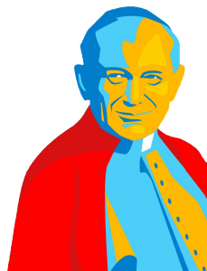
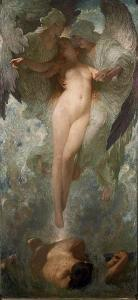

### Een bijzondere paus

Heilige Paus Johannes-Paulus II

Johannes-Paulus II (Karol Józef Wojtyła) was paus van 1978 tot zijn overlijden in 2005. Zijn Poolse nationaliteit, zijn sportiviteit, zijn lange pontificaat, zijn reislust, zijn legendarische talenknobbel, de bijna-fatale aanslag op zijn leven, zijn rol in de strijd tegen het communisme, de slepende ziekte die de laatste jaren van zijn leven tekende, zijn snelle heiligverklaring en nog veel meer [weetjes](https://nl.wikipedia.org/wiki/Paus_Johannes_Paulus_II) maken hem een [bijzondere paus](https://www.kerknet.be/kerknet-redactie/nieuws/de-10-belangrijkste-verwezenlijkingen-van-paus-joannes-paulus-ii).

> Andere erfenissen van Johannes-Paulus II:  
> \* De Catechismus van de Katholieke Kerk (eerste pulicatie sinds de reformatie!)  
> \* Vijf mysteries van het licht, toegevoegd aan het rozenkransgebed  
> \* Een vijftiende statie in de kruisweg, die de verrijzenis van Christus mediteert

### Jongeren

Gelovigen herinneren hem echter vooral als een paus die zich richt op jongeren en gezinnen. Hij roept de [wereldjongerendagen](https://nl.wikipedia.org/wiki/Wereldjongerendagen) in het leven, die dit jaar trouwens in het geboorteland van Johannes-Paulus doorgaan! Hij organiseert in de eerste jaren van zijn ambtstermijn ook een [synode over het gezin](http://www.rkdocumenten.nl/rkdocs/index.php?mi=650&dos=81), net als paus Franciscus.

### Theologie van het lichaam

Elke woensdag houdt de paus een algemene audiëntie, een ontmoeting met bezoekers en pelgrims die van over heel de wereld daarvoor naar Rome komen. Tijdens die ontmoetingen geeft de paus catechese. Van 1979 tot 1984 gaan [de meeste van die catecheses](http://www.rkdocumenten.nl/rkdocs/index.php?mi=650&dos=122) over de "theologie van het lichaam", wat eigenlijk een soort van seksuele opvoeding is, zoals je ook op school leert, maar geïnspireerd op de bijbel. De bijbel gebruikt de hartstochtelijke liefde tussen een man en een vrouw als een spiegel voor de liefde van God voor ons. De catecheseteksten zijn gericht op volwassenen en niet meteen toegankelijk voor jongeren, maar we gaan hier toch enkele eerste inzichten proberen overbrengen. Een uitdaging.

De theologie van het lichaam zoekt antwoorden op vragen als "wie ben ik?", "hoe moet ik leven?", "wat maakt me echt gelukkig?", "wat is liefde?", "wat betekent het een man of een vrouw te zijn?", "wat kan het verhaal van Adam en Eva ons vandaag leren?", "waarom heeft God ons een vrije wil gegeven?", "welke 'taal' spreekt Jezus' lichaam aan het kruis?", "welke 'taal' spreken wij met ons lichaam?"

### Jezus over echtscheiding

Laten we eerst de belangrijkste bijbelcitaten bekijken die paus Johannes-Paulus II inspireren. Hij vertrekt vanuit het antwoord dat Jezus de farizeeën geeft, die vragen of het een man toegestaan is zomaar van zijn vrouw te scheiden.

_"Hebt gij niet gelezen, dat de Schepper in het begin hen als man en vrouw gemaakt heeft en gezegd heeft: Daarom zal de man zijn vader en moeder verlaten om zich te binden aan zijn vrouwen deze zullen worden één vlees? Zo zijn zij dus niet langer twee, één vlees als zij geworden zijn. Wat God derhalve heeft verbonden, mag een mens niet scheiden." Zij zeiden Hem: "Waarom heeft Mozes dan voorgeschreven bij het wegzenden van een vrouw een scheidingsbrief te geven?" Hij antwoordde: "Om de hardheid van uw hart heeft Mozes u toegestaan uw vrouwen weg te zenden;  in het begin was dit echter niet zo"_ ([Mt 19:4-8](http://bijbel.net/wb/?p=page&i=64599,64610))

### In het begin

De schepping van Eva

Tweemaal verwijst Jezus naar hoe het was _in het begin_, met de eerste woorden van het scheppingsverhaal in de bijbel. Het boek Genesis bevat twee verhalen over de schepping van de mens, die je ongetwijfeld al eens hebt gehoord. Het eerste hoofdstuk vertelt hoe God de mens schept op de zesde dag, nadat Hij het licht en de aarde, de zee en het land en alle planten en dieren geschapen had: _"En God schiep de mens als zijn beeld; als het beeld van God schiep Hij hem; mannelijk en vrouwelijk schiep Hij hen."_ Dit verhaal beschrijft vanuit Gods ervaring (dat heet theologisch) het wezen van de mens, die in de schepping een heel bijzondere rol heeft: op God te gelijken, als man en vrouw. ([Gen 1:1-31,2:1-4](http://bijbel.net/wb/?p=page&i=2,36))

Het tweede hoofdstuk geeft een andere beschrijving van de schepping van de mens, vanuit de ervaring van de mens (dat heet antropologisch). De man wordt eerst geschapen, maar is eenzaam, en uit zijn vlees wordt de vrouw geschapen. _"Daarom zal een mens zijn vader en zijn moeder verlaten en zich hechten aan zijn vrouw, en die twee zullen één zijn. Ze waren beiden naakt, de mens en zijn vrouw, maar ze voelden geen schaamte voor elkaar."_ Dit beschrijft de oorspronkelijke onschuld van de mensen.  Ze laten zich echter verleiden door de kennis van goed en kwaad, waarmee de oorspronkelijke onschuld verloren gaat, en ze schamen zich. ([Gen 2:5-24](http://bijbel.net/wb/?p=page&i=37,58))

Als Jezus verwijst naar _het begin_, gaat het Hem erom de mens de oorspronkelijke onschuld te laten herontdekken, die niet verloren is, maar nog steeds in de orde van Gods schepping aanwezig is. Het tweede scheppingsverhaal, de zondeval,  verschaft de inzichten die de weg leiden naar de nooit ongedaan gemaakt werkelijkheid van het eerste scheppingsverhaal, het paradijs. Jezus breekt aan het kruis de muur open die de erfzonde optrok rond het paradijs. Jezus' verlossingswerk wijst de gevallen mens op de oorspronkelijke onschuld waarvoor hij met zijn vrije wil bestemd is.

### God openbaart zich in het lichaam

De theologie is de wetenschap die God wil leren kennen. God laat zich kennen in de openbaring. De eerste belangrijke openbaring van God, aan de eerste mens, is het menselijk lichaam, want hij is geschapen naar Gods beeld. Wil je God kennen, is het daarom leerrijk je eigen lichaam te kennen. God schept echter niet één menselijk lichaam, Hij schept er twee: man en vrouw. In die tweedeling laat God zich het best kennen: een man en een vrouw kunnen hun lichaam aan mekaar geven, één lichaam worden en leven voortbrengen.

De tweede belangrijke openbaring van God is in zijn eigen menswording, in Jezus. Aan het kruis geeft Jezus zijn lichaam geheel en al voor onze verlossing. Net zoals een geestelijke die celibatair leeft zijn lichaam niet bewaart voor één ander persoon, maar zich geeft voor alle mensen.

Tweemaal laat God zich kennen vanuit het menselijk lichaam. Niet te verwonderen dus dat Johannes-Paulus er theologische inzichten uit afleidt.

### De betekenis van seksualiteit

Man en vrouw die zich in de huwelijksdaad zo nauw verenigen dat zij 'één vlees' worden, ontdekken het schep­pingsmysterie elke keer op heel speciale wijze opnieuw. Het feit dat zij 'één vlees' worden, is een sterke, door de Schepper gelegde band, waardoor zij hun eigen mens-zijn ontdekken, hetzij in de oorspron­kelijke eenheid daarvan, hetzij in de dualiteit van een geheimzinnige wederzijdse aantrekkingskracht.

In de als beeld van God geschapen mens is dus het sacramenteel karakter van de schepping geopenbaard. Door zijn lichamelijkheid, zijn mannelijkheid en vrouwelijkheid, wordt de mens zichtbaar teken van de waarheid en de liefde die haar bron in God zelf heeft en die reeds geopenbaard werd in het scheppingsmysterie.

> [Hooglied](http://bijbel.net/wb/?p=inx&i=1,1,22)
> 
> Je kan dit erotisch gedicht niet lezen los van het oorspronkelijke sacrament dat in het boek Genesis naar voren komt. Het gebruik van metaforen toont aan hoe de taal van het lichaam verweven is met het geheel van de schepping.

### Goddelijke gemeenschap van personen

Het lichaam maakt zichtbaar wat onzichtbaar is: het geestelijke en het goddelijke. Het is geschapen om in de zichtbare werkelijkheid van de wereld het in God verborgen mysterie over te dragen en het zichtbaar teken ervan te zijn. De mens wordt niet zozeer beeld van God op het moment van de eenzaamheid maar eerder op het moment van de gemeenschap. _In het begin_ is hij namelijk niet alleen een beeld dat de eenzaamheid weerspiegelt van een Persoon die de wereld regeert, maar ook en wezenlijk beeld van een onpeilbare goddelijke ge­meenschap van Personen. De drie goddelijke Personen gaan op in de Drie-eenheid, en in het huwelijk gaan een man en een vrouw, met de kracht van de Heilige Geest, op in een gemeenschap van personen die een beeld is van de goddelijke eenheid. Het gezin is een imitatie van van de Triniteit en geroepen om lief te hebben zoals God liefheeft.

> [Tobit](http://bijbel.net/wb/?p=inx&i=1,1,40)
> 
> Tobias verlaat zijn ouders en gaat met de hulp van de engel Rafael de strijd aan met een demon die Sara tot zeven maal toe van haar verloofde heeft beroofd. De lofredes in dit boek benadrukken de waarden van het gezin, van ouderschap en van het huwelijk, geworteld in een vast geloof.

### Christus

Christus heeft zich niet verenigd met een vrouw, maar zijn bruid zijn wij. Door zijn eigen lichaam te geven aan het kruis, vanuit liefde voor de mens, heeft Jezus de betekenis die het lichaam heeft in het huwelijk geopenbaard, hersteld en volbracht. Het is de vrije, oprechte en liefdevolle gave van het lichaam, door de kracht van de Heilige Geest, die de mens zichzelf laat kennen zoals hij _in het begin_ is. Man en vrouw, een goddelijke gemeenschap van personen, geschapen naar Gods beeld en bestemd voor een eeuwig leven in gemeenschap met Christus.

### Toegift

> De [redevoering](https://w2.vatican.va/content/john-paul-ii/nl/speeches/1985/may/documents/hf_jp-ii_spe_19850517_popolazione-anversa.html) die paus Johannes-Paulus uitsprak op de Grote Markt van Antwerpen, in het Nederlands, op 17 mei 1985, bij zijn bezoek aan de Nederlanden.

[Paus-in-Antwerpen-17-mei-1985-Grote-Markt.mp3](https://storage.googleapis.com/geloven-leren/audiobooks/Paus-in-Antwerpen-17-mei-1985-Grote-Markt.mp3)

> Dit is een meer uitgebreide reportage van het bezoek aan België.



En hier is en nog uitgebreidere reportage, van [Radio Maria](http://www.radiomaria.be/), in vier delen, opgeluisterd met foto's van [Studio Alijn](http://www.huisvanalijn.be/info/opzoekingen-doen).









[Download dit artikel als PDF](/portfolio/theologie-van-het-lichaam/)
