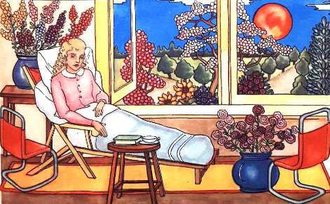

 Titelblad van kindercatechismus "Luistert naar Hem" uit 1949

[Een viertal jaar geleden](/blog/prentenchatechismus-org-prenten-uit-grootvaders-tijd-geven-een-nieuwe-kijk-op-de-kerkelijke-leer/), tijdens het 'Jaar van het geloof', werd de website [prentencatechismus.org](http://prentencatechismus.org/) in het leven geroepen om een honderd jaar oude prentencatechismus publiek toegankelijk te maken voor [alledaags](/blog/alledaags-geloven/) gebruik.

Vandaag is de website aangevuld met een 'nieuwe' oude catechismus. Iets jonger ditmaal, uit 1949, is de kindercatechismus [_Luistert naar Hem_](http://prentencatechismus.org/inhoud-luistert-naar-hem/). Zes-en-veertig kleurprenten brengen de beginselen van het geloofsleven aan, met begeleidende tekst op kindermaat.

In 1949 bevond de Kerk zich aan de vooravond van een hele reeks vernieuwingen, niet alleen in de _manier waarop_ aan catechese wordt gedaan, maar ook in de _inhoud_ van de catechese. Dit catecheseboek is dan ook ongetwijfeld het laatste van zijn soort dat in het reguliere circuit in uitgave kwam. Het zal wel toeval zijn, maar beeldend trof me dit bijzonder sterk in de [allerlaatste prent van de catechismus](http://prentencatechismus.org/luistert-naar-hem/het-heilig-oliesel/), en wel in het geïllustreerde meubilair! De meeste illustraties tonen klassieke houten tafeltjes en stoelen als dat van toepassing is, maar in de laatste prent wordt de deur op een kier gezet om het modernisme binnen te laten, met dit setje design buisstoelen aan de zijde van de zieke, wonderbaarlijk aan beterhand dankzij het heilig oliesel.

 Laatste prent uit "Luistert naar Hem"

Disclaimer: vooraleer u met dit materiaal aan de slag gaat, is het raadzaam de [historische duiding](http://prentencatechismus.org/about/) door te nemen!
