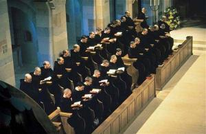
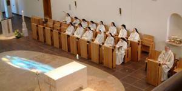
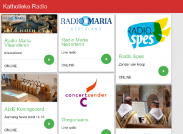

De kracht van gebed is herhaling. In uitzonderlijke, acute omstandigheden kan een kort [schietgebedje](http://www.geestvangebed.nl/index.php?option=com_content&task=view&id=128&Itemid=41) deugd doen, maar als je je gebed diep tot in je ziel wil laten doordringen, maak je er best wat meer werk van. De traditie van onze heilige moeder de Kerk voorziet in alles, dus ook in aangepaste gebedsvormen, waarvan we er hier drie nader gaan bekijken.

De belangrijkste vorm van dagelijks gebed is het getijdengebed, in eerste instantie bedoeld voor geestelijken. Volgende artikels belichten de rozenkrans en het noveengebed.

Het [Getijdengebed](http://tongerlo.org/~tongerlo/2016/06/04/het-getijdengebed/) is het dagelijkse gebed door de katholieke kerk voorgeschreven voor monniken, monialen, priesters en leken. Het getijdengebed bestaat hoofdzakelijk uit de 150 Psalmen toegeschreven aan Koning David. Hoe oud ze ook zijn, ze bezingen vreugde en verdriet, goed en kwaad, wanhoop en vertrouwen van mensen van alle tijden en plaatsen. . Er zijn talloze termen in gebruik om het getijdengebed te benoemen. Zo spreekt men ook van “getijden”, ‘’koorgebed’’, “heilig officie”, “uren” of “breviergebed”.

Aanvankelijk werden dagelijks de 150 psalmen gebeden, maar dit nam te veel tijd in beslag en men ging het psalmengebed spreiden over een week, waarbij elke dag op de verschillende gebedstijden een aantal psalmen werden gebeden.

St. Benedictus van Nursia heeft in de VIe eeuw een dergelijk gebedsschema opgezet, dat zeer snel vrij algemeen werd gebruikt. Aan deze psalm-koorboeken werden dan, over verloop van tijd, antifonen, responses, collecta’s en korte gebeden toegevoegd als hulpmiddel voor diegenen die niet zo bedreven waren in het improviseren van dergelijke gebeden.

Tot het Concilie van Trente in de XVIe eeuw kon elke bisschop het Breviarium opstellen of aanpassen voor zijn diocees en dit werd ook bijna overal gedaan, elke kloosterorde en elk bisdom had zijn eigen Breviarium. Pius V verplichtte in 1568 het gebruik van het Breviarium _ad usum Romanum_, op enkele uitzonderingen na, die in de eigen vorm mochten voortbestaan.

Na het tweede Vaticaans Concilie is het getijdengebed helemaal hervormd. Het Concilie heeft gewild dat ook de lekengelovigen, individueel of in de kerk, het getijdengebed zouden bidden. Het is het gebed waardoor je samen met heel de kerk de verschillende tijden van de dag heiligt.

\[caption id="attachment\_2708" align="alignright" width="300"\] Abbaye de Barroux\[/caption\]

De traditionele gebedstijden

- De metten gedurende de nacht, om middernacht.
- De lauden rond zonsopgang
- De priem rond 6 uur
- De terts rond 9 uur
- De sext rond 12 uur
- De none rond 15 uur
- De vespers rond 17 uur
- De completen rond 20 uur

 

\[caption id="attachment\_2709" align="alignright" width="300"\] Abdij Koningsoord\[/caption\]

De nieuwe gebedstijden

- Een inleidend gebed dat gebeden wordt voor de eerste dienst
- Lezingendienst (vervangt de metten)
- De lauden of het morgengebed
- Middaggebed (vervangt terts, sext en none)
- De vespers of het avondgebed
- De completen of de dagsluiting

 

Via de website [Katholieke Radio](http://radio.gelovenleren.net/) kan je het getijdengebed live volgen. Het traditionele getijdengebed wordt in het Latijn gebeden in de [abdij van Barroux](http://www.barroux.org/) en het nieuwe getijdengebed in het Nederlands in [abdij Koningsoord](http://www.koningsoord.org/). Ook op [Radio Maria Vlaanderen](http://www.radiomaria.be/) en [Radio Maria Nederland](http://www.radiomaria.nl/) kan je op vaste tijdstippen het getijdengebed meebidden.

\[caption id="attachment\_2526" align="aligncenter" width="300"\] Katholieke radio\[/caption\]

Een [online handleiding om het getijdengebed te bidden](http://www.tiltenberg.org/getijdengebed/webapp/) (gebruikersnaam: getijdengebed, wachtwoord: brevier) vind je op de website van het seminarie [De Tiltenberg](http://www.tiltenberg.org/cms/). Er is ook een [online versie van het traditionele getijdengebed in het Latijn](http://www.divinumofficium.com/cgi-bin/horas/officium.pl). Die online versies zijn vooral handig omdat ze je de dagelijkse gebeden kant en klaar voorschotelen, zodat je niet in je getijdenboek over en weer moet bladeren.

[Dit artikel kan je ook afdrukken in een mooie layout.](/portfolio/getijdengebed-rozenkrans-noveen/)
