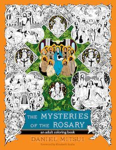

In de boekhandel heeft u het al gemerkt: kleurboeken zijn er niet langer alleen voor kinderen. Ook volwassenen blijken graag te kleuren als tijdverdrijf. Dat kan aardig mooie resultaten opleveren, maar zou het niet nog mooier zijn als zo'n kunstwerkje ook nog iets spiritueels kan bijdragen?

\[caption width="232" id="attachment\_2733" align="alignright"\] Mysteries of the Rosary, Daniel Mitsui\[/caption\]

[Daniel Mitsui](http://www.danielmitsui.com/) is een jonge illustrator die bijzonder mooie tekeningen maakt met katholieke taferelen. Die zijn nu ook beschikbaar als kleurplaten. Enkele platen kan je downloaden van zijn website, andere platen zijn gebundeld in twee boeken, de [Mysteries van de Rozenkrans](https://www.avemariapress.com/product/1-59471-584-X/The-Mysteries-of-the-Rosary/), en [Heiligen](https://www.amazon.com/Saints-Adult-Coloring-Book/dp/1594717249).

Op mijn overzicht van [boekjes-om-zelf-af-te-drukken](/page/katholieke-printerboekjes/) heb ik [deze verwijzing](/portfolio/kleurplaten/) gecatalogeerd onder "Gebeden", want dat is dan wel de bedoeling als je begint in te kleuren!
