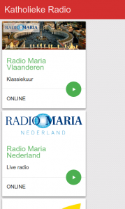
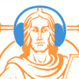

 Katholieke Radio

Nu ik toch op dreef ben met XDK, heb ik ook maar de app Katholieke Radio een nieuwe beurt gegeven. De [bijhorende website](http://radio.gelovenleren.net/) waar je kan zappen tussen katholieke radiozenders bestond al, en is nu ook beschikbaar als [app op Android](https://play.google.com/store/apps/details?id=net.credomobiel.katholiekeradio).

<table class="widget"><tbody><tr><td></td><td><a href="https://play.google.com/store/apps/details?id=net.credomobiel.katholiekeradio">Katholieke Radio (Android)</a> Nederlandstalige katholieke radio</td></tr></tbody></table>

Het aanbod omvat:

- Radio Maria Nederland
- Radio Maria Vlaanderen
- Radio Spes
- Bidden Onderweg (dagelijkse podcast)
- Concertzender Gregoriaans
- Getijdengebed vanuit abdij Koningsoord
- Getijdengebed vanuit abbaye du Barroux
- SPQN Weekend (podcast)
- Radio Vatikaan zenders 1 en 5
