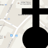
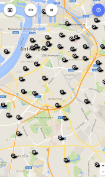

<table class="widget"><tbody><tr><td></td><td><a href="https://play.google.com/store/apps/details?id=net.credomobiel.masses">Naar de mis (Android)</a> in Vlaanderen</td></tr></tbody></table>

 naar de mis

Voor de [website "naar de mis"](/blog/kerknet-gehackt-om-naar-de-mis-te-gaan/) heb ik de gegevens over de uren van de zondagsmissen in Vlaanderen van het oude Kerknet geplunderd om ze weer te geven in een gebruiksvriendelijke omgeving. Die website is nu ook verpakt als een [app voor Android](https://play.google.com/store/apps/details?id=net.credomobiel.masses). Als je die op je gsm installeert, moet je nooit meer in paniek schieten als je je afvraagt of je in de buurt nog ergens naar de mis kan gaan.

De app is eigenlijk een update van een [eerder experiment](/blog/kan-ik-vandaag-nog-ergens-naar-de-mis/), dat al lange tijd niet meer functioneerde. Toch blijft de app, evenals de website, een prototype. Er zijn nog tal van gebreken. Om er enkele op te sommen:

- je moet online zijn om eucharistievieringen op te zoeken
- de eerste weergave van de kaart toont vaak de foutmelding "Data may still be loading…", maar als je dan even in- of uitzoomt of de positie versleept, lost dat zich meestal op
- de snelheid laat soms te wensen over
- gegevens van heilige missen buiten het weekcircuit zijn niet beschikbaar

Hopelijk komt [nieuw Kerknet snel op de proppen](/blog/nieuw-kerknet-eerste-indrukken-en-verzuchtingen/) met een volwaardige vieringenzoeker, want dat is toch echt geen overbodige luxe in het snel veranderende kerklandschap in dit digitale tijdperk, waarin het niet abnormaal is dat een gelovige over de grenzen van zijn eigen parochie heenkijkt om een dienst te zoeken die hem praktisch of inhoudelijk het best past.

In afwachting staat het parochieverantwoordelijken vrij de website aan te passen of aan te vullen met actuele gegevens. Bezoek daarvoor de [website](http://naar-de-mis.maptiming.com/) op je pc en gebruik de knoppen rechts onderaan om missen te wijzigen of toe te voegen:

Een mis toevoegen

De gegevens van een mis wijzigen

Voor de geïnteresseerden: het verpakken van de website tot app gebeurde met behulp van [XDK](https://software.intel.com/en-us/intel-xdk), het Intel-platform voor ontwikkeling van mobiele toepassingen op basis van HTML5-code en met behulp van [Cordova](https://cordova.apache.org/). Het werk werd vergemakkelijkt door toepassing van een kant-en-klare [template](https://github.com/krisrak/html5-cordova-webapp).
