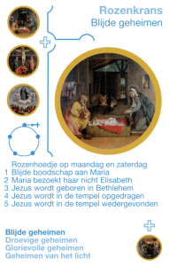
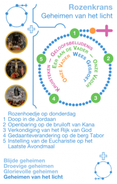
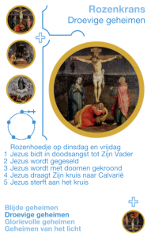
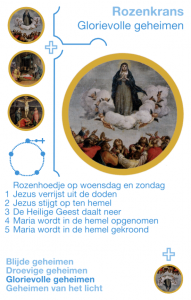
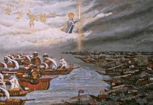

De kracht van gebed is herhaling. In uitzonderlijke, acute omstandigheden kan een kort [schietgebedje](http://www.geestvangebed.nl/index.php?option=com_content&task=view&id=128&Itemid=41) deugd doen, maar als je je gebed diep tot in je ziel wil laten doordringen, maak je er best wat meer werk van. De traditie van onze heilige moeder de Kerk voorziet in alles, dus ook in aangepaste gebedsvormen, waarvan we er hier drie nader gaan bekijken.

In dit artikel komt de rozenkrans aan bod.

De [oorsprong van het rozenkransgebed](http://www.startdestilte.be/vragen/hoe-is-het-bidden-van-de-rozenkrans-ontstaan) moet worden gezocht in de vervanging van het monastieke psalmgebed: Het bidden van 150 maal een Weesgegroet is in feite een vereenvoudiging voor het gewone kerkvolk dat de 150 psalmen niet uit het hoofd kon opzeggen, zoals de kloosterbroeders dat wel konden. Eerst werd er vooral 150 maal een Onze Vader gebeden. Later werd hieraan de devotie tot Maria verbonden, door tijdens elk tientje een mysterie uit het leven van Maria te mediteren. De rozenkrans kreeg de vorm zoals we hem vandaag kennen in de 15e eeuw.

In 2002 voegde paus Johannes Paulus II vijf mysteries van het licht toe, over het openbare leven van Jezus. De paus wilde het verval omkeren waarin de rozenkrans was beland in de laatste decennia van de vorige eeuw, door het wegglijden van de aandacht van de mysteries van de rozenkrans. Daarom benadrukt hij de contemplatieve en meditatieve dimensie van het rozenkransgebed. Het gaat om de relatie met Jezus, naar het voorbeeld van Maria en met haar hulp.

Dit zijn de [geheimen of mysteries van de rozenkrans](http://www.startdestilte.be/vragen/wat-zijn-de-mysteries-van-de-rozenkrans):

### Blijde geheimen

- De engel Gabriël brengt de blijde boodschap aan Maria (Annunciatie)
- Maria bezoekt haar nicht Elisabeth (Maria-Visitatie)
- Jezus wordt geboren in de stal van Bethlehem (Kerstmis)
- Jezus wordt in de tempel opgedragen (Maria-Lichtmis)
- Jezus wordt in de tempel teruggevonden (Heilige Familie (soms deze lezing))

### Geheimen van het Licht

- De doop van Jezus in de Jordaan. (Doopsel van Jezus)
- De openbaring van Jezus op de bruiloft van Kana.
- Jezus’ aankondiging van het Rijk Gods.
- De gedaanteverandering van Jezus op de berg Tabor (Gedaanteverandering van de Heer).
- Jezus stelt de Eucharistie in. (Witte Donderdag/Sacramentsdag)

### Droevige geheimen (Goede Vrijdag)

- Jezus bidt in doodsangst tot zijn hemelse Vader
- Jezus wordt gegeseld
- Jezus wordt met doornen gekroond
- Jezus draagt het kruis naar de berg van Calvarië
- Jezus sterft aan het kruis

### Glorievolle geheimen

- Jezus verrijst uit de doden (Pasen)
- Jezus stijgt op ten hemel (Hemelvaart)
- De Heilige geest daalt neer over de apostelen (Pinksteren)
- Maria wordt in de hemel opgenomen (Maria-Tenhemelopneming)
- Maria wordt in de hemel gekroond (Maria Koningin)

Naast de meditaties worden in het gebed ook intenties opgenomen. Op Radio Maria wordt dagelijks meermaals de rozenkrans gebeden en kunnen luisteraars hun intenties doorgeven.

Vaak bidt men niet het volledige rozenkransgebed maar de verkorte versie. Deze verkorte versie noemt men het rozenhoedje, maar wordt vaak ook gewoon 'rozenkrans' genoemd. Voor dit rozenhoedje bidt men de rozenkrans niet driemaal rond (15 tientjes) maar slechts eenmaal (5 tientjes). Wanneer men één rozenhoedje, bestaande uit vijf zogenaamde tientjes, bidt, koppelt men de [geheimen](http://www.startdestilte.be/vragen/wat-zijn-de-mysteries-van-de-rozenkrans) of mysteries aan een [bepaalde dag](https://nl.wikipedia.org/wiki/Rozenkrans) van de week.

Zo worden de geheimen gekoppeld aan de dagen van de week:

- Maandag: Blijde Geheimen
- Dinsdag: Droevige Geheimen
- Woensdag: Glorievolle Geheimen
- Donderdag: Geheimen van het Licht
- Vrijdag: Droevige Geheimen
- Zaterdag: Blijde Geheimen
- Zondag: Glorievolle Geheimen

 Slag bij Lepanto

Aan christelijke zijde werd de [overwinning bij de Slag bij Lepanto](http://www.heiligen.net/heiligen/10/07/10-07-1571-maria.php) op 7 oktober 1571 toegeschreven aan het bidden van de rozenkrans door zowel het niet-strijdende volk als de krijgsmacht. Na de slag stelde paus Pius V officieel op 7 oktober een feestdag in als gedachtenis van de overwinning op de Ottomanen. Sindsdien geldt de maand oktober als rozenkransmaand in de Rooms-katholieke Kerk.

De heilige Franse priester Lodewijk de Montfort was in de XVIIIe eeuw een belangrijke promotor van de rozenkrans, vanuit zijn persoonlijke devotie tot Maria. Hij benadrukte de trinitaire spiritualiteit van de Mariadevotie (Maria is immers dochter van God de Vader, Moeder van God de Zoon en Bruid van God de Heilige Geest) en voegde daarom het "Glorie zij de Vader…" toe voor elk Onze Vader in de rozenkransgebed.

Een [rozenkrans](http://www.legioenvanmaria.nl/?p=info&ids=rozenkrans) of paternoster is een gebedssnoer om het bidden van de rozenkrans te vergemakkelijken. De rozenkrans bestaat uit 5 grote en 50 kleine kralen en een uiteinde met nog eens 3 plus 1 kralen en een crucifix. Letterlijk vertaald is paternoster 'vaderons' en de rozenkrans bidden noemde men vroeger 'vaderonzen'.

Ook voor het bidden van de rozenkrans bestaan er online handleidingen, zoals die van [Kinderen bidden voor Kinderen](http://www.rkactiviteiten.nl/kinderenbiddenvoorkinderen/rozenkransgebed/) of [Start de Stilte](http://www.startdestilte.be/rozenkrans).

[Dit artikel kan je ook afdrukken in een mooie layout.](/portfolio/getijdengebed-rozenkrans-noveen/)
