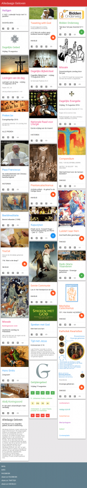
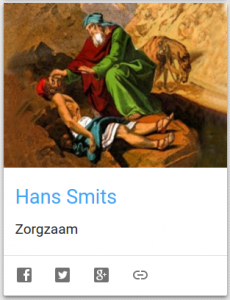
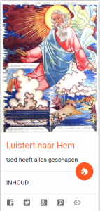

De website [Alledaags Geloven](http://alledaags.gelovenleren.net/) is uitgebreid met twee nieuwe kaarten.

Hans Smits schrijft op regelmatige basis overwegingen op [hetkatholiekegeloof.nl](http://www.hetkatholiekegeloof.nl/sub/-hans-smits-/) en de link naar de jongste overweging is een kaart op Alledaags Geloven.

\[caption id="attachment\_2780" align="alignright" width="150"\] Luistert naar Hem\[/caption\]

[Luistert naar Hem](http://prentencatechismus.org/) is een oude prentencatechismus. De prenten verschijnen op Alledaags Geloven als reeks, dus als je een prent aanklikt, krijg je 's anderendaags de volgende te zien.
