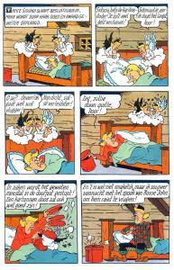
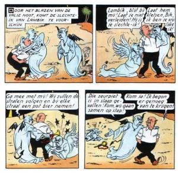

De Kerk, die het volk van God verenigt, zorgt voor haar kinderen als een goede moeder. Zij maant ons aan verenigd te blijven met Christus door zijn sacramenten. De meeste van die sacramenten bezegelen mijlpalen in ons leven met een teken van Christus' tastbare aanwezigheid: doopsel, vormsel, huwelijk en priesterwijding, ziekenzalving. Die meeste van die sacramenten ontvangen we slechts eenmalig, maar we dragen ze mee voor de rest van ons leven. Dat is een hele hulp, als we er ons tenminste voortdurend van bewust kunnen blijven of anders gezegd: als we de Heilige Geest  in ons laten werken, die ons door de toediening van die sacramenten vergezelt.

Geen van die sacramenten is een einddoel, ze zijn geen diploma's voor iets dat we bereikt hebben in ons christelijk leven, integendeel: het zijn telkens beginpunten van een nieuwe taak, met een blijvende werking. Die opdracht is een grote uitdaging: christelijk te leven, als gedoopte, als gevormde, als echtgenoot, als priester of als stervende. Een opdracht die niet zonder gevaren is, met een onbekend doel.

Het doel, dat is het koninkrijk van God, het eeuwige leven. Hoe kan je dat doel bereiken? Jezus levert ons in zijn leringen over dat koninkrijk geen kant-en-klare blauwdruk op. We hebben geen uitgestippelde route op een landkaart gekregen waarop we kunnen aflezen hoe we ons doel zullen bereiken. Toch heeft Jezus ons een weg gewezen die we kunnen volgen. Om ons op die weg te begeleiden, verschaft de Kerk ons nog twee extra sacramenten. De biecht en de eucharistie.

Biecht en eucharistie zijn instrumenten die je als gelovige moet leren gebruiken. Je moet die instrumenten leren kennen, je in de werking ervan verdiepen en zorgen dat je bij het gebruik ervan steeds betere resultaten boekt. Als je ze met vaardigheid aanwendt, zorgen ze ervoor dat je koers recht op doel afgaat en dat je een stevige steunpilaar opzet voor Gods koninkrijk.

# Het geweten

De instructies om het koninkrijk te bouwen en de wegwijzers om de weg naar het eeuwige leven te volgen, liggen verscholen in onszelf, meerbepaald: in ons [geweten](http://www.rkdocumenten.nl/rkdocs/index.php?mi=600&doc=1&id=1281&highlight=geweten). Maar ook dat geweten bevat geen voorgeprogrammeerde kennis, het is ook maar één van de vele facetten van ons menselijk verstand en je moet het voeden en oefenen om wijs te worden.

Het geweten is een speciaal soort zelfbewustzijn waardoor we naar onszelf leren kijken met de ogen van God. Als Jezus zegt _"Gij zult uw naaste beminnen als uzelf"_, zegt Hij dat we onszelf moeten beminnen vooraleer we onze naaste kunnen beminnen, maar wat betekent dat, jezelf beminnen? Aan zijn gebod gaat ter verduidelijking een ander vooraf: _"Gij zult den Heer uw God beminnen met heel uw hart, met heel uw ziel en heel uw verstand."_ Als we naar God kijken met respect, eerlijkheid, vertrouwen en openheid, kunnen we op dezelfde manier naar onszelf en onze relatie met onze naaste kijken, met de ogen van God. Want beminnen, dat is "graag zien". Die blik is het geweten.

Er valt nog veel meer te zeggen over het [geweten](http://www.katholiekgezin.nl/index.php?option=com_content&task=view&id=196), maar belangrijk is te zien hoe het ons in staat kan stellen sprankeltjes van Gods wijsheid te bevatten, om ons leven richting te geven. Het helpt ons verder te kijken dan de waan van de dag. Het maakt ons bereid om af en toe een moeilijkere weg in te slaan, als dat nuttig is om het nog onzichtbare doel te bereiken.

# Automatische piloot

Het zijn hoge woorden "richting te geven aan ons leven", alsof het enkel zou gaan om de 'grote beslissingen' in ons leven. Keuzes moeten we echter elke dag maken, veelal in kleine dingen. Elk antwoord op een vraag, elk woord dat we spreken, elke keuze om iets te doen of te laten, zelfs elke gedachte waarbij we blijven stilstaan, kan van belang zijn op de weg naar Gods koninkrijk.

Meestal staan we op automatische piloot en volgen we onze gevoelens. Dat is niet altijd de beste keuze in de ogen van God, maar als we ons geweten goed oefenen, kan het de plaats van de automatische piloot innemen en ons zonder veel nadenken leiden op de goede weg.

Hoe oefen je je geweten? Valt het te vergelijken met een sporter die elke dag moet trainen om steeds betere prestaties te kunnen behalen, of met een dier dat kan worden geconditioneerd om in bepaalde omstandigheden een bepaalde handeling te verrichten, of met een kunstmatige intelligentie die wordt gevoed met antwoorden op miljoenen probleemstellingen en zo leert autonoom te beslissen? Geen van die vergelijkingen gaat helemaal op. Het geweten ontwikkel je in voortdurende dialoog met jezelf, met de Heilige Geest als klankbord. Die dialoog noemen we het gewetensonderzoek.

# Dagelijks gewetensonderzoek

Hoe gaat dat nu in zijn werk, zo'n gewetensonderzoek? Het kan verschillende vormen aannemen, maar elementen die altijd terugkomen zijn beschouwing, reflectie, onderscheiding, dankbaarheid, vergeving en voornemen.

Een dagelijks gewetensonderzoek is een oefening die [van oudsher](/blog/gewetensonderzoek/) in de Kerk sterk wordt aanbevolen. 's Avonds neem je even de tijd om de gebeurtenissen van de dag te **overschouwen**. Elke gebeurtenis roept bepaalde gevoelens op, maar die moet je niet meteen als referentie nemen. Probeer je blik op wat is gebeurd te laten **reflecteren** 'op de spiegel van je ziel' om ze te bekijken met de ogen van God. Dat kan door ze bijvoorbeeld te koppelen aan een passage uit de Bijbel (de psalmen zijn hiervoor heel bruikbaar), aan een toepasselijk gebed of aan een heiligenleven. Als je niet belezen genoeg bent om meteen een toepasselijke tekst te vinden, kan het ook andersom: je neemt elke avond een willekeurige spirituele tekst als leidraad en gaat op zoek naar gebeurtenissen die daarop betrekking hebben. Uit die reflectie kan **onderscheiding** voortvloeien over de keuzes die je maakte. Je moet niet bang zijn om die onderscheiding in strijd te laten gaan met je gevoelens. Als je gevoelens in overeenstemming zijn met de onderscheiding, mag je **dankbaar** zijn, maar als je onderscheiding je in een andere richting voert dan je gevoelens, is dat wellicht een teken dat je een verkeerde keuze hebt gemaakt. Geen nood: je vervolgt je oefening met een gebed om **vergeving** en je maakt een concreet **voornemen** om 's anderendaags van de eerste keer de weg te volgen die je nu onderscheiden hebt.

In de ignatiaanse traditie heet deze vorm van gewetensonderzoek het [levensgebed](http://www.jezuieten.org/nl/in-de-reeks-ignatiaanse-pedagogie-het-gewetensonderzoek). Als je dit volhoudt, wordt je geweten elke dag een beetje beter getraind om de 'automatische piloot' te worden waarmee je door het leven reist.

# Zonde en biecht

Het kan best zijn dat je gewetensonderzoek je doet inzien dat er zaken gebeurd zijn waarmee je niet zomaar in het reine komt na een gebed om vergeving. Als je echt tegen beter weten in dingen hebt gedacht, gezegd of gedaan (of juist niet gezegd of gedaan, terwijl dat toch beter was geweest), die tegen je geweten indruisen, noemen we dat 'zonde'. Je mag dan nog zoveel spijt hebben en proberen het goed te maken, als er niemand is die je berouw beantwoordt en je vergeeft, blijf je jezelf ermee confronteren. Je geweten wordt erdoor bezwaard en dat kan de verdere ontwikkeling ervan in het gedrang brengen. In de woorden van de catechismus heet het dat je ziel door de zonde de gemeenschap met God kwetst of in het ergste geval de genade van de gemeenschap met God volledig verliest en daarmee ook het eeuwige leven in zijn koninkrijk.

[Dat is echter niet onherroepelijk](https://youtu.be/IUIVlc9HLyg). Jezus heeft zich aan het kruis geofferd voor één welbepaalde reden: de vergiffenis van onze zonden! Om dit ook concreet gestalte te geven, heeft Hij het [sacrament van de biecht](/blog/biecht/) ingesteld, dat ook vaak 'sacrament van boete en verzoening' wordt genoemd. De apostelen gaf Hij de kracht om zonden te vergeven, en die kracht gaat over op de opvolgers van de apostelen, de bisschoppen, die op hun beurt priesters de opdracht geven biecht te horen. Voor vergiffenis van dagelijkse zonden is een biecht strikt genomen niet noodzakelijk, maar met de voorzichtigheid eigen aan een goede moeder, raadt de Kerk ze ons wel aan. Doodzonden daarentegen kunnen slechts door een biecht van onze ziel worden weggenomen. De biecht herstelt de genade in onze ziel, zodat we weer onbelemmerd onze tocht kunnen verderzetten.

# Algemeen gewetensonderzoek

Naast het dagelijks gewetensonderzoek bestaat er ook een algemeen gewetensonderzoek. Dat bereidt ons voor op de biecht als we die slechts sporadisch gebruiken. De Kerk raadt aan minstens jaarlijks te biechten. Dat is geen willekeurige verplichting, maar een goed advies, want een beetje mensenkennis leert dat het er anders toch niet van komt. Dit gewetensonderzoek gebeurt bijvoorbeeld aan de hand van de tien geboden of de zeven hoofdzonden. Die worden typisch uitgewerkt in een vragenlijst die je als voorbereiding op de biecht kan doornemen, een [biechtspiegel](http://boetesacrament.nl/gewetensonderzoek-1/), waaraan je kan toetsen of je in alle aspecten van het christelijk leven nog op de goeie weg bent. Ook dit onderzoek doorloopt de stappen van gebed, reflectie, onderscheiding, dankbaarheid en berouw.

# Biechtspiegels

Een biechtspiegel kies je best afhankelijk van je levensstaat. Er zijn [speciale biechtspiegels voor kinderen, voor jongeren, voor volwassenen](/blog/biecht/), voor gehuwden, voor priesters, enz. Je vindt enkele voorbeelden op [Bidden Onderweg](http://biddenonderweg.org/levensgebed/), [Jongerlo](https://www.tongerlo.org/2016/12/31/gewetensonderzoek-bij-de-biecht/), [Boetesacrament](http://boetesacrament.nl/gewetensonderzoek-1/), [Bidden is een weg](http://www.biddeniseenweg.nl/visie/verootmoediging-en-berouw/167-kijk-eens-in-de-biechtspiegel).

# Bijzonder gewetensonderzoek

Er is nog een derde vorm van gewetensonderzoek. Het bijzonder gewetensonderzoek heeft als doel een specifieke deugd te verwerven. Het is een aanval eerder dan een verdediging. Als je beseft dat je in een bepaalde deugd gebrekkig bent, kan je een specifiek voornemen maken en meermaals per dag, al dan niet op vaste tijdstippen, een bijzonder gewetensonderzoek verrichten en beoordelen of je je voornemen goed hebt ingevuld.

# Leven in de sacramenten

Met een goed gevormd en gezuiverd geweten komt het belangrijkste, het allerheiligste sacrament van onze Kerk, pas echt tot zijn recht: de eucharistie. Daarin dragen we de offers op die ons geweten van ons vraagt, om deel te nemen aan het grote offer dat Christus bracht aan het kruis. De eucharistie is tevens het voedsel waarmee we ons met Christus verenigen in het volgen van zijn weg naar het eeuwige leven. Een eerlijk, christelijk geweten, gevoed door biecht en eucharistie, is de basis om te leven in de sacramenten die onze levensstaat bekrachtigen, als gedoopte, als gevormde, als echtgenoot, als priester of als stervende.

# Waar kan ik biechten?

Hoewel de biecht een essentieel sacrament is van onze Kerk, is het voor een gelovige niet zo eenvoudig een gelegenheid te vinden om te kunnen biechten. De biecht is op zijn zachtst gezegd weinig populair. Dat komt omdat de vorige generatie gelovigen hardnekkig gefixeerd is op een heel [negatief beeld](http://prentencatechismus.org/about/de-toornige-god/) van dit sacrament, waarbij ze de biecht herleiden tot een formaliteit die noodzakelijk is om straffen in de Hel of in het Vagevuur af te kopen. Dat beeld is ontstaan door gebrekkige geloofsopvoeding die in conflict kwam met een levend sacrament. Met dat beeld bespotten ze Gods barmhartigheid, want ze negeren de gewetensproblemen waarmee berouwvolle zondaars kampen als ze Gods genade willen herstellen en ze doen voor alsof het sacrament overbodig is. Het kind werd met het badwater weggegooid. Gelukkig is er een kentering merkbaar. Op [tal van plaatsen](http://www.sint-janscentrum.nl/index.php?p=biecht) is er gelegenheid om het hele jaar door te biechten en in veel parochies is er weer biechtgelegenheid tijdens de Vasten. Het [jaar van de barmartigheid](https://www.kerknet.be/kerknet-redactie/artikel/biechten-zo-had-je-het-nog-nooit-bekeken) heeft ervoor gezorgd dat er hernieuwd respect ontstaat voor dit sacrament en ook op kerkelijke manifestaties zoals de [Wereldjongerendagen](http://www.rd.nl/kerk-religie/biecht-is-onder-jongeren-weer-populair-1.539143) is er steevast gelegenheid om te biechten.

# Goede ik en kwade ik

Suske en Wiske, De lachende wolf (Willy Vandersteen)

Suske en Wiske, Het zingende nijlpaard (Willy Vandersteen)

Je kent vast wel de passages in de stripverhalen van Suske en Wiske waar een personage plots gezelschap krijgt van twee imaginaire evenbeelden, eentje getekend als een engeltje en het andere als een duiveltje, die op de schouders plaatsnemen en elk van zijn kant proberen het personage van een bepaalde keuze te overtuigen. De tekenaar illustreert daarmee heel mooi hoe het gewetensonderzoek te werk gaat. Het duiveltje vertegenwoordigt de directe gevoelens, die meestal zelfzuchtig zijn en gericht op eigengemak en die steevast leiden tot ruzie of ander onheil. Het engeltje probeert over te halen tot een moeilijkere keuze, die meestal een offer vraagt, maar die zorgt voor de goeie afloop in het verhaal. In het gewetensonderzoek ga je met jezelf, je 'goede ik' en je 'kwade ik' in dialoog en onderzoek je de mogelijke gevolgen van verschillende keuzes, om te onderscheiden welke keuze de goede is.

# Brieven uit de Hel

The Screwtape Letters (C.S. Lewis)

Een bijzonder boek dat je zeker eens moet lezen als je op een speelse manier meer wil leren over het geweten, is "Brieven uit de Hel" ([boek](https://www.bol.com/nl/p/brieven-uit-de-hel/9200000052813008/?country=BE&Referrer=ADVNLGOO002008G-M7WOO6FVZTOIK-100119487519), [ebook](https://www.bol.com/nl/p/brieven-uit-de-hel/9200000006379524/?country=BE)) (oorspronkelijk: "Screwtape Letters") van C.S. Lewis. Ook hier wordt het beeld gebruikt van de duivel, die een personage probeert afhandig te maken van zijn aartsvijand, God, en voor zich te winnen. Zeker voor volwassenen zal dit boek op confronterende wijze verhalen hoe vatbaar we wel zijn voor de valstrikken die de duivel ons spant en hoe gemakkelijk voor iemand met een ongeoefend geweten het onderscheid tussen goed en kwaad kan vervagen. Voor wie Engels verstaat is ook de [luisterboekversie](https://www.youtube.com/playlist?list=PLA8BAC9375345E6C7) ingesproken door John Cleese zeer aan te bevelen!

# Catechismus van de Katholieke Kerk §1855 -- §1861

De doodzonde vernietigt de liefde in het hart van de mens door een zware inbreuk op Gods Wet. Ze wendt de mens van God af, die zijn uiteindelijk doel en zijn zaligheid is, door aan een minder goed de voorkeur te geven boven Hem. De dagelijkse zonde laat de liefde bestaan, ook al beledigt en kwetst ze die. Om van doodzonde te kunnen spreken, moeten drie voorwaarden tegelijk vervuld zijn: "Elke zonde die zwaarwegende materie tot object heeft en die begaan wordt met volle kennis en weloverwogen toestemming, is een doodzonde." Ze veronderstelt de kennis van het zondig karakter van de daad, van zijn strijdigheid met de Wet van God. Ze veronderstelt ook een voldoende vrije instemming om een persoonlijke keuze te zijn. Wat een zwaarwegende materie is dat wordt verduidelijkt in de Tien Geboden, zoals door Christus in het Evangelie bevestigt wanneer Hij de rijke jongeling toespreekt. De doodzonde is een radicale mogelijkheid van de menselijke vrijheid, zoals de liefde zelf.

# Mechelse Catechismus §300

De Mechelse Catechismus legt nog eens beknopt het hele opzet uit:

[_Waarom moeten wij aan onszelf werken?_](http://www.hetkatholiekegeloof.nl/pages/sub/3/34767/300_Waarom_moeten_wij_aan_ons.html)

We moeten aan onszelf werken opdat we vrij, in vreugde en met lichtheid het goede kunnen volbrengen.  
Daarbij helpt in eerste instantie het vaste geloof aan God, maar ook dat wij de deugden beleven, dat wil zeggen: met Gods hulp ons oefenen in vaste levenshoudingen, ons niet overgeven aan ongeordende hartstochten, en de krachten van het verstand en de wil steeds duidelijker richten op het goede.

De belangrijkste deugden zijn: voorzichtigheid, rechtvaardigheid, dapperheid en matigheid.  
Ze worden ook 'kardinale deugden' genoemd (Latijn: cardo = scharnier, resp. cardinalis=belangrijk).

# Lijstjes

Vroeger was de Kerk heel goed in het aanleggen van lijstjes. 10 geboden van God, 5 geboden van de Kerk, 7 hoofdzonden en 7 deugden (waarvan 3 goddelijke en 4 kardinale), 4 evangelische raden, 14 werken van barmhartigheid (waarvan 7 lichamelijke en 7 geestelijke)... En die lijstje moest je allemaal van buiten leren. "Daar zijn we gelukkig voorbij", hoor ik je denken. Toch kunnen die lijstje best nuttig zijn voor je gewetensonderzoek. Niet omdat het een formele checklist is, want de complexiteit van een menselijke ziel laat zich niet vatten in lijstjes, maar omdat je geneigd zou kunnen zijn moeilijke of onaangename aspecten van je leven over het hoofd te zien als je zonder leidraad werkt. Sommige van die lijstjes komen recht uit de Bijbel, zoals de tien geboden, andere zijn door de eeuwen heen bijeengesprokkeld door grote theologen.

* * *

Download dit catecheseartikel of [andere artikels](/page/katholieke-printerboekjes/) in PDF-formaat:

[Gewetensonderzoek](/portfolio/gewetensonderzoek)

* * *

# De geboden van God

[Exodus 20,2-17](http://bijbel.net/wb/?Ex+20,2-17) of [Deuteronomium 5,6-21](http://bijbel.net/wb/?Dt+5,6-21)

1. Bovenal bemin één God
1. Zweer niet ijdel, vloek noch spot
1. Heilig steeds de dag des Heren
1. Vader, moeder zult gij eren
1. Dood niet, geef geen [ergernis](/blog/schandalig-geloof/)
1. Doe nooit wat onkuisheid is
1. Vlucht het stelen en bedriegen
1. Ook de achterklap en 't liegen
1. Wees steeds kuis in uw gemoed
1. En begeer nooit iemands goed.

Ik ben de Heer uw God.

1. Gij zult geen afgoden vereren, maar Mij alleen aanbidden en boven alles beminnen.
1. Gij zult de Naam van de Heer uw God, niet zonder eerbied gebruiken.
1. Wees gedachtig, dat gij de dag des Heren heiligt.
1. Eert uw vader en uw moeder.
1. Gij zult niet doden.
1. Gij zult geen onkuisheid doen.
1. Gij zult niet stelen.
1. Gij zult tegen uw naaste niet vals getuigen.
1. Gij zult geen onkuisheid begeren.
1. Gij zult niet onrechtvaardig begeren, wat uw naaste toebehoort.

# De geboden van de Kerk

1. Zon- en feestdag zult gij eren.
1. Op boet- en vrijdag vlees ontberen.
1. Houd de vasten ongeschonden.
1. Biecht minstens eens per jaar uw zonden.
1. En nut rond Pasen 't Brood des Heren.
1. Op zondagen en verplichte feestdagen deelnemen aan de eucharistie en af te zien van slaafse arbeid;
1. Ten minste eenmaal per jaar biechten;
1. De heilige communie ontvangen, op zijn minst in de paastijd;
1. Op door de kerk vastgestelde dagen zich onthouden van het eten van vlees en het vasten in acht nemen;
1. Helpen te voorzien in de noden van de kerk.

# De hoofdzonden of ondeugden

1. Superbia (hoogmoed – hovaardigheid – ijdelheid)
1. Avaritia (hebzucht – gierigheid)
1. Luxuria (onkuisheid – lust – wellust)
1. Invidia (nijd – jaloezie – afgunst)
1. Gula (onmatigheid – gulzigheid – vraatzucht)
1. Ira (woede – toorn – wraak – gramschap)
1. Acedia (gemakzucht – traagheid – luiheid – vadsigheid)

# De daden van barmhartigheid

## De zeven lichamelijke werken van barmhartigheid

1. De hongerigen spijzen
1. De dorstigen laven
1. De naakten kleden
1. De vreemdelingen herbergen
1. De zieken verzorgen
1. De gevangenen bezoeken
1. De doden begraven

## De zeven geestelijke werken van barmhartigheid

7. De onwetenden onderrichten
1. In moeilijkheden goede raad geven
1. De bedroefden troosten
1. De zondaars vermanen
1. Het onrecht geduldig lijden
1. Beledigingen vergeven
1. Voor de levenden en overledenen bidden

## Vijftiende werk van barmhartigheid (paus Franciscus, 2016)

15. Zorg voor de Schepping

# De hoofddeugden

1. Prudentia (Voorzichtigheid – verstandigheid – wijsheid)
1. Iustitia (Rechtvaardigheid – rechtschapenheid)
1. Temperantia (Gematigdheid – matigheid – zelfbeheersing)
1. Fortitudo (Moed – sterkte – vasthoudendheid – standvastigheid – focus)
1. Fides – Pietas (Geloof)
1. Spes (Hoop)
1. Caritas (Naastenliefde – Liefde – liefdadigheid)

# De evangelische raden

1. Nederigheid
1. Armoede
1. Zuiverheid
1. Gehoorzaamheid

# De acht zaligheden (uit de [Bergrede](https://bijbel.gelovenleren.net/mt.html#mt-5))

1. Zalig de armen van geest; want hun behoort het rijk der hemelen. 
1. Zalig de zachtmoedigen; want ze zullen het Land bezitten. 
1. Zalig, die wenen; want ze zullen worden getroost. 
1. Zalig, die hongeren en dorsten naar de gerechtigheid; want ze zullen worden verzadigd. 
1. Zalig de barmhartigen; want ze zullen barmhartigheid ondervinden. 
1. Zalig de zuiveren van hart; want ze zullen God zien. 
1. Zalig de vreedzamen; want ze zullen kinderen Gods worden genoemd. 
1. Zalig, die vervolging lijden om de gerechtigheid; want hun behoort het rijk der hemelen. 

# Akte van berouw

Mijn Heer en mijn God,  
het is mij leed dat ik tegen uw opperste Majesteit misdaan heb.  
Ik verfoei al mijn zonden,  
niet alleen omdat ik uw straffen heb verdiend,  
maar vooral omdat ze U mishagen,  
die oneindig volmaakt en alle liefde waardig zijt.  
Ik maak het vast voornemen mijn leven te beteren  
en de gelegenheden tot zonde te vluchten.  
In dit berouw wil ik leven en sterven.

(Oefeningen van [Geloof](https://gebeden.gelovenleren.net/?category=drie-eenheid&prayer=geloof), [Hoop](https://gebeden.gelovenleren.net/?category=drie-eenheid&prayer=hoop), [Liefde](https://gebeden.gelovenleren.net/?category=drie-eenheid&prayer=liefde) en [Berouw](https://gebeden.gelovenleren.net/?category=drie-eenheid&prayer=berouw))
