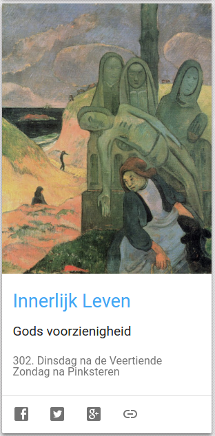

In 2015 verscheen op dit blog [dagelijks een bezinning](/blog/een-jaar-lang-innerlijk-leven-op-geloven-leren/) uit het [boek "Innerlijk Leven"](/portfolio/innerlijk-leven/) van Willem Grossouw. De artikels staan nog steeds [online](/categories/innerlijk-leven/) en kunnen vanaf nu opnieuw in een dagelijks ritme, volgens de liturgische kalender, gelezen worden via [Alledaags Geloven](http://alledaags.gelovenleren.net/). Daar vind je elke dag op de kaart voor Innerlijk Leven de link naar het artikel dat op die dag van toepassing is.

 "Innerlijk Leven" op Alledaags Geloven
