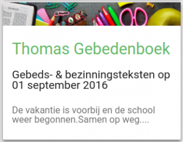

De Thomaswebsite ([www.godsdienstonderwijs.be](http://www.godsdienstonderwijs.be)) heeft een rubriekje "[Gebedenboek](https://www.kuleuven.be/thomas/page/gebedenboek/)" waarin voor elke schooldag van het schooljaar 2016-2017 een kort gebeds- of bezinningstekst wordt aangeboden. Inspiratie voor leerkracht en leerlingen op de katholieke school, al dan niet tijdens de godsdienstles.

Dit dagelijks gebed krijgt bij het begin van het nieuwe schooljaar ook op [Alledaags Geloven](http://alledaags.gelovenleren.net/) een eigen kaart (die verschijnt enkel op schooldagen)!
