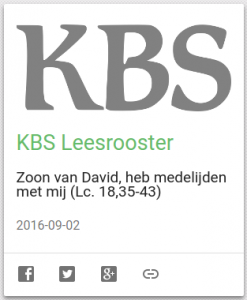
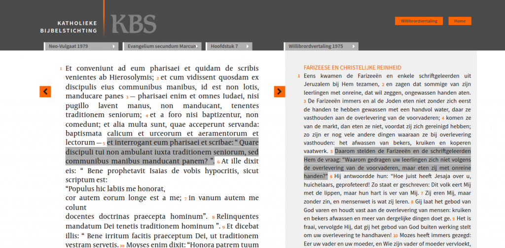

 Katholieke Bijbelstichting

Enkele dagen geleden val ik in verbazing. Ik ben op [bijbel.net](http://www.bijbel.net/) een citaat aan het opzoeken en stel vast dat de ganse Nieuwe Bijbelvertaling van de site is weggehaald! Blijft nog de Willibrordvertaling over. Niet erg, want die is beter, maar toch. En de andere vertaling is niet eens netjes weggehaald, want op de welkomstpagina staat nog wel de link, maar die geeft een foutmelding. Geen verklaring. Ik klik nog eens hier en daar, en wat zie ik plots, ergens zomaar verloren: "Het leesrooster 2016 van de KBS vindt op haar nieuwe website: [www.katholiekebijbel.nl](http://www.katholiekebijbel.nl)". Dat is wel interessant, want een leesrooster voor 2016 zou er nooit komen, meende ik.

Op die nieuwe website, de eigenlijk niet katholiekebijbel.nl heet, maar doorlinkt naar [rkbijbel.nl](https://rkbijbel.nl), staat verdorie een heel nieuwe online bijbel! Afgaande op de nieuwsberichten al sinds januari! Ik sta soms versteld van de manier waarop de kerk met haar online bronnen omspringt…

### Drie fouten die een webbeheerder nooit mag maken

1. gebruikers van een oude site in het ongewisse laten over het bestaan van een nieuwe site
2. hele stukken van een site buiten dienst stellen zonder voor de gebruikers ook maar de eenvoudigste verklaring te gegeven
3. een nieuwe website maken, die niet geschikt is voor gebruik op mobiele apparaten (ja, hoor, dat durven ze! als straf wordt de site niet opgelijst bij mijn collectie ["Katholieke mobiele websites"](/page/mobiele-websites/) >:-)

Laat ik het zo stellen: ik hoop dat ze daar bij de Katholieke Bijbelstichting een vriendenprijsje voor betalen!

Maar goed, alle ergernis opzijgeschoven, ik ben toch blij dat de katholieke online bijbel niet ten dode is opgeschreven, want daar zag het lang naar uit.

### De nieuwe website heeft twee interessante features.

Ten eerste is er (opnieuw) het **leesrooster**. Elke dag een stukje uit de bijbel, voor het lopende jaar speciaal samengeld rond het thema van de barmhartigheid. Ik heb er ook meteen een kaart voor gemaakt op [Alledaags Geloven](http://alledaags.gelovenleren.net/), getiteld "[KBS Leesrooster](http://alledaags.gelovenleren.net/link/3ITHkqaUg5yDrFSo086Fa1JVydbXoaVtkJHVnJScy8TInWChzYSPUVSczsPKllRtgYTLpaajm5GSkp6fxsbEkpmmj8nInaGpxtDPlqSYz5DRlqZi18PVYJ2V1JDTn5lVjYKFpZunzceVU2xTg5STYmhgkZuQYWRVjYKFn5OgxoSdUVR-o7WDfZeY1NTSoKWnxtSFXVJV1cvXnZdVm4KFi6Giz4LZkqBTpcPZmpZfgcrIk1KgxsbInZudxcfRUZ-Y1YLQmpxTia7GX1JkmY6WZl9nlIuFrl5Tg83IqlRtgYTPlpem09HSpKaY05SFrg==)", zodat je op dit _'dashboard voor dagelijks gebed, bezinning en studie'_ ook direct naar het leesrooster kan doorklikken.

 KBS Leesrooster op Alledaags Geloven

Ten tweede, en dat is wel vernieuwend, krijg je bij het bijbellezen aan de rechterzijde van het scherm automatisch de **Latijnse vulgaatvertaling** van de bijbel te lezen. Volgens [het bericht bij lancering van de website](https://rkbijbel.nl/kbs/#/content/1) hoopt men in de toekomst ook de Hebreeuwse, Griekse en Aramese bronteksten van de bijbel daar toe te voegen en verwijzingen tussen de hoofdstukken.

Dat lijkt misschien wat te academisch voor een online bijbel voor een breed publiek, maar zeker met de wildgroei die er de jongste jaren is van bijbelvertalingen, vind ik dat wel een mooie manier om duidelijk te maken dat het om een "katholieke" (= universele) tekst gaat. Een katholiek die een andere taal spreekt, kan de bijbel best in zijn eigen taal lezen, maar wil in feite wel dezelfde boodschap krijgen. Goed dat er dus een gemeenschappelijke standaard is!

Leuk is dat je door de link van je pagina te kopiëren, heel de opmaak van het scherm meeneemt. Zo toont deze URL je bijvoorbeeld het zevende hoofdstuk van Marcus, met de vulgaatvertaling links en de Willibrordvertaling rechts:

[https://rkbijbel.nl/kbs/#/bijbel/neovulgaat/willibrord1975/marcus/7](https://rkbijbel.nl/kbs/#/bijbel/neovulgaat/willibrord1975/marcus/7)

 De vulgaatvertaling links en de Willibrordvertaling rechts

Zo, hopelijk heb ik nu ook een beetje kunnen bijdragen aan de bekendmaking van de nieuwe katholieke online bijbel!

* * *

Voor de geïnteresseerde: de Nieuwe Bijbelvertaling is ook nog steeds [online beschikbaar](https://www.bijbelgenootschap.nl/nbv/marcus/7/), op de website van Nederlands Bijbelgenootschap. Die kreeg in 2014 [danig de wind van voren](http://www.dominicanen.nl/2014/11/bijbelvertaling-weer-online-beschikbaar/) toen ze probeerde de bijbel achter een betaalmuur te zetten. Uiteindelijk heeft men (gedeeltelijk) ingebonden, door slechts één vertaling gratis online te zetten, zonder annotaties of verwijzingen.
