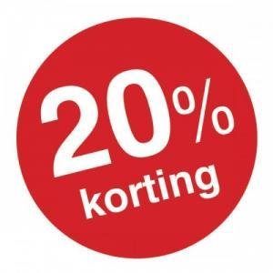

De vakantiemaanden bezorgden dit blog een _boost_ in productiviteit. Omdat u misschien op reis was, hier een overzicht van de nieuwe publicaties:

### Vier nieuwe toneeltjes uit de Bijbel

- [Het Koninkrijk van God](/blog/het-koninkrijk-gods-bijbeltoneel/)
- [De Knecht van de Honderdman](/blog/de-knecht-van-de-honderdman-bijbeltoneel/)
- [De Leerlingen van Johannes](/blog/de-leerlingen-van-johannes-bijbeltoneel/)
- [De Verloren Zoon](/blog/de-verloren-zoon-bijbeltoneel/)

* * *

### Drie nieuwe catecheseartikels

- [Gewetensonderzoek](/blog/gewetensonderzoek-2/)
- [Getijdengebed](/blog/getijdengebed-2/), [Rozenkrans](/blog/rozenkrans/) en [Noveen](/blog/noveen/)
- [De theologie van het lichaam](/blog/de-theologie-van-het-lichaam/)

* * *

### Twee nieuwe boekuitgaven

- [Luistert naar Hem](/blog/een-designstoel-als-eindpunt-van-een-catechetisch-tijdperk/) (prentencatechismus), online en te downloaded als e-boek (EPUB) en te [bestellen als boek](/blog/luistert-naar-hem-via-print-on-demand/)
- [De Heilige Schrift](/blog/bijbelvertaling-petrus-canisius-studiebijbel-gratis-downloaden/) (bijbelvertaling 'Petrus Canisius'), te downloaden als e-boek of werkbijbel

* * *

### Twee mobiele apps (Android)

- [Katholieke Radio](/blog/mobiele-app-laat-je-katholieke-radiozenders-beluisteren/)
- [Naar de Mis](/blog/mobiele-app-vertelt-waar-je-naar-de-mis-kan-gaan/)

* * *

### Drie nieuwe kaarten op Alledaags Geloven

- [Innerlijk Leven](/blog/opnieuw-innerlijk-leven/) (bezinning)
- [Hans Smits](/blog/alledaags-geloven-met-extra-bezinningsteksten-en-catechismus/) (bezinning)
- [Luistert naar Hem](/blog/alledaags-geloven-met-extra-bezinningsteksten-en-catechismus/) (catechismus)

* * *

###  Als bonus geldt op al het [drukwerk](/page/katholieke-printerboekjes/) een korting van 20%, geldig tot eind september 2016, als je bij bestelling de kortingscode "SUMMERDISCOUNT16" gebruikt! (met dank aan [Peecho](https://www.peecho.com/))
