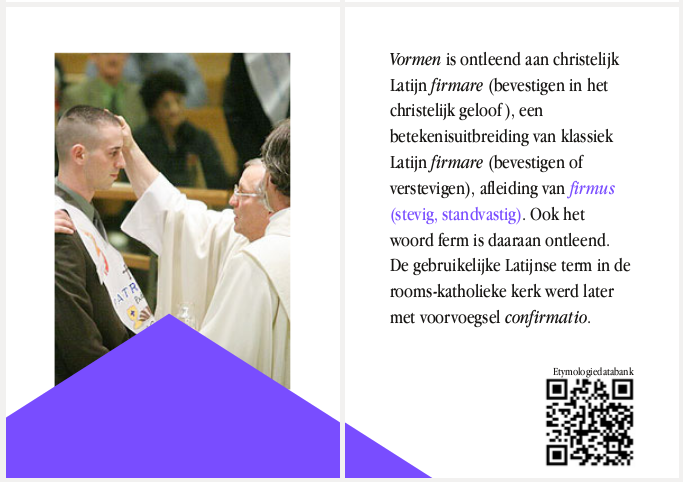
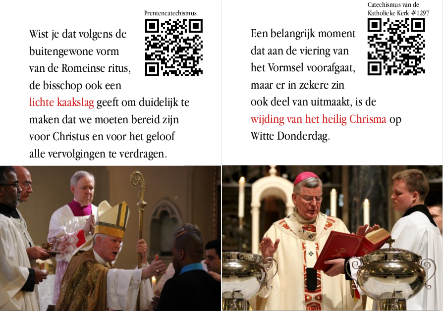

De komende maanden starten de parochies de vormselcatechese voor de vormelingen. Tijd om nog eens reclame te maken voor een boekje dat [het licht zag](/blog/gevormd/) op dit blog.

"Gevormd" bevat een verzameling korte teksten die de belangrijkste elementen van het sacrament van het Vormsel en de plechtige communie belichten, in een heldere layout. Als je meer wil weten of een onderwerp, volg je de QR-code, die bij elk artikeltje is aangebracht.

Naast enkele feiten en weetjes over het sacrament, bevat het boekje ook de reeks catecheses van paus Franciscus over de gaven van de Heilige Geest.

Catechisten kunnen het gebruiken als extraatje tijdens de voorbereidende catechese. Ouders, meter of peter kunnen het boekje (handgemaakt!) als cadeau geven aan de vormeling op het vormselfeest, een mooi persoonlijk aandenken.

Het boekje kan je gratis [downloaden als PDF](/portfolio/gevormd/), in een formaat dat je op een gewone printer kan afdrukken om er zelf een mooi boekje van te maken, of je kan het (aan kostprijs) [bestellen bij de drukker](/portfolio/gevormd/).

\[portfolio display\_types=false display\_tags=false include\_tag=gevormd columns=3\]

Enkele voorbeelden:

\[caption id="attachment\_2195" align="aligncenter" width="500"\] Gevormd!\[/caption\]

\[caption id="attachment\_2861" align="aligncenter" width="500"\] Gevormd!\[/caption\]
