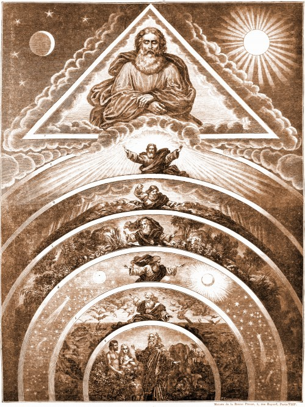

Vanavond kreeg ik nog eens de kans om voor het slapengaan enkele minuten vrij te maken om een poging te wagen de religieuze zintuigen van de kinderen aan te scherpen. Ik was van plan op het tabletje iets op [Alledaags Geloven](http://alledaags.gelovenleren.net/) op te snorren, maar het internet op de slaapkamer liet het afweten. Op de suggestie dan maar een boek van het rek te nemen, kwam terstond 'het grote boek' (de [Prentencatechismus](http://prentencatechismus.org/)) voor te liggen, op de bladzijde van het eerste artikel van de geloofsbelijdenis, deel 2: ["Schepper van Hemel en Aarde"](http://prentencatechismus.org/prent/eerste-artikel-vervolg-schepper-van-hemel-en-aarde/).

De waarschuwing uit het [vorige artikel op mijn blog](/blog/opvoeden-in-of-tot-geloof/), dat gelovige jongeren afhaken wanneer ze hun geloof niet langer kunnen verzoenen met het wereldbeeld dat de exacte wetenschappen hen voorhouden, stond me nog helder voor de geest, en het scheppingsverhaal is zowat het prototype van de bijbelverhalen die niet met de natuurkunde te verenigen zijn, dus ik dacht bij mezelf: "Ik moet hier iets uit mijn botten slaan, of het is om zeep!" En dat heb ik dan ook maar gedaan :)

 Schepper van Hemel en Aarde

Op de prent zie je in concentrische cirkels hoe God van buiten naar binnen de Schepping in zes stappen voltrekt.

- De eerste aardgordel vertoont het werk van de eerste dag: God schept het licht.
- De tweede stelt het werk van de tweede dag voor: God schept het uitspansel en scheidt het van de de aarde af.
- De derde stelt het werk van de derde dag voor: God scheidt de aarde van de wateren en gebiedt aan de aarde alle slag van planten voort te brengen.
- De vierde stelt het werk van de vierde dag voor: God schept de zon, de maan en de sterren.
- De vijfde stelt het werk van de vijfde dag voor: God schept de vogels in de lucht en de vissen in het water.
- De zesde stelt het werk van de zesde dag voor: God schept de mens naar zijn beeld en gelijkenis.

Mijn inspiratie voor het vertellen was een soort van historisch-kritische lezing van het scheppingsverhaal. Die methode houdt voor dat je een bijbelverhaal leest en daarbij in acht neemt in welke omstandigheden het geschreven is, om de boodschap ervan te begrijpen, die dus niet de letterlijke boodschap hoeft te zijn.

Het verwonderde me hoe _nauw_ het scheppingsverhaal aansluit met de natuurkundige leer over de ontwikkeling van het heelal, de aarde en het leven, en dat _ondanks_ het totaal gebrek aan wetenschappelijke kennis bij de schrijver van het verhaal! Kortom: het verwonderde me hoe _letterlijk_ je het scheppingsverhaal wel kan lezen, zonder dat je de wetenschap daarmee tegenspreekt. Ook dat is een historisch-kritische benadering, dunkt me.

### De onderverdeling van de Schepping in verschillende stappen.

De schrijver had God de aarde en alles erop en errond in één keer kunnen laten scheppen. Waarom niet? Dat was nog veel indrukwekkender geweest! Waarom in verschillende dagen? Duidelijk moet de schrijver beseft hebben dat er een bepaalde geschiedenis aan zijn wereld voorafgaat, die stapsgewijs verlopen is. Natuurlijk had die geen besef van de duizenden, miljoenen of miljarden jaren die daarvoor nodig zijn geweest, dus dat werden dan maar dagen genoemd, al is het maar omdat in Gods eeuwigheid tijd geen betekenis heeft, maar alleen al de vaststelling dat de Schepping stapsgewijs wordt voorgesteld, vind ik wonderlijk!

### De volgorde van de stappen van de Schepping.

De schrijver had een heel andere volgorde kunnen kiezen, maar hij koos er één die perfect overeenstemt met de volgorde van het ontstaan van de aarde en het leven zoals natuurkundigen en biologen die pas duizenden jaren later wetenschappelijk hebben kunnen afleiden.

- **Licht.** Dat is natuurlijk de oerknal! Eerst was er niets, duisternis, dan een explosie van energie, licht, waaruit zich ongeordende materie condenseert. 
- **Lucht en aarde.** De prille, kolkende aarde, komt stilaan tot rust, er ontstaat een solide planeet met een atmosfeer errond.
- **Aarde en water.** Landmassa's ontstaan op de planeet en water verzamelt zich in oceanen. Die laatste zullen noodzakelijk blijken voor het ontstaan van leven.
- **Planten.** Het eerste leven op de wereld is plantaardig. De planten zorgen voor een atmosfeer waarin verdere ontwikkeling van leven mogelijk is.
- **Vogels en vissen.** Tweede stap in de evolutie van leven: dieren. Tja, je kan nu zeggen dat de vissen er toch het eerst waren, maar misschien paste dat niet in het rijmschema, he.
- **De mens.** Laatste stap in de evolutie: de mens.

Hoe kan iemand die nog nooit heeft gehoord van quantummechanica, geologie, biologie, fysica en evolutieleer, dit allemaal zo netjes op een rij zetten? Een wonder!

### De vierde dag

De oplettende (en volhardende) lezer zal zeggen: je hebt een scheppingsdag overgeslagen! De vierde dag pas schept God zon, maan en sterren! Dat is toch niet te rijmen met de natuurkunde!

Toch wel, en wel op een heel subtiele manier! De vierde dag onderbreekt de stappen in de evolutie op een merkwaardige manier. Wat betekenen immers 'zon, maan en sterren'? Dat is het onderscheid tussen dag en nacht. En in welke stap van de evolutie van het leven wordt dat relevant? De ontwikkeling van dierlijk leven, dat zich helemaal ent op het ritme van dag en nacht, waken en slapen. Een plant heeft geen nacht nodig, die zou het liefst nog heel de dag van de zon kunnen genieten, maar een dier kan niet zonder. Ik vraag me af of evolutiebiologen zich ooit al gebogen hebben over de vraag of de evolutie tot hogere dierlijke levensvormen wel mogelijk zou zijn als er geen dag- en nachtritme bestond.

En als ik me nog even op heel glad ijs mag begeven, vond ik ter verantwoording van die vierde scheppingsdag ook inspiratie in de prent, waar naast zon, maan en sterren, ook _vallende_ sterren getekend staan. We weten intussen dat de evolutie een fameuze trigger heeft gekregen door het uitsterven van de dinosaurussen, wellicht door de impact van een hemellichaam. Dus misschien kan dat ook een verklaring zijn waarom die bijbelauteur ---onbewust, want hij had natuurlijk nog nooit van dinsaurussen gehoord--- die vierde dag inlast, tijdens dewelke een vallende 'ster' de  weg bereidt voor de verdere ontwikkeling van dierlijk leven!

Ik weet ook wel dat wat hierboven staat grotendeels onzin is, maar ik vind dat het element "[verwondering](/blog/search-for-normaal/)" in het geloof nooit mag worden onderschat, ook niet als je voor de zoveelste keer het scheppingsverhaal leest! Met klachten wend je je best tot de kinderbescherming.
