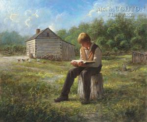
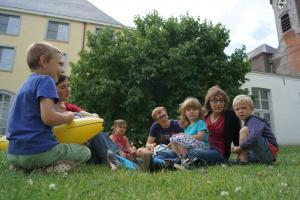
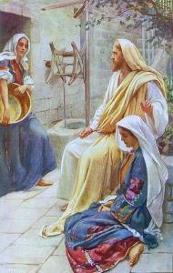

Je kan kinderen niet 'opvoeden tot geloof', in de zin dat er een methode zou bestaan waardoor je het geloof kan aanleren. Je kan met redelijke kans op succes een kind leren schrijven, leren zwemmen, leren fietsen, leren rekenen, leren zingen en wat niet meer, maar je kan met eenzelfde slaagkans een kind niet leren geloven.

Dat je iets niet kan aanleren, wil niet zeggen dat het daarom wel vanzelf zal komen. Niets is minder waar, maar niet iedereen is daarvan overtuigd. Het zijn vaak dezelfde mensen die graag heel wollig doen over geloof als iets wat nooit voltooid is en voortdurend moet groeien (en dat is zo), die als het op geloofsopvoeding aankomt dat groeiproces nauwelijks voeding willen (durven?) geven, "omdat het om een vrije keuze moet gaan". Dat is dus duidelijk inconsequent.

Als je er toch zo van overtuigd bent dat geloof een lang groeiproces nodig heeft en dat het niet iets is wat je van de ene op de andere dag verkrijgt door naar de mis te gaan en dogma's van buiten te leren, dan moet je er ook alles op inzetten om dat groeiproces ruimte te geven, ook bij kinderen.

Op [Aleteia](http://aleteia.org/), een katholieke nieuwssite, verscheen een artikeltje dat een vinger op de wonde legt: "[Waarom gelovigen op de leeftijd van 10 jaar het geloof achter zich laten en wat ouders daaraan kunnen doen](http://aleteia.org/blogs/deacon-greg-kandra/report-some-catholics-leave-the-faith-by-age-10/?ru=47d0756eb45e889ab5ed62566f95d010)". Het eerste deel van het artikel gaat over de moeilijke verhouding tussen geloof en wetenschap, waarop veel jongeren volgens een studie blijken af te knappen. Daar is al veel inkt over gevloeid en dit stuk bevat weinig nieuws. Het belangrijkste puntje, "wat ouders daaraan kunnen doen", blijft beperkt tot één paragraafje (mijn vertaling):

_"Een combinatie van drie factoren maakt dat 80% van de jonge katholieken het geloof bewaren. Jongeren die deelnemen aan een "wekelijkse activiteit" zoals catechese, bijbelstudie of jeugdvereniging_ _; die contact hebben met volwassenen in de parochie__, buiten hun ouders, met wie ze over geloof kunnen praten_ _; en die "diepe spirituele ervaringen" hebben_ _, hebben een veel hogere waarschijnlijkheid om katholiek te blijven."_

Aan de slag dus! Opvoeden _middenin_ geloof en -wie weet- daarmee ook _tot_ geloof!

Ik durf vier artikelen die eerder op dit blog verschenen voor (her)lezing aanbevelen, waarin deze nood reeds uitvoerig aan het licht kwam!

 Jezus blokt – over het belang van kennisoverdracht in geloofsopvoeding

 

 …en zijn eenzame kudde – over het belang van sociale omkadering in geloofsopvoeding en wat dat betekent voor de hervorming van het parochielandschap

 

 Een vaardigheid om God te ontmoeten – over de rol van het gezin in geloofsopvoeding
