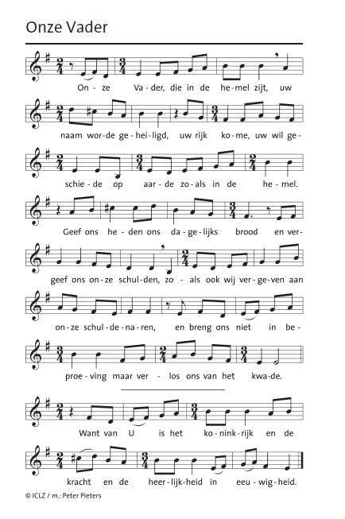
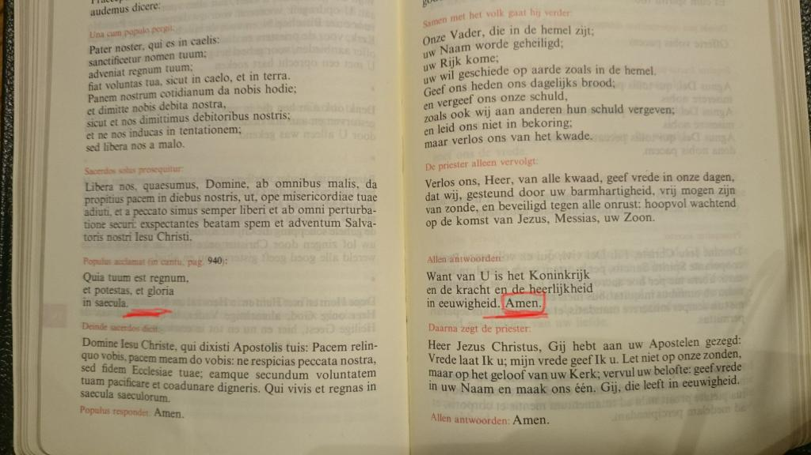
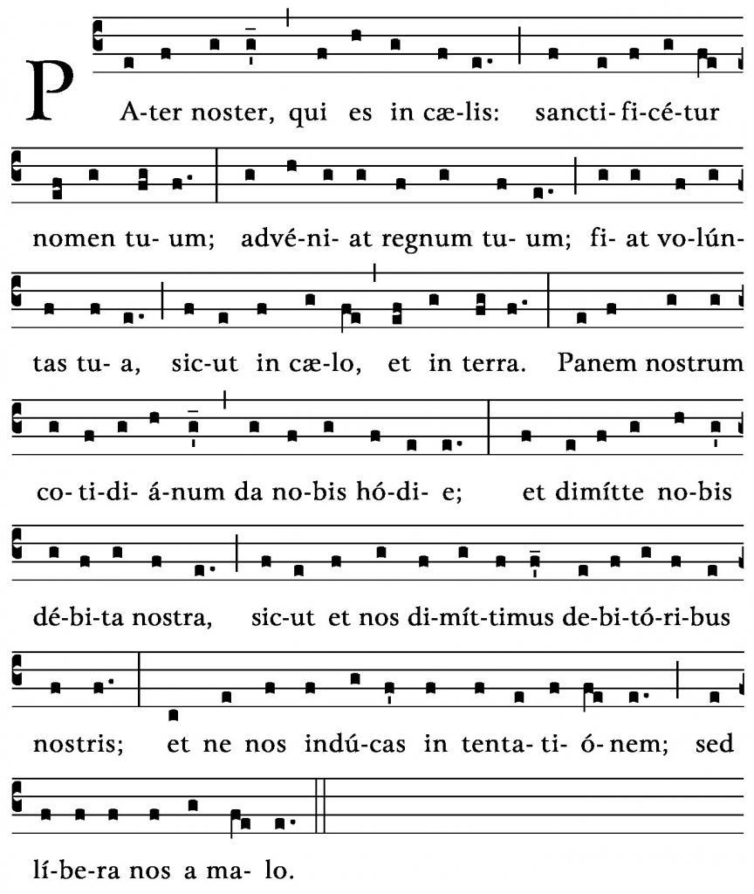

Vorige zondag namen we deel aan de eerste [Famcat](http://www.famcat.be/)\-viering van het nieuwe werkjaar. Dan zijn alle kinderen die volgend jaar hun eerste communie of hun vormsel ontvangen, voor de eerste keer uitgenodigd. Hals over kop, maar zeer terecht, werd er beslist om in de liturgie het nieuwe Onze Vader te gebruiken, meteen in zijn ---ook nieuwe--- muzikale vorm. Het zou immers nogal gek zijn als je die kinderen halverwege hun catechesetraject plots een andere versie van het Onze Vader moet gaan aanleren (het enige gebed dat ze misschien tegen dan al kennen?).

Goed idee, maar zoals elke verandering liep het ietwat stroef. Het boekje van de mis voorzag niet in de nieuwe notenbalken, dus meezingen was geen optie. De pastoor van de kathedraal, vicaris Bart Paepen, had op de nieuwe versie gelukkig al gestudeerd, want bij deze gelegenheid was het dan ook de priester die het Onze Vader 'solo' vertolkte. Dat was zo de gewoonte in tridentijnse tijden, maar nu horen we dat gebed toch samen te vertolken?

Geen verwijt echter naar de liturgisten. Als er een verwijt te maken valt, is het aan onszelf. We wisten al meerdere maanden dat de nieuwe versie van het Onze Vader zou worden ingevoerd in de liturgie, dus waarom hadden we ons er nog niet op voorbereid? De tekst en muziek stonden al lang gereed op [Kerknet](https://www.kerknet.be/kerknet-redactie/audio/leer-het-nieuwe-onzevader-zingen-met-partituur). We hebben ons weer gedragen zoals een makke kudde schapen die zonder enig eigen initiatief blatend de herder achternaholt. Is dat 'deelname' aan de eucharistie? Getuigen we daarmee van 'ownership' over de liturgie, wij die toch zo snel gereed staan met commentaar op preek, muziekkeuze of verstaanbaarheid van de priester? Daar stonden we mooi met onze mond vol tanden! Als [jonge katholieken](http://broodjepaap.nl/2016/09/23/over-vastgeroeste-kerkvernieuwers-en-jonge-katholieken/) hadden we beter moeten weten!

Goed, aan het werk dus. Partituur bij de hand, even beluisteren op Youtube, en studeren die handel. Dat het niet tot Pasen duurt voor je het van buiten kent!

https://youtu.be/UmSCdkHh0Kw?t=133

 Partituur van het nieuwe Onze Vader

Wat mij bij het beluisteren (en meezingen) van het nieuwe Onze Vader meteen opviel, is het ontbreken van het "amen" na de [doxologie](https://meneergodsdienst.wordpress.com/2013/04/30/waarom-is-het-onze-vader-langer-in-de-mis/) "Want van U is het koninkrijk, en de kracht en de heerlijkheid,..." Nu kan ik me vergissen, maar ik meende toch dat we vroeger in de mis bij het zingen van het Onze Vader er altijd een "amen" op lieten volgen. En wat blijkt! In de liturgie hoort er achter het Onze Vader helemaal geen "amen". Toch is dat blijkbaar in onze gewesten zodanig de gewoonte geworden, dat zelfs mijn Latijn-Nederlands missaal in de kolom voor het Nederlands netjes een "amen" toevoegt dat er in het Latijn helemaal niet staat. Nu zal je zeggen: "waar die zich druk om maakt", maar ik ben toch blij dat de liturgisten van vandaag iets zorgvuldiger omgaan met de universaliteit van de heilige Mis. Ons Vlaamse kerkje is immers geen buurtspeeltuin. Wat meer achtergrond over dat mysterieuze "amen" vind je hier.

 "amen" na het Onze Vader

Voor wie dit allemaal veel te ingewikkeld is, meer van eenvoudige melodieën houdt en bij het oude blijft: er is ook nog de gregoriaanse versie van het Pater Noster, die je gerust nog eens mag opfrissen, want je zal ze vroeg of laat in de liturgie zeker nog eens tegenkomen:

https://www.youtube.com/watch?v=fCyFbLMepZ0

 Partituur van het Pater Noster
