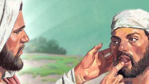
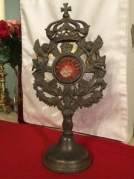

Met twee losse bedenkingen wil ik nog een staart knopen aan het [vorige artikel](/blog/geloven-normaal-of-abnormaal/), over kerstening en het spanningsveld tussen de 'normale' wereld en het 'abnormale' geloof. Een spanningsveld dat gesloten wordt in 'verwondering'.

\[caption width="300" id="attachment\_2874" align="alignleft"\] "Eens denken... wat zou ik nu normaal moeten zeggen?"\[/caption\]

Soms doorzoek ik de bijbel op een willekeurig woord, omdat die methode wel eens verrassende treffers oplevert. Wist je dat in de ganse bijbel het woord 'normaal' nergens voorkomt? In de [Petrus Canisiusvertaling](/blog/bijbelvertaling-petrus-canisius-studiebijbel-gratis-downloaden/) is dat toch zo. In de [Willibrordvertaling](http://bijbel.net/wb/?normaal) (\*) vinden we het woord welgeteld éénmaal in het evangelie, bij de genezing van de doofstomme (Mc 7:35): "Meteen gingen zijn oren open, zijn tongriem ging los, en hij sprak _**normaal**_." In de Petrus Canisiusvertaling heet dat: "En terstond werden zijn oren geopend, en de band van zijn tong werd losgemaakt, en hij sprak _**goed**_." Ik wil geen vertaalkritiek leveren, maar ontwaar in dat (toevallige) verschil een klein mirakel (= iets wat verwondering wekt en inzicht geeft in een onderliggende geheime waarheid). Die doofstomme man heeft net het grootste wonder van zijn leven meegemaakt, zou hij dan iets 'normaals' zeggen, of zou hij iets 'goeds' zeggen, over Jezus, over dat wonder dat hem geschiedt, maar dat voor de wereld totaal abnormaal is? Ik denk dat de Willibrordvertaling de bal misslaat: het woord 'normaal' hoort gewoon niet thuis in de bijbel!

\[caption width="150" id="attachment\_2868" align="alignright"\] Verwondering!\[/caption\]

Ik hou wel van dit soort van mirakeltjes, omdat ik ervan overtuigd ben dat het zetjes zijn van de Heilige Geest, die ik nodig heb om tot nieuwe inzichten te komen. Daarom doet het me pijn te horen met hoeveel ijver de kerkelijke [commentatoren](http://www.hln.be/hln/nl/922/Nieuws/article/detail/2838935/2016/08/24/Bloedende-hostie-allicht-biochemische-reactie-in-brood.dhtml) afstand nemen van het [bloedmirakel dat zich in de huiskamer van E.H. Jacqmin](http://www.nieuwsblad.be/cnt/dmf20160824_02437216) voordoet. Het kan best zijn dat de hostie in de monstrans, al dan niet geconsacreerd, gewoon beschimmeld is. Maar zelfs al is het daarmee technisch gereduceerd tot een 'normaal' natuurkundig verschijnsel, toch vind ik dat de omstandigheden nopen tot spontane verwondering, ook al is de waarnemer een geroyeerd priester. En in zijn plaats zou ook ik me afvragen of daar voor mij geen diepere betekenis achter schuilt. 

**Iemand die zich niet meer kan verwonderen, is die nog wel vatbaar voor het geloof, dat stoelt op het grootst denkbare wonder, van verrijzenis en eeuwig leven?**

(\*) Ik wilde ook even de Nieuwe Bijbelvertaling doorzoeken, maar die blijkt integraal van de website [bijbel.net](http://bijbel.net/) te zijn weggehaald. Waarschijnlijk een gebrek aan goeie wil bij de auteursrechtenhouders. Ook over zo'n fratsen blijf ik me verwonderen...
