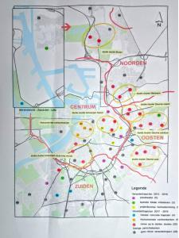

Juni 2011, minister van binnenlandse zaken Geert Bourgeois schrijft een [brief aan de Vlaamse bisdommen](http://crkc.be/sites/default/files/conceptnota_toekomst_parochiekerk.pdf) met de vraag wat ze met al die lege (en dure) kerken van plan zijn. Ruim vijf jaar later zijn de [Antwerpse parochies](https://nl.wikipedia.org/wiki/Lijst_van_kerken_in_Antwerpen_(stad)) eindelijk zover: er is een kerkenplan! Weliswaar slechts een 'stand van zaken', maar het is er toch.

De totstandkoming van het plan verliep van tijd tot tijd nogal chaotisch. Ik herinner me nog vrij levendig hoe snel het de eerste maanden ging. Er was een stortvloed van informatiesessies, bevragingen, terugkoppelingen en overlegvergaderingen die plaatsvonden op het niveau van bisdom, stad, kerkraad, centraal kerkbestuur (CKB) en het overlegorgaan van CKB's. Er was zelfs een Antwerpse pastorale organisatie die voor haar beurt sprak een wiens visieplan onverkort naar de prullenmand werd verwezen. Tot een jaar later, najaar 2012, wanneer er gemeenteraadsverkiezingen plaatsvinden. Dan valt de [strakke planning](http://crkc.be/sites/default/files/brief_aan_parochies_en_kerkfabrieken-nota_minister_bourgeois-kerkgebouwen.pdf) zo'n beetje stil, althans naar buiten toe, want in beperkte cenakels wordt er, na consolidatie van het nieuwe bestuur, zowel in de stad als in het bisdom, gezapig voortgewerkt met de verzamelde gegevens en lopen er een handvol concrete proefprojecten. Midden 2016 krijgt het bisdom plots een zetje van de Vlaamse overheid om toch tegen het eind van het jaar met een plan op de proppen te komen, wat heeft geresulteerd in de 'stand van zaken', voorgesteld op 11 oktober.

### Hulp, wij willen een visie!

Wat betreft communicatie, is het proces de voorbije vijf jaar nog niet eens zo slecht verlopen, als je rekening houdt met de verschillende niveaus waarop gecommuniceerd moet worden en de zeer uiteenlopende profielen van de betrokkenen. Toch heeft mij al de tijd iets dwars gezeten. Vanaf dag één is vanuit het bisdom gecommuniceerd dat het de individuele parochies zijn die voor hun eigen toekomst en het gebruik van hun kerkgebouw een visie moeten ontwikkelen en dat ze dat niet moeten verwachten van het bisdom. Dat is een heel slimme boodschap als je wil voorkomen dat 'de basis' schaapachtig blijft wachten op instructies van hogerhand (instructies waarop diezelfde basis gegarandeerd bakken kritiek zou uiten). Of het kan ook slim zijn om tijd te winnen als je net bisschop bent benoemd en je eerst je [interne organisatie](/blog/bisdom-antwerpen-hervormt-interview-met-kan-paepen/) op poten wil krijgen. Probleem is echter dat die basis enkele cruciale bovenlokale parameters onvoldoende in de hand heeft, om een eigen toekomstvisie te ontwikkelen.

Een concreet voorbeeld: het pastorale zwaartepunt in mijn parochie ligt bij een allochtone gemeenschap die onze kerk gebruikt, maar geografisch niet aan onze kerk is gebonden. Als de bisschop morgen beslist dat deze gemeenschap zich in een andere kerk beter kan ontplooien, een beslissing waarover hij onze lokale kerkraad niet hoeft te horen, heeft dat een dramatische impact op onze eigen toekomstvisie voor het gebruik van de kerk. Deze impasse heeft er ons in de loop van het proces op een bepaald moment zelfs toe gebracht een officiële brief tot het bisdom te richten dat we eigenlijk geen toekomst meer zagen voor onze (Vlaamse) parochie en een opheffing of fusie aanbevolen, wat gelukkig nooit is overwogen. Dit maar om te illustreren dat '_empowerment_' van 'de basis' snel kan leiden tot een gevoel van machteloosheid als de kritische parameters niet mee uit handen worden gegeven.

### Medegebruik wordt kerngebruik

 Het Antwerps Kerkenplan (eind 2016) toont nog veel studiewerk.

Het kerkenplan dat nu voorligt, zet in op de aanwezigheid van andere christelijke gemeenschappen om de kerkgebouwen voor de toekomst te vrijwaren. In zijn [korte inleiding](https://www.kerknet.be/bisdom-antwerpen/nieuws/parochiekerkenplan-voor-antwerpen-voorgesteld-door-bisdom-en-stad) maakte mgr. Bonny een krachtig statement: **"een katholieke kerk die geen gastkerk wil zijn voor een andere gemeenschap, is niet katholiek"**. Vervolgens somde hij op welke christelijke gemeenschappen er zoal in aanmerking komen. Om te beginnen de anderstalige rooms-katholieke en niet-latijnse katholieke gemeenschappen. Vervolgens christelijke gemeenschappen met wie de Kerk oecumenische banden heeft: de orthodoxe kerk en de protestantse kerk. Tot slot, en dat is nieuw, verschijnen ook de evangelische kerken in het blikveld van de bisschop, met wie de Kerk geen relaties heeft, bij gebrek aan overkoepelende gesprekspartner. Hoe wil hij met hen in zee gaan? Gaan ook zij binnenkort in een katholiek kerkgebouw een plaats kunnen vinden? Misschien wel, als daarmee het kerkgebouw van verkoop of afbraak gevrijwaard kan worden?

De uitdagingen van zo'n plan zijn groot. De allochtone katholieke gemeenschappen staan pastoraal heel sterk, maar organisatorisch zijn ze nog niet op snelheid om evenredig het beheer van een kerk handen te nemen. De impact van medegebruik door een niet-katholieke gemeenschap op de Vlaamse beheerders is nog vele malen groter. Een extra moeilijkheid is de directe concurrentie tussen sommige christelijke gemeenschappen. De engelstalige Afrikaanse katholieke gemeenschap bijvoorbeeld, heeft een publiek waarop de talrijke evangelische kerken een sterke aantrekkingskracht kunnen uitoefenen, maar even goed omgekeerd.

In elk geval, als medegebruik of nevenbestemming zo belangrijk wordt, mag het prioriteit heten tenminste de katholieke anderstalige gemeenschappen ondubbelzinnig voor lange termijn te verankeren aan 'eigen' kerkgebouwen, zodat ze meer ownership kunnen nemen en er een echte _drive_ kan ontstaan om met visie over de toekomst van een concrete parochie na te denken.

### Stand van zaken

Het plan dat voorligt, is nu nog maar een stand van zaken. Van de 69 Antwerpse kerken zijn er 41 opgegeven voor een "verandertraject", waarvan meer dan de helft nog moet van start gaan. Voor hoeveel van die kerken er nog toekomst is, blijft giswerk. Het grote werk moet dus nog beginnen!
